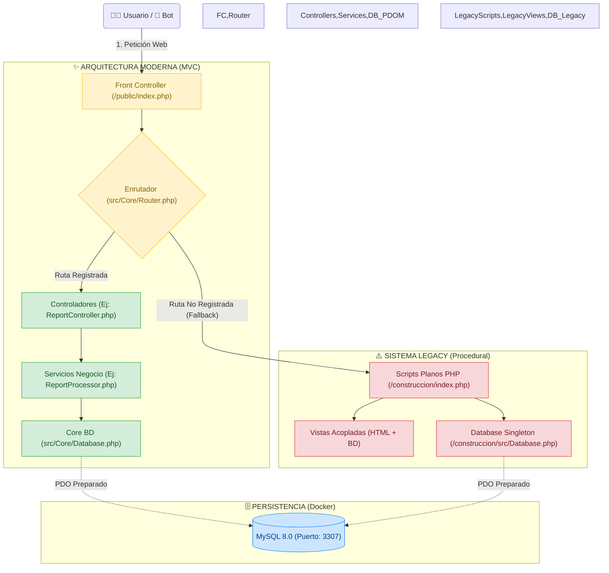

# Last Planner AIA: Construyendo con +CERTEZA

> Este repositorio no es solo código; es el motor de transformación cultural y productiva en
> nuestros proyectos de construcción.

A continuación, te guiamos a través de la metodología técnica y filosófica que sustenta la
plataforma, estructurada en el arco de tres actos que rige nuestra visión operativa organizacional.

---

## 📑 Índice de Navegación

- [🎬 Acto 1: El Comienzo (El Conflicto y el Llamado)](#-acto-1-el-comienzo-el-conflicto-y-el-llamado)
- [🎬 Acto 2: El Nudo (Filosofía Metodológica y Arquitectura)](#-acto-2-el-nudo-filosofía-metodológica-y-arquitectura)
  - [2.1 El Flujo Operativo Last Planner (LPS)](#21-el-flujo-operativo-last-planner-lps)
  - [2.2 Mejora Continua: El Ciclo de Medición (PAC y CNC)](#22-mejora-continua-el-ciclo-de-medición-pac-y-cnc)
  - [2.3 El Reflejo Técnico: Arquitectura Híbrida (Patrón Estrangulador)](#23-el-reflejo-técnico-arquitectura-híbrida-patrón-estrangulador)
- [🎬 Acto 3: El Desenlace (Apropiación y Gobernanza)](#-acto-3-el-desenlace-apropiación-y-gobernanza)
  - [3.1 Despliegue y Entorno (Exclusivo Docker)](#31-despliegue-y-entorno-exclusivo-docker)
  - [3.2 Gobernanza de Inteligencia Artificial ("Antigravity")](#32-gobernanza-de-inteligencia-artificial-antigravity)
  - [3.3 El Guardián del Estilo (VS Code Workspace)](#33-el-guardián-del-estilo-vs-code-workspace)

---

## 🎬 Acto 1: El Comienzo (El Conflicto y el Llamado)

> [!WARNING]
> **El Problema Operativo**  
> Las obras de construcción tradicionales sufren de islas de información,
> promesas rotas y un enfoque de planificación empujada ("Push") donde el cronograma maestro impone
> fechas que la realidad del sitio de obra no puede sostener. Las consecuencias son sobrecostos,
> estrés operativo, y cuellos de botella derivados de una planificación desintegrada y asilada del
> equipo de terreno.

> [!TIP]
> **La Gran Idea (+CERTEZA)**  
> Implementar _Last Planner System_ (LPS) no es instalar un software de
> gestión de proyectos. Es adoptar una **filosofía organizacional** donde el "Último Planificador"
> (residentes, maestros, subcontratistas) tiene el poder y la responsabilidad de comprometerse
> **únicamente** con lo que puede cumplir. Last Planner AIA es la respuesta corporativa para erradicar las
> promesas vacías, garantizando flujos de trabajo predecibles y continuos.

### Documentación Complementaria (El Manual de Supervivencia)

- **[Constitución y Reglas (GEMINI.md)](GEMINI.md)**: Reglas core y workflows de desarrollo.
- **[Glosario (GLOSARIO.md)](GLOSARIO.md)**: Diccionario oficial de más de 100 términos técnicos y
  de la metodología LPS (Indispensable para todo colaborador).
- **[Roadmap (ROADMAP.md)](ROADMAP.md)**: Planificación a largo plazo, hitos aprobados y sprints de
  modernización.
- **[Rutas del Sistema (docs/ROUTES.md)](docs/ROUTES.md)**: Direccionamiento del MVC, APIs e
  instrucciones del Front Controller.
- **[Guía de Stitch (docs/STITCH.md)](docs/STITCH.md)**: Conexión, autenticación e interacción con
  Stitch para generar el design system y las pantallas de la app.
- **[Rutina de despliegue SiteGround](docs/siteground-deploy-routine.md)**: Checklist operativo para
  desplegar desde `main`, validar el sitio y tener rollback rápido.

---

## 🎬 Acto 2: El Nudo (Filosofía Metodológica y Arquitectura)

Para que el llamado a la acción se concrete, la organización despliega la metodología a través de
tres horizontes de planeación. El rol del software es capturar empíricamente estas fases.

### 2.1 El Flujo Operativo Last Planner (LPS)

La metodología transforma progresivamente la teoría del cronograma en realidades de obra mediante un
esquema de filtros estructurados:

1. **Programa General / Máster (Lo que se DEBERÍA hacer):** Establece el plan maestro de alto
    contraste. Mapea los hitos del proyecto, las secuencias constructivas ideales y las metas
    presupuestales (Cantidades y Costos Teóricos). Fija la hoja de ruta a largo plazo y determina si
    una tarea _debería_ ejecutarse en una ventana futura.
2. **Programación Intermedia o _Lookahead_ (Lo que se PUEDE hacer):** El escudo protector de la
    obra. Evaluamos una ventana de tiempo (típicamente 4-6 semanas adelante) para identificar toda
    barrera que pueda bloquear la ejecución de la tarea. Aquí se detectan y remueven las
    **Restricciones** (Problemas de Diseños, Materiales, Mano de Obra, Equipos, Trámites, etc.).
    Solo las tareas cuyas restricciones se han resuelto ("Liberadas") pueden avanzar.
3. **Programación Semanal (Lo que se HARÁ):** El terreno de juego táctico. Aquí, residentes y
    subcontratistas analizan los frentes sin restricciones y asumen **compromisos reales** (medibles
    en cantidades y horas). En la Programación Semanal no se planifica, se firman acuerdos de
    palabra y datos sobre lo que efectivamente se va a ejecutar esa semana.

### 2.2 Mejora Continua: El Ciclo de Medición (PAC y CNC)

El sistema madura mediante el componente de medición empírica al final de la semana, haciéndonos la
pregunta crítica: ¿Cumplimos lo prometido?

- **PAC (Porcentaje de Asignaciones Completadas):** Un indicador implacable de confiabilidad. Cada
  compromiso evaluado solo tiene dos estados: se cumplió (PAC = 1) o no se cumplió (PAC = 0).
- **CNC (Causas de No Cumplimiento):** Si PAC = 0, el equipo debe obligatoriamente rootear la falla.
  ¿Falló el Diseño? ¿No llegó el Material? ¿Faltó Personal? El análisis CNC alimenta la mejora
  continua para que los errores corporativos no se repitan la semana entrante.

---

### 2.3 El Reflejo Técnico: Arquitectura Híbrida (Patrón Estrangulador)

El desafío de modernizar esta metodología requirió migrar de scripts legacy hacia un ecosistema
robusto validado por **RBAC** (Control de Acceso Basado en Roles). El software intercepta cada
petición e inyecta la seguridad y rutas hacia la lógica de negocio moderna, delegando lo antiguo en
aislamiento controlado:

<details>
<summary><b>🗺️ Ver Diagrama de Arquitectura Híbrida</b></summary>



</details>

#### Ecosistema Base PHP

El backend corre en un entorno estandarizado sin frameworks comerciales que engorden el bundle,
priorizando eficiencia transaccional para operaciones con alta densidad de datos.

- **Core:** PHP 8.3 + MariaDB/MySQL 8.
- **Librerías Críticas:** `phpoffice/phpspreadsheet` (Reportería), `vlucas/phpdotenv` (Seguridad), `phpmailer/phpmailer` (correo transaccional para recuperación de contraseña).
- **Seguridad Central:** Inyección protegida contra consultas (Prepared Statements mandatory),
  denegación explícita (HTTP 403) liderada por RBAC para roles restrictivos de la obra (`D`, `R`,
  `C`, `G`, etc.).

---

## 🎬 Acto 3: El Desenlace (Apropiación y Gobernanza)

La transición a la modernidad culmina cuando el desarrollador toma el volante de la infraestructura.
Esta etapa finaliza las dependencias caóticas e implementa Docker y Agentes IA como única directriz.

### 3.1 Despliegue y Entorno (Exclusivo Docker)

> [!CAUTION] > **El fin del caos local.** Prohibido terminantemente el uso de MAMP, XAMPP o
> servidores Apache instalados en la máquina host. Todo el entorno está rigurosamente
> contenedorizado. No instales dependencias base ni uses Composer globalmente; el stack lo hará por
> ti.

<details>
<summary><b>🐳 Ver Instrucciones de Despegue Rápido Local</b></summary>

1. Clona el repositorio a tu máquina.
2. Crea tu archivo `.env` basado en `.env.example`. (Ver `GEMINI.md` para credenciales).
   Si vas a habilitar recuperación de contraseña, configura también `APP_URL`, `MAIL_HOST`, `MAIL_PORT`, `MAIL_USERNAME`, `MAIL_PASSWORD`, `MAIL_ENCRYPTION`, `MAIL_FROM_ADDRESS` y `MAIL_FROM_NAME`.
3. Despierta el stack:

```bash
# Construye la imagen, resuelve composer y levanta bases de datos en DB y App.
docker compose up -d --build db app adminer
```

</details>

**Credenciales de Prueba (Testing Out-Of-The-Box)**: Para validar interfaces o probar las
ramificaciones del PAC y las Restricciones, debes emular la vida real de los roles. Ya existen
múltiples perfiles `RBAC` inyectados en la base de datos de Docker listos para iniciar sesión y
depurar módulos. Por ejemplo: `test.A` (Administración global), `test.D` (Director), `test.R`
(Residente).

- _Localiza todas las contraseñas e IDs en el ecosistema **`GEMINI.md`** (Sección 5)._
- _Puntos de acceso:_ App -> `http://localhost:8081` | DB UI -> `http://localhost:8082`.

#### Recuperación de contraseña y SMTP

- **Variables requeridas:** `APP_URL`, `MAIL_HOST`, `MAIL_PORT`, `MAIL_USERNAME`, `MAIL_PASSWORD`, `MAIL_ENCRYPTION`, `MAIL_FROM_ADDRESS`, `MAIL_FROM_NAME`.
- **Base URL pública:** `APP_URL` se usa para construir los enlaces de restablecimiento (`/password/reset` y `/admin/password/reset`).
- **Dependencia SMTP:** el flujo de recuperación no funciona si el contenedor/app no puede abrir conexión saliente al servidor SMTP configurado.
- **Parche de base de datos:** aplica `database/patches/20260329_create_password_reset_tokens.sql` antes de usar el flujo en un entorno nuevo o clonado.
- **Rutas nuevas:** app pública `GET|POST /password/forgot` y `GET|POST /password/reset`; panel admin `GET|POST /admin/password/forgot` y `GET|POST /admin/password/reset`.

### 3.2 Gobernanza de Inteligencia Artificial ("Antigravity")

> [!WARNING] Este repositorio extirpó los workflows manuales estándar. No utilizamos Forks caóticos
> ni PRs directos sin automatización. El desarrollo y la mutación del código están gobernados por
> **nuestros Agentes de IA locales (Antigravity)**.

Si aportas código a la refactorización arquitectónica o los reportes métricos, tu iteración con
nuestro asistente de IA debe estar parametrizada:

- `/plan [tarea]`: Desencadena el análisis de requerimientos del modelo para crear tu
  `implementation_plan.md` libre de riegos y protegido.
- `/run` o `/exec`: Permite a la IA ejecutar atómicamente la refactorización una vez hayas validado
  técnicamente el documento de planificación.
- `/fast [tarea]`: Vía rápida para delegarle fixes menores a la IA (< 20 líneas).
- `/smart-git-workflow`: El asistente orquesta todo tu historial, versiones y actualiza ramas con
  los estándares de _Conventional Commits_.

**Regla de Oro en Arquitectura Híbrida:** Prohibido bypassear a los Agentes ingresando bloques
inmensos de código manual de dudosa procedencia.

### 3.3 El Guardián del Estilo (VS Code Workspace)

Para certificar consistencia, la plataforma requiere de manera silenciosa que instales las
extensiones sugeridas en `.vscode/extensions.json` cuando abras el workspace (Ej. Linters avanzados:
`php-cs-fixer`, `eslint` y el enforcer de estilo `Prettier`).

> [!IMPORTANT]
> **Bienvenido al ecosistema. Construyamos con certeza.**
