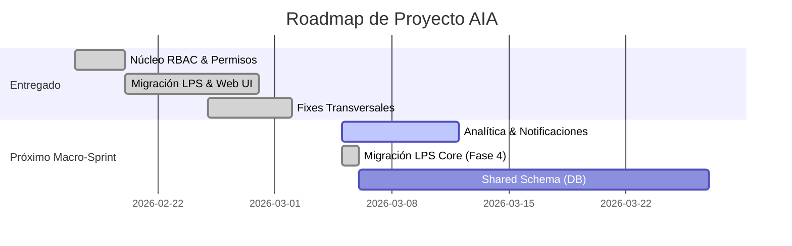

# ROADMAP - Implementación Híbrida y Gobernanza Transversal

Fecha: 2026-03-02

## Objetivo Estratégico

Visión unificada y plan de adopción metodológica de **Last Planner System (LPS)** con **Arquitectura Híbrida**, **Control de Acceso (RBAC)** y futuras integraciones avanzadas (Analítica y Shared Schema).

---

## 📅 Timeline de Desarrollo (Diagrama de Gantt)

---

## ✅ Historial de Hitos Alcanzados (V0.1 a V1.0-RC1)

<b>🛠️ Fases Tempranas (0 a 3) - Core RBAC y Autenticación</b>

- **Fase 0 - Baseline:** Congelamiento de matriz y eventos fuente (`docs/rbac_phase0_baseline.md`).
- **Fase 1 - Catálogo RBAC:** Setup inicial de migraciones SQL y siembra de eventos/roles en `lastplanneraia_dev`.
- **Fase 2 - Core Services:** Desarrollo de `RbacCatalog.php`, `RbacService.php` y envolturas `authorizePermission()` integradas al MVC Front Controller.
- **Fase 3 - Admin Console:** Purga de cargo repetitivos (de 47 a 22 cargos directos) integrados al dictionary formal en `/admin`.

<b>🛡️ Fases Intermedias (4 a 5C) - Endurecimiento LPS y Deuda Técnica</b>

- **Fase 4 - Paridad Frontend:** Traducción de identificadores de roles asimétricos hacia los 9 roles canónicos (`A`, `D`, `R`, `OT`, etc.) en Handosontable.
- **Fase 5 - Hardening Backend:** Prohibido el paso de endpoints en `construccion/` que escriben reportes/LPS con un 403 limpio desde `RbacGuard.php`.
- **Fase 5A y 5B - Deuda Técnica & UI:** Centralización de Outputs en un solo super-servicio `ReportController`, mitigación de crash CLI y rediseño interactivo vía `rbac_capabilities.js`.
- **Fase 5C - QA RBAC:** Muestreo automatizado con scripts `docs/rbac_phase5c_check.php` para validar colisiones de permisos cross-role.

<b>🚀 Fases Recientes (6 a 6.3) - Limpieza, Accesibilidad y Codificación</b>

- **Fase 6 - Limpieza Migratoria:** Remoción quirúrgica del módulo superpuesto `PaquetesContratacion` para favorecer a la vista canónica de `/contratos`.
- **Fase 6 - Limpieza Legacy Masiva (Fase 1):** Eliminación de ~1350 archivos obsoletos y muertos (vendor legacy duplicado, fpdf184, módulos inactivos y routers antiguos) del directorio `construccion/` para reducir deuda técnica sin impacto funcional.
- **Fase 6 - Migración Arquitectónica de Vistas (Fase 2):** Movidos todos los archivos `.view.*.php` activos desde `construccion/{modulo}/views/` hacia el directorio moderno `views/{modulo}/`. Se actualizaron los requerimientos en los controladores MVC con paths resolutivos absolutos.
- **Fase 6 - Kill Switch Legacy (Fase Final) ✅ (2026-03-09):** Eliminación definitiva y absoluta del directorio `/construccion/` original. Refactorización masiva de endpoints asíncronos en `src/Legacy/Endpoints/`, unificación de assets en `/public/` y consolidación total del proyecto en la arquitectura 2026 MVC.
- **Fase 6 - Kill Switch Legacy (Fase Final) ✅ (2026-03-06):** Eliminación definitiva y absoluta del directorio `/construccion/` original. Refactorización masiva de endpoints asíncronos en `src/Legacy/Endpoints/`, unificación de assets en `/public/` y consolidación total del proyecto en la arquitectura 2026 MVC.
- **Fase 6.1 a 6.3 - UX, UI y Config:** Sustitución interactiva HTML en reportes, parches UTF-8 transversal para encodings fallidos como `Ń` o `ń` y normalizaciones visuales responsivas Single Line.
- **Fix Tablet Viewport (2026-03-03):** Desactivación del zoom agresivo 0.7x en desktop (`tablet-viewport-scale.js`), suavizado a 0.85x para tablets reales, y media queries intermedias 768-1024px en `navbar.css` y `project_selector.view.php`.
- **Fix Notificaciones Legacy (2026-03-03):** Corrección de inyección dinámica DOM y resolución de condition race para asegurar la carga asíncrona segura del componente Outbox (Campana) en el ecosistema heredado.
- **Fix Panel Admin Moderno (2026-03-12):** Restauración del acceso al panel administrativo integrado moderno (`/admin`). Se corrigió el error fatal por rutas de Base de Datos huérfanas y se resolvieron los fallos 404 de assets (logo, css, js). ✅
- **Rediseño Sidebar Móvil (2026-03-03):** Implementación de la capa `aia-premium-drawer`. Transformación del menú colapsable en un Drawer (Premium Glassmorphism y animaciones spring) con Isla de Usuario (Thumb Zone UI) compartida entre MVC y Legacy.
- **Ajuste de Terminología LPS (2026-03-03):** Renombramiento del estado "No activa" a "Programada Manualmente" en Programación Semanal para mayor claridad operativa, diferenciando actividades agregadas por el usuario de las autoprogramadas.
- **Recuperación Formulario Nueva Actividad Modal (2026-03-03):** Restauración del HTML premium de dos columnas y refactorización en CSS Grid para compactar los campos. Reconstrucción completa de la lógica de hidratación JS (AJAX) para la "Bandeja de Excepciones No Autoprogramadas" en Programación Semanal.
- **Apple-Style Design System (2026-03-03):** Revisión de botones nativos de `.modal_nueva_sem` en la Bandeja de Excepciones para alinear la estética premium `oklch()`.
- **Estrategia CSS @layer 2026 ✅ (2026-03-03):** Migración completa de la arquitectura CSS a `@layer` (7 commits atómicos en `feature/css-layering-2026`). Se encapsularon 8 archivos CSS en layers estructurales (`reset`, `theme`, `base`, `layout`, `components`, `utilities`), se implementó un Unlayered Override Bridge para vencer a Bootstrap CDN, y se resolvieron 5 regresiones visuales (botones, overflow, nombres). Navbar abreviado inteligentemente vía JS.
- **Notificaciones PI Avanzadas (2026-03-03):** Implementación integral del sistema `NotificationService` con inyección de eventos en `guardar_programacion_intermedia.php` y `ProgramacionIntermediaController.php`. Incluye 4 grandes grupos lógicos: `pi_restriction_change` (subidas/bajadas/liberación), `pi_state_alert` (alertas de semáforo operativo), `pi_assignment` (asignación de Responsables y Subcontratistas), y `pi_shared_constraint` (cambios en lote), con un puente de mapeo avanzado de nombres legado a Usernames RBAC.
- [x] **Optimización UI PI (2026-03-03):** Integración de `HandsontableSelect2Editor.js` como custom editor en el Handsontable para las columnas del Subcontratista y Predecesoras en Programación Intermedia, mejorando la usabilidad.
- [x] Corrección de `RbacCapabilities.canEditMga` (TypeError)
- [x] Migración de endpoint de listado a `/api/general/list` (404/405 Fix)
- [x] Implementación de **Nuevo Importador de Excel con Rollover Semanal, Activación Automática y Selector de Fecha Inicial** (Fase 4 Modernización) ✅ (2026-03-12)
    - Fix Fatal Error 500 (columna `Estado` faltante).
    - Activación automática de Semana 1 en proyectos nuevos.
    - Detección dinámica de jerarquía (WBS/Esquema).
    - Modal de éxito premium y redirección integrada (Manual de Marca AIA).
- [x] **Modelo Híbrido LPS 2.0: Importación con Herencia y Borradores** ✅ (2026-03-13)
    - Actualización dual `_programa` (baseline) + `_programa_consolidado` (borrador).
    - Herencia inteligente desde semana activa real (Restricciones, PDC, Responsables).
    - Borradores habilitados: S2+ se guarda sin activar hasta "Nueva Semana".
    - Fix Visibilidad: Filtro por defecto 'Mostrar Todas' para evitar falsos negativos tras rollover.
    - Fix Persistencia: Sanitización de IDs en `autoSaveRow` (SQLSTATE 22007 resolved).
    - Opt. API: Remoto filtro de fechas obligatorias para visibilidad total de registros.
    - Fix Sincronización:- [x] **Persistencia Garantizada**: Mapeos persistentes en base de datos tras refresco. Incluye botón "Eliminar Actualización" con borrado físico de borradores (`DELETE`) para un flujo de trabajo sin residuos de actualizaciones fallidas. ✅ (2026-03-13)
- [x] **Herencia Inteligente y Robusta (AIA 2026)** ✅ (2026-03-15)
    - Re-ingeniería de `getPreviousWeekData` con priorización de registros con datos.
    - [x] Sincronización proactiva de ratios desde API POST a Renderizadores.
  - [x] Fix del Colapso al Cambio Dinámico de Unidades (Ratio * Presupuesto calculado).
  - [x] Refactorización del Data Model en HOT (`hot.js`, `hot_actualizar.js`) para almacenar cantidad Física nativa.
  - [x] Fix GeneralApiController.php para manejo resiliente de fallback a porcentaje y error 400.
    - Unificación de lógica de herencia para Mapeo Manual (Dropdown) e Importación Excel.
    - Sincronización automática de las 7 restricciones individuales.
    - Normalización de nombres (Capítulos) y limpieza de etiquetas HTML activa.
- [x] **Paridad Programa General Actualizar** ✅ (2026-03-15)
    - Bloqueo de presupuesto para unidades `%`, permisos por rol y renderizado premium.
    - Fix UI: Alineación vertical de celdas y eliminación de números de fila.
    - Fix Editor: Estabilidad de TomSelect (ESC bug, closeAfterSelect).
- [x] Habilitación de POST en router para API General
- [x] **Corrección Integral del Motor de Ejecución (Base Ratio 0-1) ✅ (2026-03-16)**
    - Restauración total del motor `LpsService` a escala decimal (0.0 a 1.0).
    - API General actúa como traductor inteligente (Cantidades Físicas vs Porcentaje).
    - Sincronización de Frontend (`hot.js` y `hot_actualizar.js`) eliminando auto-divisiones indebidas.
    - Renderizadores adaptativos: Visualización de `Cantidad (Unidad) + %` basada en presupuesto.
    - [x] **Ejecución Real & Blindaje de Feedback (2026-03-18)**:
    - [x] **Cambio Dinámico de Unidades**: Prevención de colapso de porcentajes al cambiar unidades o presupuesto mediante conversión inteligente de Ratio a Cantidad Física.
    - [x] **Validación Preventiva JS**: Bloqueo de envíos fuera de rango (0-100%) en el navegador para eliminar errores 400 en la consola y red.
    - [x] **Unificación de Notificaciones**: **AIA.Notice** (SweetAlert2 + badges nativos) establecido como el sistema oficial unico, eliminando las dependencias activas de `toastr` en Core, Admin y modulos operativos, y migrando los flujos principales de feedback desde `alert()` hacia una UI mas consistente. ✅ (2026-03-18)
- **Select2 Arquitectura Inteligente y UI/UX Premium (2026-03-04):** Consolidación de Select2 Múltiple paramétrico y aislado, evadiendo colisiones del motor "outside clicks" de Handsontable mediante DOM-nesting atado directamente a la celda activa (`this.TD`). Refinamiento exhaustivo inyectando CSS modular para arreglos de espaciado interactivo, alineación flexible (`flex-wrap`) de chips y erradicación de gaps inter-elementos vía resets absolutos. Se forzó despliegue con actualizador de cache manual.
- **Erradicación de DataTables (2026-03-03):** Se eliminó por completo la dependencia visual y los archivos base (`*.view.nuevaBarra.php`) del antiguo jQuery DataTables en las vistas maestras de Programación General, Programación Intermedia y Programación Semanal, consolidando Handsontable como la única tecnología de grilla.
- [x] **[Hito 2 completado en refactor]** Ajustar breakpoints y overflow del header (Navbar global). Implementados breakpoints `xl`, `clamp()` typography y truncado inteligente por CSS (`navbar.css` y archivos base JS/PHP actualizados).
- **Fix Alerta Autoprogramación (2026-03-04):** Se corrigió la lógica de validación PHP en `guardar_programacion_semanal.php` para que las actividades con unidad en porcentaje (`%`) no levanten falsos positivos por falta de `Cantidad PPTO` al intentar autoprogramar, respetando las reglas de negocio base.
- **Alertas de Restricciones en Autoprogramar (2026-03-04):** Se implementó un nuevo sistema de alertas (Gate 2) que informa detalladamente qué actividades fueron omitidas por tener restricciones pendientes (< 95%) y especifica cuáles de estas (Diseño, Materiales, etc.) impiden la programación.
- **Auto-corrección de Unidades Vacías (2026-03-04):** Se añadió una sentencia UPDATE en `api/program/list.php` que formatea e inyecta la unidad implícita `%` en bases de datos legadas al momento exacto en que el usuario abre o consulta el módulo de **Programa General**.
- **Fix Navegación Select2 100% Funcional ✅ (2026-03-04):** Erradicación definitiva del "focus trap". Se implementó una captura global de teclado a nivel de `document` que garantiza la navegación (Tab/Flechas) incluso en celdas totalmente vacías, eliminando la dependencia del estado interno de Select2 y restaurando el foco al grid de forma instantánea.
- **Optimización de Foco en Select2 (2026-03-04):** Restauración forzada del foco al textarea nativo de Handsontable tras la destrucción del editor Select2, resolviendo la fuga de foco hacia elementos del header.
- **Distribución Asintótica de Cantidad Sugerida (2026-03-04):** Se rediseñó por completo el algoritmo de `proyeccionSemana` en el backend (`listar_programacion_semanal.php`). En lugar de calcular el avance basado puramente en un % lineal teórico que ignoraba los atrasos, ahora se emplea una aproximación asintótica (Opción 3) que distribuye equitativamente el _Remanente Real de Obra_ a lo largo de los _Días Calendario Restantes_, corrigiendo la miopía del modelo inercial y brindando una sugerencia de compromiso verdaderamente útil para "Last Planner".
- **Fix Mensaje Error Creación Semana (2026-03-04):** Corrección lógica en `funcionesGenerales7.js` y `funcionesGenerales6.js`. Al intentar crear una semana, si la semana más reciente del backend no está confirmada, la plataforma informará de forma exacta el número de la semana restrictiva que bloquea la creación, en vez de arrastrar la anomalía visual de la `semanaActual` de la UI.
- **Bloqueo Inteligente de Ceros Virtuales (2026-03-04):** Prevención de evasión de _Causas de No Programación (CNP)_ en Programación Semanal. Se inyectó validación en el hook `beforeChange` de Handsontable para detectar y rechazar valores `< 0.001`, forzando la apertura del modal obligatorio de CNP y desprogramando la actividad. Validación de defensa complementaria implementada en el backend PHP.
- **Unificación Visual de Barra de Acciones (2026-03-04):** Rediseño de la barra de herramientas en **Programación Semanal** para unificar su estética con **Programa General** y **Programación Intermedia**. Se eliminaron los fondos grises y bordes ("la caja") favoreciendo una interfaz limpia sobre fondo blanco, y se refactorizaron las clases CSS propietarias a un estándar modular (`header-actions`). Adicionalmente, se forzó el diseño de botones rectangulares (`border-radius: 4px`) venciendo las herencias de navegador.
- **Fix Validación de Sobreasignación en Programación Semanal (2026-03-04):** Implementación de validación cruzada en `hot.js` que suma dinámicamente el `Compromiso` y `Ejecutado_Real` de todas las filas (subcontratistas) de una misma actividad. Esto previene que la asignación combinada supere matemáticamente el 100% o la Cantidad PPTO disponible, calculando dinámicamente un techo límite con base en la iteración de `masterData`.
- **Compatibilidad Cross-Browser CSS (2026-03-04):** Adición de la propiedad estándar `appearance: none` junto al prefijo `-webkit-appearance` en la definición global de UI de las vistas secundarias de Programación Semanal (CNC, CNP y CIC), resolviendo advertencias de compatibilidad CSS de los linters.
- **Fix Navegación Select2 Multi-Eje ✅ (2026-03-05):** Evolución del motor de navegación para Select2. Se habilitó el soporte completo para flechas verticales (Arriba/Abajo) integrando una "Navegación Inteligente" que distingue entre la selección de ítems (dropdown abierto) y el movimiento entre celdas (dropdown cerrado). Se optimizó el handler de captura para ser resiliente a búsquedas activas y saltos de fila automáticos al tabular.
- **Fix Causa Raíz Navegación Select2 ✅ (2026-03-05):** Corrección definitiva de `this.instance` → `this.hot` en `HandsontableSelect2Editor.js`. En Handsontable 14.6.1 la propiedad para acceder la instancia del grid es `this.hot`, no la legada `this.instance`, por lo que toda la lógica de navegación (Tab, flechas, selectCell) nunca se ejecutaba.
- **Auto-apertura de Dropdowns al Navegar ✅ (2026-03-05):** Al navegar con Tab o flechas a cualquier celda con dropdown (Select2 o nativo) en PI, el desplegable se abre automáticamente. Se reutilizó `openDropdownEditorAtCell` desde `afterSelectionEnd` y se conectó con el editor Select2 vía `window.__piPendingNav`.
- **Migración LPS Core a API MVC ✅ (2026-03-06):** Finalización de la Fase 4 de modernización. Se migraron todos los endpoints legacy de **Programación Semanal**, **CNC**, **CNP** y **CIC** hacia controladores API robustos en `/src/Controllers/Api/`.
  - **Controladores Creados:** `SemanalApiController`, `CncApiController`, `CnpApiController` y `CicApiController`.
  - **Frontend Refactorizado:** `hot.js` y las vistas de soporte (`cic.view`, `cnc.view`, `cnp.view`) ahora consumen JSON via AJAX/POST eliminando la dependencia de scripts PHP planos en `construccion/`.
  - **Lógica Preservada:** Se integró la autoprogramación asíncrona, el split de subcontratistas, la reprogramación de actividades y el cálculo automático del CIC (Calificación Integral) dentro de la arquitectura moderna.
  - [x] **Despliegue a Producción (Testing):** Subida exitosa a SiteGround (`prueba-lps.lastplanneraia.com`) con PHP 8.3, Composer y enrutamiento MVC asegurado.
  - **Seguridad:** Se mantuvieron los túneles RBAC y la validación de contexto de base de datos/semana en cada petición.
  - **Fix CIC Evaluaciones (2026-03-06):** Reescritura de `CicApiController::updateMetrics()` para incluir el cálculo de promedios por disciplina (Calidad, GSA, SST, ADM) y corrección del campo Observaciones (`mdo_Observaciones`/`si_Observaciones`).
  - **Migración PI list/save (2026-03-06):** Se añadieron los métodos `list()` y `save()` al controlador existente `ProgramacionIntermediaController`, migrando los 2 últimos endpoints legacy de Programación Intermedia. El `save()` delega al script legacy (608 líneas) que contiene la lógica de alertas y notificaciones.
  - **Migración PG API (2026-03-06):** Se creó `GeneralApiController.php` consolidando la lógica de `list.php`, `update.php`, `update_batch.php` y `get_codigos_actividad.php`. Se actualizaron las llamadas AJAX en `hot.js` y `main.js`. ✅
  - **Fix DataTables vs MVC API (2026-03-06):** Reversión estratégica de mapeo de rutas a `POST` en el Front Controller para restablecer el consumo nativo de las tablas legacy sin comprometer la nueva arquitectura Handsontable (Fase 4).
  - **LPS Service Refactor (2026-03-06):** Centralización de lógica core (`calculateGeneralStatus`, `calculateWeeklyProjections`, `disableProductivityMeasurementTemporarily`) en `LpsService.php`. Reducción de deuda técnica mediante la eliminación de `require_once` de scripts legacy en `GeneralApiController` y `SemanalApiController`. Creación y registro de ruta `/api/indicadores/generar` en `IndicadoresApiController`.
  - **Fix Fatal Error 500 en Programación Semanal Server (2026-03-09):** Eliminación de un `require_once` residual apuntando a `construccion/conexion.php` en el archivo `programacion_semanal.view.php` que provocaba caída total en Siteground al intentar abrir el módulo. La Base de Datos ahora es aprovisionada nativamente mediante `Database::getInstance()` inyectada por el Controller.
  - **Migración a Tom Select (2026-03-09):** Reemplazo definitivo de Select2 por Tom Select v2.3 en Programación Intermedia para erradicar el bug de Scroll Lock. Creado `HandsontableTomSelectEditor.js` aislando el DOM y previniendo fugas de eventos en `window`.
  - **Fix Desalineamiento y UI de Tom Select (2026-03-10):** Corrección visual del offset y superposición de anchos. Restauración del ancho dinámico (min 300px) para evitar truncamiento de nombres largos. Implementación de botón elegante de **"Limpiar"** con icono y texto, siguiendo el manual de marca AIA y garantizando bypass de caché mediante versionamiento de scripts (`v=tomselect11`).
  - **Fix Creación de Semana LPS (2026-03-12) ✅:** Corrección integral de 12 hallazgos en el flujo de creación de semana. Se eliminó `funcionesGenerales7.js` (código muerto), se robusteció el backend `nueva_semana.php` con validación de programa maestro vacío, se migró a RBAC real (`permiso_canonico`), se corrigieron vulnerabilidades de SQL Injection en evaluaciones CIC y se resolvieron bugs de "Invalid Date" en Safari y proyectos nuevos. Se implementó manejo de errores asíncronos (`.fail()`) para evitar bloqueos de UI (spinner infinito).
- **Paridad Local-Producción y Limpieza de Rutas (2026-03-11):** Sincronización exitosa del entorno Docker local con SiteGround. Eliminación definitiva de todas las referencias hardcodeadas a `/construccion/` en JavaScript, PHP (vistas), y configuraciones. Implementación de capa de enrutamiento comodín `/legacy/` en `index.php` para scripts huérfanos y redirección de persistencia de archivos a `/public/storage/`.

---

## 🎯 Backlog Estratégico (Siguientes Fases y Shared Schema)

<b>Fase 7 - Notificaciones por Rol e Inteligencia Asíncrona</b>

> **¿Para qué lo necesitamos?** En LPS, si un residente levanta una alerta o un subcontratista cambia un compromiso, el equipo no se entera hasta recargar tablas manuales. Esto automatizará avisos in-app.

- **Infraestructura Outbox:** Crear la tabla `system_notifications` y un `NotificationService`.
- **Sistema de Alertas Tempranas (AIA +CERTEZA):**
    - [ ] Implementar **Asistente de Turno AIA** (Panel de métricas proactivas en lenguaje natural).
    - [ ] Módulo de **Score de Fiabilidad de Subcontratistas** (Basado en PPC histórico).
    - [ ] Alertas de **Vencimiento de Restricciones** y **Actividades Zombie**.
- [x] **[Hito 2 completado en refactor]** Ajustar breakpoints y overflow del header (Navbar global). Implementados breakpoints `xl`, `clamp()` typography y truncado inteligente por CSS (`navbar.css` y archivos base JS/PHP actualizados).
- **Despachador y UI In-App:** Conectar los eventos emitidos con la interfaz de alertas globales (campana de notificaciones del Navbar).

<b>Fase 8 - QA Sistemático por Roles</b>

- Ejecutar un acceso metódico integral y simular flujos críticos con usuarios de prueba (ej. `test.R`, `test.D`) para asegurar blindaje absoluto de `RbacGuard` y `UI_Toggles` en la vista de producción.

<b>Fase 9 - Despliegue Gradual y Observabilidad</b>

- Integración de `Feature Toggles` para transiciones modulares en la vista Legacy vs Modern MVC.
- Incorporar monitorización, rollback scriptings, y logs server-side nativos para interceptación de `Errores 403` y `Excepciones 500`.

<b>Fase 10 - Shared Schema y Bitácora LPS (Construcción Futura)</b>

- Descenso y disociación de metadatos ultra-acoplados del super-modelo de `_programa_consolidado`.
- Transición escalonada a tablas vinculadas estandarizadas (`lps_shared_constraints`, `lps_constraint_links`).
- Implementación del concepto **"Inteligencia de Agrupación"** y Dashboards Reactivos de la **Bitácora LPS Operativa**.

---

## 📚 Documentos Históricos de Referencia Oficial

Las siguientes guías establecen el soporte del desarrollo asíncrono y la declaración de la Constitución IA de la base de código.

1. [**Declaración de Arquitectura e IA** (`GEMINI.md`)](GEMINI.md)
2. [**Mapa de Sub-Sistemas MVC y Legacy** (`docs/ROUTES.md`)](docs/ROUTES.md)
3. [**Glosario Operativo** (`GLOSARIO.md`)](GLOSARIO.md)
4. [**Diccionario de Eventos Canónicos** (`docs/rbac_event_dictionary.md`)](docs/rbac_event_dictionary.md)
5. [**Migración Shared Schema (Architectural Ready)** (`docs/plan-migracion-shared-schema-sin-reporteria.md`)](docs/plan-migracion-shared-schema-sin-reporteria.md)
6. [**Migración Datos Cero Pérdida (Architectural Ready)** (`docs/plan-migracion-datos-zero-loss.md`)](docs/plan-migracion-datos-zero-loss.md)
