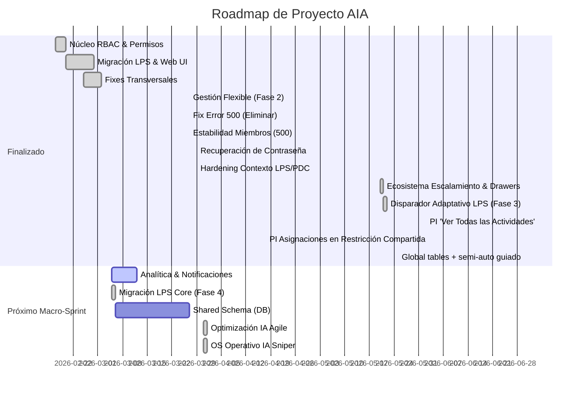

# Roadmap

Last Planner AIA hace visible el estado de la planificación de obra para que los equipos actúen
antes de que un punto crítico se vuelva un incidente. «Terminado» es que los cuatro programas de
abajo estén cerrados y el producto viva en producción sin deuda de gobierno.

## Fases

El detalle vivo, con su orden y sus dependencias, está en [[TASKS]]. Esta tabla es el resumen.

| Fase | Qué entrega | Estado |
|---|---|---|
| 0. Mudanza del repositorio | El repo en `~/Developer/lps-aia`, verificado antes del cutover | hecha (2026-08-18) |
| 0b. Wiki v2 | Vault entero etiquetado, 13 mapas de área, capa visual nativa | hecha (2026-08-19) |
| 1. Programa Design System | Cuatro fases F0–F3: definir, implementar y controlar | en curso |
| 2. Cierre hasta producción | Cinco fases | pendiente |
| 3. Móvil, tablet y tema claro | Siete fases | pendiente |

## Decisiones de rumbo

- 2026-08-21 — **La aplicación se queda con dos motores de tabla, no tres.** DataTables 1.10.21
  (CIC, CNC, CNP, control de cambios y el panel de administración) es el carril a retirar: sale
  hacia AG Grid, que ya vive en Plan de Compras y es el mismo motor que se usará de aquí en
  adelante. **No abre frente propio:** se cobra cuando haya que entrar a una de esas pantallas por
  otra razón. Handsontable se queda donde está — las seis rejillas del Last Planner llevan años de
  reglas de negocio y cambiarlas de motor es un proyecto, no una limpieza. Registrado por decisión
  de Felipe. Tarjeta operativa en [[TASKS]].
- 2026-08-19 — **El gate de publicación bloquea por la forma de la wiki**; la alarma de veracidad
  solo avisa. Un defecto de lo que publicas no es lo mismo que un contador que pide trabajo.
- 2026-08-19 — **Los cinco archivos de la wiki del proyecto viven en la raíz**, y los dos que ya
  existían dentro de `memoria/` se migraron en vez de duplicarse. Dos fuentes únicas no son una.
- 2026-08-19 — **Un tag nunca duplica el `tipo` ni el `estado`.** De ahí que `moc` saliera del
  vocabulario: `tipo: mapa` ya significa MOC. Detalle: [[docs/wiki-operacion]].
- 2026-08-18 — **Replanteo completo de la wiki** conservando la metodología LLM Wiki, con
  frontmatter en todas las fuentes. Detalle: [[docs/superpowers/specs/2026-08-18-wiki-v2-visual-design]].
- 2026-08-18 — **`MAIL_TRANSPORT`**: en producción el correo sale por `sendmail`, no por relay
  externo. Lo decide la categoría de la IP de origen, no la autenticación.
- 2026-08-18 — **El design system se rehace por programa F0–F3**: no está bien definido, ni bien
  implementado, ni bien controlado. Detalle: [[memoria/decisiones/programa-design-system-en-cuatro-fases]].
- 2026-08-04 — **El PDC v1 se eliminó.** Su sucesor es Plan de Compras v2. Detalle: [[docs/pdc-v2]].

---

Lo que sigue es el roadmap de arquitectura de marzo de 2026, que se conserva como historia: su
Gantt, sus hitos y su backlog estratégico siguen siendo la referencia de cómo se llegó aquí.

## ROADMAP de arquitectura (marzo 2026)

Fecha: 2026-03-02

## Objetivo Estratégico

Visión unificada y plan de adopción metodológica de **Last Planner System (LPS)** con **Arquitectura Híbrida**, **Control de Acceso (RBAC)** y futuras integraciones avanzadas (Analítica y Shared Schema).

## Regla Arquitectónica Vigente

- La BD aprobada es **global-only**: tablas globales con `project_id`.
- No se permiten nuevas dependencias runtime a tablas `{prefix}_*`.
- Listado, Contratos y PDC usan automatización semi-asistida con preview obligatorio y trazabilidad global.
- La confianza semi-auto es `0-100`: listo `80-100`, revisión `50-79`, no recomendado `<50`.

---

## 📅 Timeline de Desarrollo (Diagrama de Gantt)

---

## ✅ Historial de Hitos Alcanzados (V0.1 a V1.0-RC1)

<b>🛠️ Fases Tempranas (0 a 3) - Core RBAC y Autenticación</b>

- **Fase 0 - Baseline:** Congelamiento de matriz y eventos fuente (`docs/rbac_phase0_baseline.md`).
- **Fase 1 - Catálogo RBAC:** Setup inicial de migraciones SQL y siembra de eventos/roles en `lastplanneraia_dev`.
- **Fase 2 - Core Services:** Desarrollo de `RbacCatalog.php`, `RbacService.php` y envolturas `authorizePermission()` integradas al MVC Front Controller.
- **Fase 3 - Admin Console:** Purga de cargo repetitivos (de 47 a 22 cargos directos) integrados al dictionary formal en `/admin`.

<b>🛡️ Fases Intermedias (4 a 5C) - Endurecimiento LPS y Deuda Técnica</b>

- **Fase 4 - Paridad Frontend:** Traducción de identificadores de roles asimétricos hacia los 9 roles canónicos (`A`, `D`, `R`, `OT`, etc.) en Handosontable.
- **Fase 5 - Hardening Backend:** Prohibido el paso de endpoints en `construccion/` que escriben reportes/LPS con un 403 limpio desde `RbacGuard.php`.
- **Fase 5A y 5B - Deuda Técnica & UI:** Centralización de Outputs en un solo super-servicio `ReportController`, mitigación de crash CLI y rediseño interactivo vía `rbac_capabilities.js`.
- **Fase 5C - QA RBAC:** Muestreo automatizado con scripts `docs/rbac_phase5c_check.php` para validar colisiones de permisos cross-role.

<b>🚀 Fases Recientes (6 a 6.3) - Limpieza, Accesibilidad y Codificación</b>

- **Fase 6 - Limpieza Migratoria:** Remoción quirúrgica del módulo superpuesto `PaquetesContratacion` para favorecer a la vista canónica de `/contratos`.
- **Fase 6 - Limpieza Legacy Masiva (Fase 1):** Eliminación de ~1350 archivos obsoletos y muertos (vendor legacy duplicado, fpdf184, módulos inactivos y routers antiguos) del directorio `construccion/` para reducir deuda técnica sin impacto funcional.
- **Fase 6 - Migración Arquitectónica de Vistas (Fase 2):** Movidos todos los archivos `.view.*.php` activos desde `construccion/{modulo}/views/` hacia el directorio moderno `views/{modulo}/`. Se actualizaron los requerimientos en los controladores MVC con paths resolutivos absolutos.
- **Fase 6 - Kill Switch Legacy (Fase Final) ✅ (2026-03-09):** Eliminación definitiva y absoluta del directorio `/construccion/` original. Refactorización masiva de endpoints asíncronos en `src/Legacy/Endpoints/`, unificación de assets en `/public/` y consolidación total del proyecto en la arquitectura 2026 MVC.
- **Fase 6 - Kill Switch Legacy (Fase Final) ✅ (2026-03-06):** Eliminación definitiva y absoluta del directorio `/construccion/` original. Refactorización masiva de endpoints asíncronos en `src/Legacy/Endpoints/`, unificación de assets en `/public/` y consolidación total del proyecto en la arquitectura 2026 MVC.
- **Fase 6.1 a 6.3 - UX, UI y Config:** Sustitución interactiva HTML en reportes, parches UTF-8 transversal para encodings fallidos como `Ń` o `ń` y normalizaciones visuales responsivas Single Line.
- **Fix Sobreposición de Miembros (2026-03-27):** Resolución de desbordamiento horizontal en la tabla de miembros mediante `.table-responsive` y utilidad `.text-break`. Blindaje del layout contra strings extremadamente largos que afectaban la usabilidad del panel de asignación. ✅
- **Filtro y Badge de Usuarios sin Proyectos (2026-03-27):** Implementación de lógica de filtrado en DataTables y mejora visual con indicador "Sin proyectos" para gestionar la visibilidad de usuarios sin asignaciones. ✅
- **Fix Tablet Viewport (2026-03-03):** Desactivación del zoom agresivo 0.7x en desktop (`tablet-viewport-scale.js`), suavizado a 0.85x para tablets reales, y media queries intermedias 768-1024px en `navbar.css` y `project_selector.view.php`.
- **Fix Notificaciones Legacy (2026-03-03):** Corrección de inyección dinámica DOM y resolución de condition race para asegurar la carga asíncrona segura del componente Outbox (Campana) en el ecosistema heredado.
- **Fix Panel Admin Moderno (2026-03-12):** Restauración del acceso al panel administrativo integrado moderno (`/admin`). Se corrigió el error fatal por rutas de Base de Datos huérfanas y se resolvieron los fallos 404 de assets (logo, css, js). ✅
- **Rediseño Sidebar Móvil (2026-03-03):** Implementación de la capa `aia-premium-drawer`. Transformación del menú colapsable en un Drawer (Premium Glassmorphism y animaciones spring) con Isla de Usuario (Thumb Zone UI) compartida entre MVC y Legacy.
- **Ajuste de Terminología LPS (2026-03-03):** Renombramiento del estado "No activa" a "Programada Manualmente" en Programación Semanal para mayor claridad operativa, diferenciando actividades agregadas por el usuario de las autoprogramadas.
- **Recuperación Formulario Nueva Actividad Modal (2026-03-03):** Restauración del HTML premium de dos columnas y refactorización en CSS Grid para compactar los campos. Reconstrucción completa de la lógica de hidratación JS (AJAX) para la "Bandeja de Excepciones No Autoprogramadas" en Programación Semanal.
- **Apple-Style Design System (2026-03-03):** Revisión de botones nativos de `.modal_nueva_sem` en la Bandeja de Excepciones para alinear la estética premium `oklch()`.
- **Estrategia CSS @layer 2026 ✅ (2026-03-03):** Migración completa de la arquitectura CSS a `@layer` (7 commits atómicos en `feature/css-layering-2026`). Se encapsularon 8 archivos CSS en layers estructurales (`reset`, `theme`, `base`, `layout`, `components`, `utilities`), se implementó un Unlayered Override Bridge para vencer a Bootstrap CDN, y se resolvieron 5 regresiones visuales (botones, overflow, nombres). Navbar abreviado inteligentemente vía JS.
- **Notificaciones PI Avanzadas (2026-03-03):** Implementación integral del sistema `NotificationService` con inyección de eventos en `guardar_programacion_intermedia.php` y `ProgramacionIntermediaController.php`. Incluye 4 grandes grupos lógicos: `pi_restriction_change` (subidas/bajadas/liberación), `pi_state_alert` (alertas de semáforo operativo), `pi_assignment` (asignación de Responsables y Subcontratistas), y `pi_shared_constraint` (cambios en lote), con un puente de mapeo avanzado de nombres legado a Usernames RBAC.
- [x] **Optimización UI PI (2026-03-03):** Integración de `HandsontableSelect2Editor.js` como custom editor en el Handsontable para las columnas del Subcontratista y Predecesoras en Programación Intermedia, mejorando la usabilidad.
- [x] **Restauración y Optimización Handsontable PI (2026-06-01):** Se restauró `public/js/modules/programacion_intermedia/hot.js` desde la base histórica previa al borrado accidental y se aplicaron patrones estabilizados de PG adaptados a PI: cache de estados/clases por fila, invalidación de metadata post-edición, render batch en guardado, anchos porcentuales para 17 columnas, `rowHeights` fijo y override mobile en `@layer components` para mantener la grilla visible a `375px` mientras no exista renderizador real de tarjetas.
- [x] **Fix Ancho Columnas PI con Sidebar LPS (2026-06-01):** Se normalizaron los ratios porcentuales de las 17 columnas de Programación Intermedia para sumar 100% del ancho disponible, se compactaron mínimos de `colWidths()` para evitar overflow residual y se mantuvo la reserva de 60px para scrollbar y disparador/sidebar de Concurrencia LPS como referencia de PG.
- [x] **Fix Color PG con Filtro + Scroll (2026-06-10):** Se agregó hook `beforeRenderer` en `hot.js` de Programa General que intercepta cada celda ANTES del render del DOM y sobrescribe `cellProperties.className` con el valor correcto del estado. Esto reemplaza el enfoque anterior (`afterRender` + `applyPGCellDomClass`) que fallaba en virtual scrolling por race conditions con el ciclo interno de renderizado de Handsontable 14.6.1. También se agregó `afterLoadData` hook para invalidar el cache de clasificación al recargar datos. Test E2E `test-pg-color-fix.mjs` valida que filas filtradas mantienen clases de estado correctas tras scroll a 8000px.
- [x] **Auto-generación del Plan de Compras desde Programa General (2026-06-11):** Implementado flujo inicial Programa General → familia constructiva → estrategia/modalidad → paquetes del Plan de Compras. Incluye patch SQL de mapeo (`general_pdc_familias`, reglas regex, opciones contractuales, ítems y aliases), permiso `lps.pdc.auto_generar`, API `/api/pdc/auto/{suggest,inventory,apply}` y wizard básico en Listado de Actividades con revisión obligatoria para redes de instalaciones. Smoke local sobre `da_porto` semana 1: `suggest` detecta 11 familias sobre 242 actividades e `apply` valida duplicados sin inserciones accidentales.
- [x] **Catálogo Maestro PDC por Familias (Fase 2 SQL) (2026-06-12):** Creado `database/patches/20260612_pdc_familias_maestro.sql` como patch autocontenido e idempotente para el nuevo modelo por familias. Re-siembra limpia de 75 familias constructivas, 125 reglas regex para texto normalizado, 75 opciones contractuales, 90 paquetes/items, defaults por categoría y `siempre_revision` para `CAMPAMENTO`. Validado en MySQL 8.0.40 sobre base temporal con 0 familias/reglas huérfanas. `database/dump_db_estructura.sql` quedó sincronizado para producción con tablas generales PDC y sin columnas Licify en `general_dias_procesos_contratacion` ni en tablas `{proyecto}_pdc`. Se agregó `database/patches/20260612_drop_licify_all_pdc_tables.sql` para eliminar Licify dinámicamente en todas las tablas `_pdc` de producción; luego se ajustó para phpMyAdmin con `USE dbhif4pdimjtxe` porque al ejecutarlo desde `information_schema` no encontraba columnas.
- [x] **Motor de Detección PDC v2 (Fase 2 Backend) (2026-06-11):** Reescrito `PdcAutoGenerateController.php` con pipeline de normalización (`strip_tags` → `html_entity_decode` → mayúsculas → sin tildes vía Transliterator NFD con fallback `strtr` → colapso de espacios) y matching three-pass: nombre de la actividad → niveles del breadcrumb `[Capítulo: ...]` (inmediato primero) → capítulo padre posicional (`Titulo != 0`) precargado en `loadProjectActivities()`. Flag `siempre_revision` ahora se lee de BD (reemplaza la constante hardcoded `MEP_FAMILIES_ALWAYS_REVIEW`; solo CAMPAMENTO fuerza revisión). Respuesta de `suggest` incluye metadata `matchedBy`/`breadcrumbLevel` por actividad para la UI de Fase 3. Script de verificación por reflexión `scripts/test_pdc_detection.php` ejercita los métodos reales del controller contra las 125 reglas en BD (datos reales de `da_porto` si existen localmente, o fixture sintético). Validado con datos reales de Da Porto semana 1 (242 hojas): 21 familias detectadas (techo del dataset; el motor anterior detectaba 11), cobertura 217/242 hojas (90%), 5/5 casos específicos OK. Se corrigieron en el patch las 5 reglas "por capítulo" (`CAPITULO.*X` → se agregó alternativa `^X$` porque el motor nuevo matchea niveles desnudos del breadcrumb) y se agregó `VACIADO.*CONCRETO`; las 25 hojas sin mapeo restantes son ASEO/ENTREGA DE APTOS (sin familia de compras).
- [x] **UI v2 del Modal de Auto-generación PDC (Fase 3) (2026-06-12):** Reescrita la UI de `#modalPdcAutoGenerar` en `views/listado-actividades/listadoActividades.view.php` (único archivo modificado, **sin cambios backend**). Carga TomSelect 2.3.1 con `<optgroup>` por `tipoContratoNombre` (un solo select en lugar de cascada de 2 pasos — el propio doc PDCA lo autoriza como criterio ACT). CSS embebido mobile-first con borde izquierdo por tier, chips de duraciones beige `#f4f1ea`, touch targets ≥44px. 13 helpers ES5 nuevos: `obtenerBadgeConfianzaPdc` (3 tiers Auto/Revisión/Manual con umbrales 80/50), `iconoFuentePdc` (fa-tag/fa-layer-group/fa-sitemap + title), `fuenteDominantePdc` (moda para header), `limpiarTextoActividad` (corrige bug visual de tags literales), `renderizarDiasPdc` (chips por proceso con 7 etiquetas), `construirOpcionesTomSelect` (optgroups/options con sub-línea de días), `sincronizarOpcionPdc` (camino único de sincronización checkbox/optionId/días). Ciclo de vida TomSelect con 3 puntos de `destroy()` (inicio del render, antes de vaciar listado, `hidden.bs.modal`) para evitar `.ts-wrapper` duplicados al recargar. Degradación elegante: `typeof window.TomSelect !== 'function'` deja operativo el handler delegado `change.pdcAutoOption` con select plano. `pdcAutoSuggestions` extendido con `opciones` por familia, `manualReview[]` y `matchedBy/breadcrumbLevel` por actividad para sección colapsable al final. Validado E2E con Playwright contra Da Porto (375×667 desktop y móvil): 21 cards renderizadas, 19 marcadas Auto + 2 Revisión (CAMPAMENTO), badges 84-98% confianza, iconos fuente 34 nombre / 204 breadcrumb / 0 capítulo, búsqueda TomSelect filtra por texto+grupo, cambio de opción actualiza chips de días, apply→25 paquetes insertados + 2 omitidos por duplicado, consola limpia, sin errores PHP en `docker logs`, recargar 3x sin `.ts-wrapper` huérfanos. Decisión de diseño documentada: input libre con creación de paquetes nuevos se difiere a Fase 4 (las 75 familias tienen opciones, así que la rama estaría muerta). Cierra Fase 3 del PDCA; desbloquea Fase 4.
- [x] **Optimización integral Listado → Contratos → PDC (2026-06-30):** Flujo semi-auto consolidado sobre tablas globales con `project_id`, preview obligatorio, apply por selección, undo, feedback y métricas.
- [x] **UX guiada para bandeja automática (2026-06-30):** La bandeja técnica se reemplazó por asistente de 3 pasos con grupos “Listo para aplicar”, “Requiere revisión” y “Conflictos”; detalle técnico solo Admin.
- [x] **Fix Persistencia de Filtros PI (2026-05-20):** Programación Intermedia conserva las condiciones nativas del plugin `filters` de Handsontable durante el refresco posterior a guardados individuales o cambios en lote, evitando que `loadData()` borre filtros activos hasta que el usuario los limpie manualmente o recargue la página.
- [x] **Fix Validación de Asignaciones PI con Filtros (2026-05-20):** La validación previa a editar restricciones ahora resuelve correctamente la fila fuente mediante conversión de índice visual a físico, evitando falsos bloqueos de "sin Responsable y Subcontratista" cuando hay filtros nativos activos.
- [x] **Corrección Regresión Edición PI (2026-05-20):** El hook `cells()` vuelve a leer la fila fuente directa para no clasificar actividades filtradas como encabezados, y la validación de asignaciones usa los valores visibles como respaldo antes de bloquear una restricción.
- [x] **Fix Persistencia de Filtros PS/PG y Real PS (2026-05-26):** Programación Semanal y Programa General replican la preservación de condiciones nativas de Handsontable aplicada en PI durante `loadData()`. PS además resuelve la fila fuente desde el índice visual antes de validar `Real`, evitando CNC falsos cuando hay filtros activos.
- [x] **Fix Inicialización de Celdas PS (2026-06-01):** `cells()` de Programación Semanal declara `cellProperties` antes de aplicar clases y `readOnly`, evitando el `ReferenceError` que bloqueaba el render de Handsontable al cargar `/programacion-semanal`.
- [x] **Fix Texto Plano en Filtros de Actividad HOT (2026-05-20):** Las columnas `Actividad` de Programación Intermedia, Programa General, Programación Semanal y Actualizar Cronograma mantienen el render jerárquico con HTML seguro en la grilla, pero transforman el `visualValue` del filtro nativo mediante `modifyFiltersMultiSelectValue` para evitar que el menú muestre etiquetas `<b>`/`<small>` en Handsontable 14.6.1. En Actualizar Cronograma también se normaliza el filtro de `programaAnteriorAsociar`.
- [x] **Fix Actualización Cronograma Excel/Mapeo (2026-05-25):** `/programa-general-actualizar` vuelve a descargar la plantilla desde `/archivosBase`, carga el selector `Asociar con...` desde la semana activa correcta, permite mapeo a roles A/D aun con semana cerrada y normaliza fechas importadas desde Excel priorizando seriales numéricos antes de textos validados `yyyy-mm-dd`/`dd-mm-yyyy`.
- [x] **Fix Contexto Estable Actualizar Cronograma y Plantilla Actividades (2026-05-25):** Actualizar Cronograma separa `semanaBaseActualizacion` de `semanaObjetivoActualizacion` para que los refrescos no alternen entre grilla vacía y datos del borrador. Listado de Actividades descarga `listadoActividades.csv` mediante endpoint MVC `/api/listado-actividades/template`.
- [x] **Fix Render HOT Actualizar Cronograma (2026-05-26):** `/programa-general-actualizar` usa `propToCol` compatible con Handsontable 14, refresca dimensiones tras `loadData()` y consulta la semana objetivo con `semana_objetivo` para evitar que el API cambie la semana base de sesión durante el mapeo.
- [x] **Restauración Local desde Producción (2026-05-26):** Se respaldó la base Docker local en `backups/local_lastplanneraia_dev_before_prod_restore_20260526_105525.sql`, se recreó `lastplanneraia_dev` y se cargó `backups/dbhif4pdimjtxe_prod_backup.sql`. Validación final: 286 tablas importadas y conexión app -> DB confirmada.
- [x] **Parche RBAC Producción G/S/SG (2026-05-27):** Creado `database/patches/20260527_rbac_g_s_sg_lps_read_permissions.sql` para conceder lectura explícita de Programa General, Programación Intermedia y Programación Semanal a roles Ambiental, SST y SST + Ambiental tras las validaciones server-side locales.
- [x] **Fix Importación Inicial de Cronograma (2026-05-28):** El importador de `/api/general/import` detecta columnas por encabezado real de la plantilla, conserva el esquema `0` en cargas iniciales y muestra errores de importación en la UI sin depender de consola.
- [x] **Fix Arranque Async Consolidación Reportes (2026-05-28):** El panel admin resuelve de forma robusta el binario PHP CLI y la ruta real de `admin/async/consolidate.php`, conserva logs en `admin/logs/consolidation_async.log`, amplía el umbral de `stale` para reportes largos y blinda reportes PDC/CIC ante datos vacíos o calificaciones integrales nulas, evitando falsos estados de conexión perdida.
- [x] **Fix de Coloreado y Edición Inmune a Filtros Nativos HOT (2026-05-30):** Se erradicaron todas las llamadas residuales e inestables de `getSourceDataAtRow` a lo largo de los cuatro módulos Handsontable (PI, PG, PS, Actualizar) y en el panel lateral de restricciones (`lps_drawer.js`). Se reemplazaron por lecturas físicas directas del array de origen nativo en memoria (`instance.getSourceData()[physicalRow]`), haciendo al coloreado y la edición 100% inmunes a los filtros del plugin de columnas de Handsontable 14. Validación Playwright completada con éxito rotundo (16/16 pruebas superadas sin fallos).
- [x] **Rediseño Responsivo en Caja Flexible (Flex-Wrap) de Leyendas PG/PI/PS (2026-05-30):** Consolidación visual transversal absoluta. Se eliminaron el CSS Grid y los estiramientos horizontales que deformaban las píldoras de color y desbarataban las barras de herramientas. Se migró a un layout unificado de caja flexible (`display: flex`, `flex-wrap: wrap`, `justify-content: flex-start`) con chips de ancho idéntico compacto (`155px`), misma altura (`32px`), tipografía homologada (`0.72rem`) y paddings simétricos. En móviles, se autoalinean en una cuadrícula simétrica de 2 columnas de ancho idéntico (`calc(50% - 8px)`). Validación de Playwright con éxito en Escritorio, Tablet y Móvil.
- [x] **Aislamiento de Logs por Corrida Única en Autoprogramar (2026-05-30)**: Se limitó la visibilidad de logs en el modal "Actividades Auto-gestionadas" y en el badge a los cambios ejecutados exclusivamente en la última corrida de la función. Se implementó una arquitectura de batching temporal con marcas de control en la tabla `_auto_program_log`, logrando un aislamiento determinista y retrocompatible validado con Caso 5 exitoso.
- [x] **Inmunidad de Actividades Reprogramadas en Autoprogramar (2026-05-29)**: Se corrigió el bug de desprogramación automática en Programación Semanal. Se otorgó inmunidad en `ProgramChangeDetector.php` para que actividades futuras reprogramadas voluntariamente (`estaActiva = true`) mantengan su estado activo, y se ajustó `$eligibleSubSql` en `autoprogramar()` y `sanear()` de `SemanalApiController.php` para evitar que la limpieza física elimine actividades viables no terminadas del consolidado. Suite de pruebas con Caso 4 validada con 100% de éxito en Docker.
- [x] **PI "Ver Todas las Actividades" (2026-06-02):** Nuevo toggle slider persistente en sesión dentro del toolbar de Programación Intermedia (Bootstrap 4 `custom-control custom-switch`, mismo patrón que `consoleLogsGlobalToggle` en admin/dashboard) que permite editar actividades fuera de la ventana de lookahead de 6 semanas, útil para registrar Sub-Contratista y Responsable AIA adjudicados con anticipación. Implementación: nuevo endpoint `GET /programacion-intermedia/set-view-all` (`setViewAll()` en `ProgramacionIntermediaController` con `authorizePermission('lps.programacion_intermedia.editar')`) con doble modo — AJAX (`?ajax=1` o header `X-Requested-With: XMLHttpRequest` → JSON) o navegación con `header('Location: ...)` como fallback. Parámetro `pi_view_all` en sesión, barrera `Semanas_Inicio <= 6` removida del WHERE de `list()` cuando el toggle está activo, y mitigación crítica: `Activa = 1` en `guardar_programacion_intermedia.php` solo se aplica cuando la actividad está dentro de la ventana 6-sem para evitar contaminación del cascade de `ProgramChangeDetector`. El semáforo de estados mantiene siempre los conteos de la ventana 6-sem (badge "(Ventana 6 sem.)" ámbar) y el JS (`hot.js`) consume `view_all` del payload de `getFilters` para usar `updateLegendCountsFromServer()` en lugar del conteo local cuando el toggle está activo. UX sin recarga: el slider dispara AJAX → `loadData()` refetchea la grilla y el semáforo. Estilo brand AIA verde #1a5633 para el active state del switch. Estado por defecto: desactivado.
- [x] **Gobernanza de Asignaciones en "Aplicar Restricción Compartida" PI (2026-06-03):** Corrección de bug silencioso donde `Sub_Contratista` y `Responsable_AIA` se sobreescribían en BD para todas las filas del lote aunque el usuario no hubiera marcado "Aplicar asignaciones comunes" — la guarda de `applySharedConstraints` ahora exige `applyAssignments=true` para ambos campos, garantizando simetría cliente/servidor. La validación de Responsable AIA obligatoria cuando solo se aplican restricciones también se eliminó: ahora el campo es opt-in, ligado al checkbox. El preview del modal se enriqueció con detección de conflictos (cuenta cuántas actividades tienen Sub-Contratista o Responsable AIA distintos al objetivo) y resaltado por fila. Decisión final de UX: el botón "Aplicar en Lote" **nunca se bloquea** y los warnings de confirmación se despliegan **solo cuando el conflicto puede materializarse**: (1) si `applyAssignments=OFF` se aplica directo sin alerta porque no se modificarán asignaciones; (2) si `applyAssignments=ON` y el último Preview detectó diferencias, se muestra "Conflictos de asignación" con el texto literal acordado; (3) si el Preview fue limpio, se muestra "Aplicar restricción compartida" (info); (4) si la configuración cambió tras el Preview, "Preview desactualizado"; (5) si nunca se ejecutó Preview, "No se validaron conflictos". Todos los textos están redactados a prueba de bobos: mencionan cuántas actividades se modificarán, qué columnas se sobreescribirán, y ofrecen "Cancelar" para ejecutar "Ver Conflictos" antes de continuar. El botón "Preview" se renombró a **"Ver Conflictos"** para comunicar con precisión que su función es detectar sobreescrituras de Sub-Contratista o Responsable AIA, no solo previsualizar restricciones. Smoke test PHP valida los 4 escenarios clave (`tests/test_pi_shared_payload_smoke.php`) y E2E Playwright `tests/browser/pi-shared-constraint-conflicts.mjs` cubre los 5 escenarios: aplicar sin alerta con `applyAssignments=OFF`, advertencia sin preview, info de preview limpio, stale tras cambio, reset al desactivar check.
- [x] **Unificación de Modales `.aia-modal` Verde AIA (2026-05-29):** Estandarización visual de modales Bootstrap visibles con header Verde AIA, body Linen, footer Alabaster, `modal-dialog-centered`, corrección de IDs duplicados reales en modales críticos y prueba Playwright no destructiva `tests/browser/modal-brand.mjs` validada en viewport móvil 375px. Validación final: `modal-brand.mjs` 59/59, `change-monitor.mjs` 30/30 y `filter-persistence.mjs` 16/16 sin fallos. Auditoría visual: 144 capturas desktop/móvil generadas en `test-output/modal-screenshots/`.
- [x] **Fix Monitor de Cambios PG/PI -> PS (2026-05-29):** Corrección del flujo de confirmación de acciones para usar promesas de `AIA.Notice.confirm`, envío de `db`/`semana` al endpoint `/api/semanal/apply-changes`, recarga segura de Programación Semanal tras aplicar cambios y rediseño responsive del modal con selección visible, filtros activos y confirmación clara.
- [x] **Estabilización de Autoprogramación en Cascada PG → PI → PS (2026-05-29):** Corrección quirúrgica del cálculo en `ProgramChangeDetector.php:resolvePaso3` para descomprometer de forma incondicional actividades finalizadas (estado "Terminada") y aquellas con restricciones rotas sin compromiso manual en PS. Validación integral determinista ejecutada mediante suite Playwright `tests/browser/auto-program.mjs` con 100% de éxito (23/23 validaciones exitosas). Generación de capturas de pantalla de evidencia y reporte detallado en `test-output-auto-program/REPORTE-AUTO-PROGRAM.md`.
- [x] **Fix Priorización de Ejecución Real sobre Restricciones en PS (2026-05-29):** Corrección del bug en el backend (`ProgramChangeDetector.php`) para respetar la regla que prioriza el avance ejecutado físico real (`Ejecutado > 0.001` en PG) sobre la verificación de restricciones en la programación semanal activa. Esto evita que actividades ya en curso sean desprogramadas (`Activa = 0`) o reciban CNC/CNP por preparativos pendientes, permitiendo su continuidad operativa y alineando la lógica PHP con la elegibilidad del frontend.
- [x] **Gobernanza de Decisiones de Usuario en Autoprogramación PS (2026-05-29):** Endurecimiento del motor de auto-programación semanal (`ProgramChangeDetector.php`) para respetar la soberanía del usuario: (1) Se omiten completamente modificaciones en actividades manuales (`Activa = 'NA'`), (2) se bloquean reactivaciones automáticas sobre actividades desprogramadas voluntariamente por el usuario (`Activa = '0'`) con Causas de No Programación (CNP) propias, y (3) se garantiza la inmunidad ante el saneamiento para actividades reprogramadas manualmente a activa (`Activa = '1'`) por el usuario a pesar de tener restricciones rotas, evitando bucles infinitos de sobreescritura silenciosa en el backend.
- [x] **Fix Renderizado de Actividades en Modal Auto-gestionadas (2026-05-29):** Corrección visual del modal de registro de auto-programación semanal en `changeMonitor.js` cambiando el método `.text()` por **`.html()`** al inyectar el nombre de la actividad. Esto resuelve la anomalía de renderizado en la que las etiquetas HTML de capítulo (`<b>`, `<small>`) aparecían como texto plano escapado, asegurando la consistencia estética con el resto de la plataforma y validando 13/16 smoke tests de Playwright exitosamente.
- [x] **Fix Carga de Contratistas en Módulo CIC (2026-05-29):** Se refactorizó la generación de registros en la tabla de calificaciones del proyecto (`generateMissingSubs`) para evitar campos `NULL` en `tipo_proveedor`, `correo_contacto`, `NIT` y `alcance`. Se incorporó auto-curación y mapeo para `'AIA (MO Directa)'` como `'Mano de Obra'`, solucionando la omisión de contratistas en el listado SQL.
- [x] **Fix Selección Visible PI (2026-05-27):** El botón `Seleccionar visibles` y el modal de restricción compartida ahora toman los índices visuales actuales de Handsontable, respetando filtros nativos de columna y evitando marcar todo el dataset cargado.
- [x] **Fix Edición PI con Filtros Activos (2026-05-27):** Eliminado `applyFiltersAndRender()` del guardado individual. Tras editar una celda ya no se recarga toda la tabla, evitando que se guarde en actividad incorrecta (stale visualRow) y preservando todos los filtros nativos activos. El `estado_operativo` y los contadores de leyenda se actualizan inline.
- [x] **Redefinición % Liberación como Promedio de 7 Restricciones (2026-05-27):** `Estado_Restricciones` ahora promedia las 7 restricciones (D_y_E, Materiales, MdeO, Equipos, Predecesora, Pdto_Cons, Modelo) excluyendo N/A, en vez de solo las 5 duras. Se actualizaron `calculateRestrictionStateRatio` (PI hot.js), `calculateRestrictionState` (PHP Controller), `guardar_programacion_intermedia.php`, `modificar_sem_estado.php` y `modificar_sem_estado_actualizar.php`. El estado operativo `Listo para comprometer` y alertas de restricciones en PG/PS siguen usando compuertas duras individuales (no el promedio). Se agregó `areHardRestrictionsMet()` en PI hot.js, PG hot.js y PG main.js para mantener la lógica de habilitación binaria basada en umbrales individuales. LPS drawer ya no usa `Estado_Restricciones` como fallback de ITR. Cache-buster: `hot37→hot38`, `lps_drawer.js→20260522d`.
- [x] **Asignaciones Opcionales en Restricción Compartida PI (2026-05-21):** El lote de Programación Intermedia ahora permite aplicar Sub-Contratista y Responsable AIA comunes mediante un check explícito, manteniendo por defecto la actualización exclusiva de restricciones para evitar sobrescrituras accidentales.
- [x] **Restricciones Múltiples en Lote PI (2026-05-21):** El modal de Restricción Compartida permite marcar una, varias o todas las restricciones con valores independientes en un mismo lote, con preview consolidado, actualización transaccional y recálculo único de `% Liberación` por actividad.
- [x] **Autoprogramación Semanal por Matriz de Restricciones (2026-05-21):** La autoprogramación de Programación Semanal deja de depender del promedio `Estado_Restricciones` y evalúa la matriz acordada: Diseños, Materiales, Mano de Obra y Equipos en `100%` o `N/A`, Predecesora en `>= 50%` o `N/A`, sin bloquear por Procedimiento Constructivo ni Modelación BIM. El flag `Liberada` queda alineado con la misma regla.
- [x] **Estados Operativos Accionables PI/PS (2026-05-21):** Programación Intermedia y Programación Semanal adoptan estados cortos orientados a habilitación (`inicio por habilitar`, `Alistamiento en riesgo`, `Condiciones Pendientes`, `Listo para comprometer`) con acciones dinámicas por restricción según su nivel real de avance. Se reemplaza el lenguaje punitivo por mensajes de habilitación en leyendas y resúmenes.
- [x] **Zoom Progresivo de Estado Operativo PI/PS (2026-05-21):** La columna de Estado Operativo ahora usa celda compacta con chip, pills de acciones y contador `+N`; el detalle completo se consulta mediante drawer lateral con bullets accionables, reduciendo altura de fila sin perder trazabilidad operativa.
- [x] **Checks Visuales CNP/CNC en Estado Operativo PS (2026-05-21):** El drawer de Programación Semanal distingue acciones hechas, pendientes, parciales, no aplicables y conflictos con pills de color y checks visuales. CNC y CNP se detectan explícitamente para mostrar si ya están registradas, incompletas o requieren revisión.
- [x] **Fix Leyenda Dinámica PS vs Modal Legacy (2026-05-21):** Programación Semanal usa `#modal_leyenda_colores_ps` para aislar la guía operativa dinámica del modal global inyectado por `funcionesGenerales6.js` con imagen `Leyenda_Actividades.png`. Se actualizó el cache-buster de `hot.js` y el render de la leyenda mantiene HTML escapado.
- [x] **Fix Etiquetas Sin Recorte PI (2026-05-21):** Programación Intermedia permite que chips, pills y contadores de Estado Operativo crezcan sin `overflow` ni clamps visuales, y activa autoajuste de altura en Handsontable para evitar etiquetas cortadas.
- [x] Corrección de `RbacCapabilities.canEditMga` (TypeError)
- [x] Migración de endpoint de listado a `/api/general/list` (404/405 Fix)
- [x] Implementación de **Nuevo Importador de Excel con Rollover Semanal, Activación Automática y Selector de Fecha Inicial** (Fase 4 Modernización) ✅ (2026-03-12)
    - Fix Fatal Error 500 (columna `Estado` faltante).
    - Activación automática de Semana 1 en proyectos nuevos.
    - Detección dinámica de jerarquía (WBS/Esquema).
    - Modal de éxito premium y redirección integrada (Manual de Marca AIA).
- [x] **Modelo Híbrido LPS 2.0: Importación con Herencia y Borradores** ✅ (2026-03-13)
    - Actualización dual `_programa` (baseline) + `_programa_consolidado` (borrador).
    - Herencia inteligente desde semana activa real (Restricciones, PDC, Responsables).
    - Borradores habilitados: S2+ se guarda sin activar hasta "Nueva Semana".
    - Fix Visibilidad: Filtro por defecto 'Mostrar Todas' para evitar falsos negativos tras rollover.
    - Fix Persistencia: Sanitización de IDs en `autoSaveRow` (SQLSTATE 22007 resolved).
    - Opt. API: Remoto filtro de fechas obligatorias para visibilidad total de registros.
    - Fix Sincronización:- [x] **Persistencia Garantizada**: Mapeos persistentes en base de datos tras refresco. Incluye botón "Eliminar Actualización" con borrado físico de borradores (`DELETE`) para un flujo de trabajo sin residuos de actualizaciones fallidas. ✅ (2026-03-13)
- [x] **Herencia Inteligente y Robusta (AIA 2026)** ✅ (2026-03-15)
    - Re-ingeniería de `getPreviousWeekData` con priorización de registros con datos.
    - [x] Sincronización proactiva de ratios desde API POST a Renderizadores.
  - [x] Fix del Colapso al Cambio Dinámico de Unidades (Ratio * Presupuesto calculado).
  - [x] Refactorización del Data Model en HOT (`hot.js`, `hot_actualizar.js`) para almacenar cantidad Física nativa.
  - [x] Fix GeneralApiController.php para manejo resiliente de fallback a porcentaje y error 400.
    - Unificación de lógica de herencia para Mapeo Manual (Dropdown) e Importación Excel.
    - Sincronización automática de las 7 restricciones individuales.
    - Normalización de nombres (Capítulos) y limpieza de etiquetas HTML activa.
- [x] **Paridad Programa General Actualizar** ✅ (2026-03-15)
    - Bloqueo de presupuesto para unidades `%`, permisos por rol y renderizado premium.
    - Fix UI: Alineación vertical de celdas y eliminación de números de fila.
    - Fix Editor: Estabilidad de TomSelect (ESC bug, closeAfterSelect).
- [x] Habilitación de POST en router para API General
- [x] **Corrección Integral del Motor de Ejecución (Base Ratio 0-1) ✅ (2026-03-16)**
    - Restauración total del motor `LpsService` a escala decimal (0.0 a 1.0).
    - API General actúa como traductor inteligente (Cantidades Físicas vs Porcentaje).
    - Sincronización de Frontend (`hot.js` y `hot_actualizar.js`) eliminando auto-divisiones indebidas.
    - Renderizadores adaptativos: Visualización de `Cantidad (Unidad) + %` basada en presupuesto.
    - [x] **Ejecución Real & Blindaje de Feedback (2026-03-18)**:
    - [x] **Cambio Dinámico de Unidades**: Prevención de colapso de porcentajes al cambiar unidades o presupuesto mediante conversión inteligente de Ratio a Cantidad Física.
    - [x] **Validación Preventiva JS**: Bloqueo de envíos fuera de rango (0-100%) en el navegador para eliminar errores 400 en la consola y red.
    - [x] **Flujo de Timeout de Sesión (Fase 1)**: Redirección con aviso SweetAlert2 y limpieza de URL para mejorar UX tras inactividad. ✅
    - [x] **Unificación de Notificaciones**: **AIA.Notice** consolidado como capa oficial. Se completaron las **Fases 2 y 3**, eliminando `alert()` nativos de helpers compartidos y de los Módulos Operativos LPS (Programación Semanal, Intermedia, General y PDC). ✅ (2026-03-18)
    - [x] **Hotfix Notificaciones**: Reparación de regresión CSS (!important) y soporte global para saltos de línea (`\n`) en `AiaAlertInterceptor.js`. ✅
    - [x] **Corrección de Bugs e Inconsistencias Reales**: Reordenamiento de argumentos en `AIA.Notice.warning`, eliminación de duplicidad de scripts en el dashboard y ajuste de copy genérico en Subcontratistas.
    - [x] **Estandarización Final AIA.Notice**: Migración total de `Swal.fire` y `window.confirm` a la capa oficial. Se refactorizó el interceptor para soporte de Promesas booleanas y firmas duales, eliminando 26 instancias redundantes en Subcontratistas, Profesionales, Programación Semanal y Administración. ✅ (2026-03-18)
     - [x] **Restauración Global de AIA.Notice (2026-03-24)**: Reinyección de SweetAlert2 + `AiaAlertInterceptor.js` en legacy, admin y login, con fallbacks seguros en helpers compartidos para evitar rutas silenciosas.
     - [x] **Autoguardado PI-Style Unificado (2026-03-24)**: Programa General, Programación Semanal, Programa General Actualizar, Subcontratistas y Profesionales ahora usan el badge inline de `AIA.Notice.badge('success', ...)` como patrón común de autoguardado.
     - [x] **Runtime Frontend Config y Feature Flags (2026-03-25)**: Nuevo endpoint publico `'/runtime/frontend-config.js'`, servicio `FeatureFlagService` con auto-creacion de tabla y switch global en Admin para controlar la visibilidad de `console.log` en login, selector de proyecto y vistas operativas.
     - [x] **Contexto Inteligente de Aterrizaje por Proyecto (2026-03-27)**: Refinamiento del `ProjectLandingService` para búsqueda descendente, priorizando semanas abiertas sobre confirmed-pending para mejorar el flujo de trabajo. ✅ (2026-03-27)
     - [x] **Gestión Proactiva de Timeout de Sesión (2026-03-28)**: Implementación de monitoreo frontend sincronizado (multi-pestaña), heartbeat asíncrono y redirección automática por inactividad. ✅ (2026-03-28)
     - [x] **Programación Semanal - Bloqueo por Asignaciones Incompletas (2026-03-25)**: El chip operativo y la clasificacion semanal ahora consideran faltantes de `Responsable_AIA` y/o `Sub_Contratista` como bloqueantes, evitando falsos `Lista para Confirmar` y bloqueando el cierre hasta completar asignaciones.
     - [x] **Fix CNP - Columna Liberada sin Warning (2026-03-25)**: La vista `/programacion-semanal/cnp` ahora tolera `Prog_Sin_Restricciones_100 = NULL` en DataTables y la autoprogramacion semanal vuelve a recalcular ese flag para prevenir regresiones al abrir la seccion.
     - [x] **Sincronización de Profesionales por Proyecto (2026-03-24)**: Nuevo servicio de conciliación entre `admin/` y `*_profesionales` con mapeo de roles `A/D/DCV/G/OT/R/S/SG`, consolidación de duplicados por correo, preservación de historial y bloqueo de identidad/cargo para registros gobernados desde Admin.
     - [x] **Control Local de Activo en Profesionales (2026-03-24)**: Los profesionales sincronizados desde `admin/` mantienen `nombre/correo/cargo` bloqueados, pero el proyecto puede administrar el campo `Activo` cuando el usuario sigue vigente en el proyecto; si sale del proyecto o entra en conflicto, queda inactivo y totalmente bloqueado.
     - [x] **Normalización Canónica del Nombre en Profesionales (2026-03-24)**: `*_profesionales` ahora persiste el `nombre` oficial de `general_usuarios` cuando el correo tiene coincidencia única, corrige históricos durante la sync, mantiene fallback local si no hay match confiable y preserva la carga del módulo al verificar dependencias sin error SQL.
    - [x] **Blindaje de Subcontratistas y PDC (2026-03-24)**: Validación integral de filas completas y unicidad por nombre, correo y NIT en Desktop, Mobile y adjudicación desde PDC, eliminando errores SQL crudos y altas parciales.
    - [x] **Persistencia Canónica de Cambio a % (PG)**: Al cambiar una actividad física a `%` o unidad vacía, Programa General ahora preserva el ratio backend de `Ejecutado`, limpia `cantidad_ppto` y reconstruye `Ejecutado Real` como porcentaje real tras guardar/recargar. ✅ (2026-03-20)
    - [x] **Fase 6.4 - Seguridad y Rutinas de Usuario ✅ (2026-03-25)**: Implementación de la rutina de cambio de contraseña obligatorio. Incluye bandera DB `force_password_change`, visualizador de progreso en Admin y modal de forzado en Login (`AIA.Notice.dialog`) con actualización asíncrona.
    - [x] **Carryover PS -> PG con Herencia/MAPEO ✅ (2026-03-25)**: Crear semana normal o con nuevo cronograma ahora arrastra desde Programación Semanal el `Ejecutado_Real`, `Responsable_AIA`, `Sub_Contratista`, `unidad` y `cantidad_ppto` hacia Programa General, respetando subdivisiones, `programaAnteriorAsociar` y normalizando a `%` cuando las medidas quedan inconsistentes.
- [x] **Deduplicación de Usuarios y Re-Mapeo de Proyectos (2026-03-26)**: Ejecución de flujo PDCA para sanitizar la tabla `general_usuarios` (eliminación de duplicados por correo) y consolidar el historial de `project_members` reteniendo el `id` con el proyecto más reciente. Se generó un único script SQL de truncado y reinserción para garantizar la integridad referencial.
- [x] **Eliminación Condicional de Permisos (Fase 1) ✅ (2026-03-27)**: Implementación de validación AJAX, bloqueo por actividad programada y automatización de baja de profesional (PDCA Ciclo 1).
- [x] **Gestión Flexible de Usuarios (Fase 2) ✅ (2026-03-27)**: Eliminación de la restricción de "mínimo un proyecto", permitiendo usuarios con cero asignaciones (PDCA Ciclo 2).
- [x] **Usuarios Persistentes e Inactivos en Admin (2026-03-27)**: Nuevo switch `Activo/Inactivo` con bloqueo de login y cierre de sesiones, filtro para ocultar inactivos por defecto, revocatoria total de permisos sin pérdida de historial y control individual de cambio obligatorio de contraseña.
- [x] **Hardening Contextual de Compras/LPS (2026-03-29)**: `ModuleRequestContext` centraliza `db` y `semana`, las APIs de Contratos/Listado/PDC exigen permisos explícitos y las escrituras quedan acotadas a la semana operativa para evitar cruces inseguros entre proyectos y periodos.
- [x] **Estabilización Operativa de Listado/Contratos/PDC (2026-03-30)**: Listado de Actividades ahora toma la semana máxima activa y resuelve la tarea de inicio por consecutivo real; Contratos recibió un refactor visual del modal de edición; y PDC consolidó paquetes con `general_dias_procesos_contratacion` según el tipo de contrato para mejorar exactitud y navegación del flujo de compras.
- [x] **Pulido Final de Navegación y Modales de Compras (2026-03-30)**: Se estabilizó el modal de Nueva Actividad con Select2 anclado al campo y layout consistente durante la captura, se unificó el shell visual de modales en Compras y PDC quedó configurado para autoactualizarse una sola vez al entrar desde PG, Actividades o Contratos manteniendo la semana operativa correcta.
- [x] **Word Wrap en Selector de Proyectos (2026-03-26)**: Actualización de reglas CSS (`white-space: normal`, `word-break: break-word`) en el componente de selección de proyectos para revelar el nombre completo sin recortes, mejorando la usabilidad de lectura rápida.
- [x] **Fase 11 - IA Agile Operative OS 2026 ✅ (2026-03-31)**: Adopción del Protocolo Sniper, Kill Switch de 5 intentos, ciclos PDCA y planificación por fases (Pro Planning) para maximizar la velocidad de entrega y la estabilidad del agente.
- [x] **Indicadores de Desviación PDC (Delta) ✅ (2026-03-31)**: Se implementó un motor de cálculo de desfases en `PdcApiController` y se enriqueció la UI de Compras con badges dinámicos que muestran el retraso en días de cada paquete.
- [x] **Panel Solo Alertas PDC ✅ (2026-04-07)**: Implementación de filtro semántico y semáforos de riesgo en la vista PDC para enfocar la gestión exclusivamente en los paquetes retrasados o sin configurar.
- [x] **Documentación Stitch Design System ✅ (2026-04-07)**: Integración de la base de conocimiento y estándares visuales AIA (`STITCH.md`) para componentes UI/UX, modularizando el diseño y variables OKLCH bajo un estándar corporativo.
- [x] **Fix Falsos Duplicados en Subcontratistas (2026-04-08)**: El módulo dejó de validar duplicados contra filas draft del grid y ahora usa solo registros persistidos cargados desde API, evitando bloqueos falsos por nombre, correo y NIT al crear subcontratistas.
- [x] **Configuración de la Bitácora IA**: Refactorización del `task-planner` para eliminar logs redundantes y favorecer planes quirúrgicos atómicos.
- **Select2 Arquitectura Inteligente y UI/UX Premium (2026-03-04):** Consolidación de Select2 Múltiple paramétrico y aislado, evadiendo colisiones del motor "outside clicks" de Handsontable mediante DOM-nesting atado directamente a la celda activa (`this.TD`). Refinamiento exhaustivo inyectando CSS modular para arreglos de espaciado interactivo, alineación flexible (`flex-wrap`) de chips y erradicación de gaps inter-elementos vía resets absolutos. Se forzó despliegue con actualizador de cache manual.
- **Erradicación de DataTables (2026-03-03):** Se eliminó por completo la dependencia visual y los archivos base (`*.view.nuevaBarra.php`) del antiguo jQuery DataTables en las vistas maestras de Programación General, Programación Intermedia y Programación Semanal, consolidando Handsontable como la única tecnología de grilla.
- [x] **[Hito 2 completado en refactor]** Ajustar breakpoints y overflow del header (Navbar global). Implementados breakpoints `xl`, `clamp()` typography y truncado inteligente por CSS (`navbar.css` y archivos base JS/PHP actualizados).
- **Fix Alerta Autoprogramación (2026-03-04):** Se corrigió la lógica de validación PHP en `guardar_programacion_semanal.php` para que las actividades con unidad en porcentaje (`%`) no levanten falsos positivos por falta de `Cantidad PPTO` al intentar autoprogramar, respetando las reglas de negocio base.
- **Alertas de Restricciones en Autoprogramar (2026-03-04):** Se implementó un nuevo sistema de alertas (Gate 2) que informa detalladamente qué actividades fueron omitidas por tener restricciones pendientes (< 95%) y especifica cuáles de estas (Diseño, Materiales, etc.) impiden la programación.
- **Auto-corrección de Unidades Vacías (2026-03-04):** Se añadió una sentencia UPDATE en `api/program/list.php` que formatea e inyecta la unidad implícita `%` en bases de datos legadas al momento exacto en que el usuario abre o consulta el módulo de **Programa General**.
- **Fix Navegación Select2 100% Funcional ✅ (2026-03-04):** Erradicación definitiva del "focus trap". Se implementó una captura global de teclado a nivel de `document` que garantiza la navegación (Tab/Flechas) incluso en celdas totalmente vacías, eliminando la dependencia del estado interno de Select2 y restaurando el foco al grid de forma instantánea.
- **Optimización de Foco en Select2 (2026-03-04):** Restauración forzada del foco al textarea nativo de Handsontable tras la destrucción del editor Select2, resolviendo la fuga de foco hacia elementos del header.
- **Distribución Asintótica de Cantidad Sugerida (2026-03-04):** Se rediseñó por completo el algoritmo de `proyeccionSemana` en el backend (`listar_programacion_semanal.php`). En lugar de calcular el avance basado puramente en un % lineal teórico que ignoraba los atrasos, ahora se emplea una aproximación asintótica (Opción 3) que distribuye equitativamente el _Remanente Real de Obra_ a lo largo de los _Días Calendario Restantes_, corrigiendo la miopía del modelo inercial y brindando una sugerencia de compromiso verdaderamente útil para "Last Planner".
- **Fix Mensaje Error Creación Semana (2026-03-04):** Corrección lógica en `funcionesGenerales7.js` y `funcionesGenerales6.js`. Al intentar crear una semana, si la semana más reciente del backend no está confirmada, la plataforma informará de forma exacta el número de la semana restrictiva que bloquea la creación, en vez de arrastrar la anomalía visual de la `semanaActual` de la UI.
- **Bloqueo Inteligente de Ceros Virtuales (2026-03-04):** Prevención de evasión de _Causas de No Programación (CNP)_ en Programación Semanal. Se inyectó validación en el hook `beforeChange` de Handsontable para detectar y rechazar valores `< 0.001`, forzando la apertura del modal obligatorio de CNP y desprogramando la actividad. Validación de defensa complementaria implementada en el backend PHP.
- **Unificación Visual de Barra de Acciones (2026-03-04):** Rediseño de la barra de herramientas en **Programación Semanal** para unificar su estética con **Programa General** y **Programación Intermedia**. Se eliminaron los fondos grises y bordes ("la caja") favoreciendo una interfaz limpia sobre fondo blanco, y se refactorizaron las clases CSS propietarias a un estándar modular (`header-actions`). Adicionalmente, se forzó el diseño de botones rectangulares (`border-radius: 4px`) venciendo las herencias de navegador.
- **Fix Validación de Sobreasignación en Programación Semanal (2026-03-04):** Implementación de validación cruzada en `hot.js` que suma dinámicamente el `Compromiso` y `Ejecutado_Real` de todas las filas (subcontratistas) de una misma actividad. Esto previene que la asignación combinada supere matemáticamente el 100% o la Cantidad PPTO disponible, calculando dinámicamente un techo límite con base en la iteración de `masterData`.
- **Compatibilidad Cross-Browser CSS (2026-03-04):** Adición de la propiedad estándar `appearance: none` junto al prefijo `-webkit-appearance` en la definición global de UI de las vistas secundarias de Programación Semanal (CNC, CNP y CIC), resolviendo advertencias de compatibilidad CSS de los linters.
- **Fix Navegación Select2 Multi-Eje ✅ (2026-03-05):** Evolución del motor de navegación para Select2. Se habilitó el soporte completo para flechas verticales (Arriba/Abajo) integrando una "Navegación Inteligente" que distingue entre la selección de ítems (dropdown abierto) y el movimiento entre celdas (dropdown cerrado). Se optimizó el handler de captura para ser resiliente a búsquedas activas y saltos de fila automáticos al tabular.
- **Fix Causa Raíz Navegación Select2 ✅ (2026-03-05):** Corrección definitiva de `this.instance` → `this.hot` en `HandsontableSelect2Editor.js`. En Handsontable 14.6.1 la propiedad para acceder la instancia del grid es `this.hot`, no la legada `this.instance`, por lo que toda la lógica de navegación (Tab, flechas, selectCell) nunca se ejecutaba.
- **Auto-apertura de Dropdowns al Navegar ✅ (2026-03-05):** Al navegar con Tab o flechas a cualquier celda con dropdown (Select2 o nativo) en PI, el desplegable se abre automáticamente. Se reutilizó `openDropdownEditorAtCell` desde `afterSelectionEnd` y se conectó con el editor Select2 vía `window.__piPendingNav`.
- **Migración LPS Core a API MVC ✅ (2026-03-06):** Finalización de la Fase 4 de modernización. Se migraron todos los endpoints legacy de **Programación Semanal**, **CNC**, **CNP** y **CIC** hacia controladores API robustos en `/src/Controllers/Api/`.
  - **Controladores Creados:** `SemanalApiController`, `CncApiController`, `CnpApiController` y `CicApiController`.
  - **Frontend Refactorizado:** `hot.js` y las vistas de soporte (`cic.view`, `cnc.view`, `cnp.view`) ahora consumen JSON via AJAX/POST eliminando la dependencia de scripts PHP planos en `construccion/`.
  - **Lógica Preservada:** Se integró la autoprogramación asíncrona, el split de subcontratistas, la reprogramación de actividades y el cálculo automático del CIC (Calificación Integral) dentro de la arquitectura moderna.
  - [x] **Construcción y Despliegue del Master SQL Híbrido (2026-03-26):** Se diseñó un Sandbox Efímero en Docker para fusionar el esquema 2026 de desarrollo con la data legacy de producción. Se inyectaron dinámicamente 90 tablas relacionales para `pi_shared_constraints`, se purgaron los 29 proyectos de datos históricos basura y se cargaron intactas las tablas globales configurables (`general_*` + RBAC) en SiteGround.
  - [x] **Fix 404 Añadir Miembros (2026-03-26)**: Renombrado de endpoint `/admin/proyectos/miembros/añadir` a `/agregar` para prevenir fallos 404 ocasionados por codificación URL del carácter especial `ñ`.
  - [x] **Despliegue General a Producción SiteGround (2026-03-25):** `main` quedó sincronizada en `prueba-lps.lastplanneraia.com` vía SSH (`git reset --hard origin/main`), con Composer validado sobre PHP 8.3 CLI. Adicionalmente, la base `dbhif4pdimjtxe` fue clonada desde el entorno local, replicando estructura y datos de prueba para validar las nuevas funcionalidades y refactorizaciones en producción controlada.
  - **Seguridad:** Se mantuvieron los túneles RBAC y la validación de contexto de base de datos/semana en cada petición.
  - **Fix CIC Evaluaciones (2026-03-06):** Reescritura de `CicApiController::updateMetrics()` para incluir el cálculo de promedios por disciplina (Calidad, GSA, SST, ADM) y corrección del campo Observaciones (`mdo_Observaciones`/`si_Observaciones`).
  - **Migración PI list/save (2026-03-06):** Se añadieron los métodos `list()` y `save()` al controlador existente `ProgramacionIntermediaController`, migrando los 2 últimos endpoints legacy de Programación Intermedia. El `save()` delega al script legacy (608 líneas) que contiene la lógica de alertas y notificaciones.
  - **Migración PG API (2026-03-06):** Se creó `GeneralApiController.php` consolidando la lógica de `list.php`, `update.php`, `update_batch.php` y `get_codigos_actividad.php`. Se actualizaron las llamadas AJAX en `hot.js` y `main.js`. ✅
  - **Fix DataTables vs MVC API (2026-03-06):** Reversión estratégica de mapeo de rutas a `POST` en el Front Controller para restablecer el consumo nativo de las tablas legacy sin comprometer la nueva arquitectura Handsontable (Fase 4).
  - **LPS Service Refactor (2026-03-06):** Centralización de lógica core (`calculateGeneralStatus`, `calculateWeeklyProjections`, `disableProductivityMeasurementTemporarily`) en `LpsService.php`. Reducción de deuda técnica mediante la eliminación de `require_once` de scripts legacy en `GeneralApiController` y `SemanalApiController`. Creación y registro de ruta `/api/indicadores/generar` en `IndicadoresApiController`.
  - **Fix Fatal Error 500 en Programación Semanal Server (2026-03-09):** Eliminación de un `require_once` residual apuntando a `construccion/conexion.php` en el archivo `programacion_semanal.view.php` que provocaba caída total en Siteground al intentar abrir el módulo. La Base de Datos ahora es aprovisionada nativamente mediante `Database::getInstance()` inyectada por el Controller.
  - **Migración a Tom Select (2026-03-09):** Reemplazo definitivo de Select2 por Tom Select v2.3 en Programación Intermedia para erradicar el bug de Scroll Lock. Creado `HandsontableTomSelectEditor.js` aislando el DOM y previniendo fugas de eventos en `window`.
  - **Fix Desalineamiento y UI de Tom Select (2026-03-10):** Corrección visual del offset y superposición de anchos. Restauración del ancho dinámico (min 300px) para evitar truncamiento de nombres largos. Implementación de botón elegante de **"Limpiar"** con icono y texto, siguiendo el manual de marca AIA y garantizando bypass de caché mediante versionamiento de scripts (`v=tomselect11`).
  - **Fix Creación de Semana LPS (2026-03-12) ✅:** Corrección integral de 12 hallazgos en el flujo de creación de semana. Se eliminó `funcionesGenerales7.js` (código muerto), se robusteció el backend `nueva_semana.php` con validación de programa maestro vacío, se migró a RBAC real (`permiso_canonico`), se corrigieron vulnerabilidades de SQL Injection en evaluaciones CIC y se resolvieron bugs de "Invalid Date" en Safari y proyectos nuevos. Se implementó manejo de errores asíncronos (`.fail()`) para evitar bloqueos de UI (spinner infinito).
- **Paridad Local-Producción y Limpieza de Rutas (2026-03-11):** Sincronización exitosa del entorno Docker local con SiteGround. Eliminación definitiva de todas las referencias hardcodeadas a `/construccion/` en JavaScript, PHP (vistas), y configuraciones. Implementación de capa de enrutamiento comodín `/legacy/` en `index.php` para scripts huérfanos y redirección de persistencia de archivos a `/public/storage/`.

- [x] **Optimización del Cargador de Head y Localización de CDNs (2026-05-30) (Fase GOAL) ✅:**
    - Localización masiva de 15+ dependencias de CDNs externos (FontAwesome v5.11.2, Bootstrap v4.3.1, DataTables v1.11.4, AnyChart v8, Select2, SweetAlert2, Toastr, jQuery y jQuery UI) en `/public/vendor/` servidos localmente a **0ms** reales de red.
    - Mitigación del comportamiento destructivo de `head.innerHTML = staticContent` en `linksComunesHead2.js` mediante la implementación de inyecciones secuenciales dinámicas no intrusivas con `document.createElement` y validación de existencia previa para preservar la caché del navegador.
    - Reducción del tiempo de renderizado de la grilla de Handsontable (HoT Render) de **~6.4 segundos a 15 ms** en frío, eliminando el bloqueo acumulativo de conexiones externas.
    - Validación del 100% de la suite de telemetría de red con Playwright (`diagnose-cascade.mjs`) en el contenedor Docker.
- [x] **Estado `Ejecución con restricciones` en Programación Semanal (2026-05-21)**: Nueva clasificación no bloqueante para actividades con avance registrado pero restricciones habilitantes pendientes (Diseños, Materiales, MO, etc.). Se agregó el estado `prog-ejecucion-con-restricciones` en `stateMachine.js`, `hot.js` (chip + leyenda + KPI en cierre semanal) y `estado_programacion_semanal.php`. Sin bloqueo de compromiso, solo alerta visual informativa.
- [x] **Gate de Autoprogramación: Ejecución vs Restricciones (2026-05-21)**: La autoprogramación (API y legacy) ahora permite insertar nuevas actividades si `Ejecutado > 0` o restricciones liberadas. Actividades con `Ejecutado = 0` y restricciones pendientes quedan bloqueadas, listadas como excepciones y reportadas en el modal de alertas. `listarExcepciones()` filtrado por la misma regla de elegibilidad.
- [x] **Pulido visual de etiquetas de Estado Operativo PI/PS (2026-05-21)**: Las etiquetas principales de Estado Operativo ahora usan layout interno en grid, contraste reforzado, multilinea controlada a dos líneas y pills con wrap limitado para mejorar lectura sin modificar el ancho de columna.
- [x] **Labels compactos RC y Por Comprometer en Estado Operativo PS/PI (2026-05-21)**: Se abreviaron labels de ruta crítica como `RC`, se adoptó `Por Comprometer` en PS, se mantuvo la paleta vigente y se reforzó la diferenciación visual por criticidad sin modificar anchos de columna.
- [x] **Restricciones blandas Pdto. Construcción y Modelo BIM (2026-05-21)**: PS/PI separan habilitantes duros de restricciones blandas. Pdto. Construcción y Modelo BIM quedan como seguimiento visual ámbar y texto explícito en leyendas/modales, sin bloquear habilitación, estado operativo ni autoprogramación.
- [x] **Ecosistema de Escalamiento, Drawers y Dashboard Kanban Directivo ✅ (2026-05-21):** Implementación integral de drawers contextuales responsivos (Liquid Glass, OKLCH, @layer 2026), motor de escalamiento semanal, botón y codificación de WhatsApp SOS, controlador directivo, y Dashboard Kanban jerárquico de 4 columnas con emulación reactiva mediante adaptador `dummyHot` para la mitigación y bitácora unificada.
- [x] **Optimización de Drawer Contextual e ITR Habilitantes (Fase 2) ✅ (2026-05-22):** Ajuste del ancho del drawer a 320px con desplazamiento responsivo de grilla (`padding-right`) para prevenir superposiciones, renderizado jerárquico HTML (`innerHTML`), reajuste del termómetro de ITR para evaluar estrictamente las 5 restricciones habilitantes duras, y cache-busting global (`?v=20260522`) en 5 vistas maestras PHP.
- [x] **Disparador Adaptativo LPS y Reactividad Silenciosa (Fase 3) ✅ (2026-05-22):** Cajón Contextual colapsado por defecto para mitigar intrusión en Handsontable. Implementación de disparador adaptable (Sidebar vertical en Desktop y FAB circular en Móviles/Tablets). Incorporación de reactividad silenciosa en segundo plano con badge parpadeante (`🔥`) que alerta dinámicamente de crisis y bloqueos P1. Refinamiento estético definitivo que evita la sobreposición del disparador y del drawer sobre la navbar fixed-top y el subheader en pantallas de escritorio, encogiendo y alineando el body y la barra de navegación coordinadamente.
- [x] **Unificación Cromática y Contraste Premium (Fase 3.1) ✅ (2026-05-22):** Aplicación de variables corporativas oficiales `--aia-green` y `--aia-green-dark` al disparador lateral (vertical fijo en escritorio y móvil) y a la cabecera del Drawer Contextual, eliminando colores ad-hoc. Corrección de contraste para headings del cajón y aprobación exitosa de la suite de pruebas del servidor (100% PASS).
- [x] **Alineación Semántica del Cajón Contextual PG/PI/PS (2026-05-22):** El Cajón Contextual LPS ahora normaliza porcentajes (`33%`, `0.33`, `33`) con los mismos umbrales de habilitación, reconoce alias de Programación Semanal (`restr_*`, `Critica`, `Consecutivo_En_Programa`), excluye filas de capítulo y consume el adaptador de estado operativo de cada módulo para evitar diagnósticos contradictorios frente a la tabla.
- [x] **Ajuste de Severidad PS en Cajón Contextual (2026-05-22):** El estado semanal `Por Comprometer` deja de mostrarse como escalamiento directivo cuando la actividad está habilitada; el cajón lo trata como pendiente operativo, reserva SOS/tono crítico para bloqueos reales, ejecución con restricciones, incumplimiento crítico o alertas manuales.
- [x] **Matriz de Severidad y Color del Cajón Contextual LPS (2026-05-22):** Documentación en `docs/matriz-severidad-cajon-contextual-lps.md` de todos los escenarios PG/PI/PS, reglas de restricciones duras/blandas, CNP/CNC, sidebar y colores representativos alineados al manual de marca AIA.
- [x] **Modo Mantenimiento (2026-05-28):** Implementación de toggle de mantenimiento desde el panel admin. Crea/elimina archivo `.maintenance` en la raíz del proyecto. El Front Controller de la app (`public/index.php`) detecta el archivo y sirve `public/mantenimiento-aia.html` con HTTP 503. El panel admin (`admin/`) no se bloquea para permitir desactivación. Toggle visible en Configuración y Seguridad del dashboard admin.
- [x] **Implementación de Severidad Única en Sidebar y Cajón LPS (2026-05-22):** `lps_drawer.js` centraliza `normal`, `attention`, `critical`, `info` y `neutral`; `isCrisis` queda ligado solo a `critical`; el disparador lateral distingue atención ámbar sin pulso y crisis roja con badge; PS evita escalar `Por Comprometer`, `Condiciones Pendientes` e incumplimientos no RC, y PG/PI dejan de convertir actividades futuras 4-6 semanas en crisis.
- [x] **Fix Visual del Disparador LPS Attention/Critical (2026-05-22):** Normalización del badge superior del sidebar en desktop y móvil para evitar recuadros desalineados; atención mantiene badge ámbar sin pulso y crisis conserva badge rojo centrado con animación compatible con `translateX(-50%)`.
- [x] **Resaltado, Contraste WCAG AA y Overlays Fix Transversal en Todo el Sistema LPS (2026-05-29):** Replicación completa e impecable en todo el ecosistema Handsontable y DataTables de los 12 módulos de la aplicación (PG, PS, PDC, PI, CNC, CNP, CIC, Profesionales, Subcontratistas, Contratos, Listado Actividades, control-cambios y Actualizar Cronograma). Se intensificaron los colores de estado de fila (escala Tailwind 200/300) garantizando contraste de texto semántico oscuro superior a 4.5:1 (WCAG AA). Se forzaron líneas de demarcación (bordes grises nítidos `#cbd5e1 !important`) de forma global para Handsontable y DataTables, impidiendo que el background cubra las divisiones. Se corrigieron los overlays de box-shadow `:not(...)` y se inyectaron las clases de fila condicionales de CNC, CNP y CIC en `styles.css`. Se incrementó el cache-buster a `styles.css?v=piStateColors3`.
- [x] **Post-Licify Cleanup + Bug Fixes Transversales ✅ (2026-06-10):** Eliminación completa del step Licify del sistema: 14 referencias PHP (`_pdc_functions.php`, `PdcApiController`, `ContratosApiController`, `nueva_semana.php`, `ReportProcessor`, `Project.php`), 0 referencias restantes en JS. SQL patch aplicado a 8 proyectos (`20260609_drop_licify.sql`). Se corrigió el crash `pasos[8]` en PDC (TypeError por arrayOutOfBounds), se eliminaron columnas fantasma `_licify1/_licify2/_licify3` y se ajustaron `orderFixed`/`columnDefs` targets. Se agregó botón "Agregar fila" + `agregarFilaVacia()` para creación inline en Listado de Actividades. Se ocultaron formularios de proveedor/contrato/seguimiento por defecto (`display:none`) en el modal PDC. Verificados los 3 fixes con 0 errores en consola.

---

## 🎯 Backlog Estratégico (Siguientes Fases y Shared Schema)

<b>Fase 7 - Notificaciones por Rol e Inteligencia Asíncrona</b>

> **¿Para qué lo necesitamos?** En LPS, si un residente levanta una alerta o un subcontratista cambia un compromiso, el equipo no se entera hasta recargar tablas manuales. Esto automatizará avisos in-app.

- **Infraestructura Outbox:** Crear la tabla `system_notifications` y un `NotificationService`.
- **Sistema de Alertas Tempranas (AIA +CERTEZA):**
    - [ ] Implementar **Asistente de Turno AIA** (Panel de métricas proactivas en lenguaje natural).
    - [ ] Módulo de **Score de Fiabilidad de Subcontratistas** (Basado en PPC histórico).
    - [ ] Alertas de **Vencimiento de Restricciones** y **Actividades Zombie**.
- [x] **[Hito 2 completado en refactor]** Ajustar breakpoints y overflow del header (Navbar global). Implementados breakpoints `xl`, `clamp()` typography y truncado inteligente por CSS (`navbar.css` y archivos base JS/PHP actualizados).
- **Despachador y UI In-App:** Conectar los eventos emitidos con la interfaz de alertas globales (campana de notificaciones del Navbar).

<b>Fase 8 - QA Sistemático por Roles</b>

- Ejecutar un acceso metódico integral y simular flujos críticos con usuarios de prueba (ej. `test.R`, `test.D`) para asegurar blindaje absoluto de `RbacGuard` y `UI_Toggles` en la vista de producción.

<b>Fase 9 - Despliegue Gradual y Observabilidad</b>

- Integración de `Feature Toggles` para transiciones modulares en la vista Legacy vs Modern MVC.
- Incorporar monitorización, rollback scriptings, y logs server-side nativos para interceptación de `Errores 403` y `Excepciones 500`.

<b>Fase 10 - Shared Schema y Bitácora LPS (Construcción Futura)</b>

- Descenso y disociación de metadatos ultra-acoplados del super-modelo de `_programa_consolidado`.
- Transición escalonada a tablas vinculadas estandarizadas (`lps_shared_constraints`, `lps_constraint_links`).
- Implementación del concepto **"Inteligencia de Agrupación"** y Dashboards Reactivos de la **Bitácora LPS Operativa**.

---

## ✨ Feature: Monitor de Cambios PG/PI → PS (2026-05-28)

### Estado: ✅ Implementado

### Descripción
Monitor de cambios en Programa General (PG) y Programación Intermedia (PI) que detecta automáticamente actividades que pueden ser comprometidas en PS o que ya no cumplen restricciones duras.

### Tipos de cambio detectados
| Tipo | Descripción |
|---|---|
| A | Restricción liberada (todas las restricciones duras pasaron a OK) |
| B | Nueva actividad en PG (no estaba en PS ni en tracking previo) |
| C | Fecha de inicio/fin modificada en PG |
| D | Estado de actividad cambiado en PG |
| E | Actividad eliminada de PG (ya existe en PS) |

### Archivos creados
- `src/Services/ProgramChangeDetector.php` — Core de detección y aplicación de cambios
- `public/js/modules/programacion_semanal/changeMonitor.js` — Módulo frontend (modal, badge, acciones)
- `views/programacion-semanal/partials/_changeMonitorModal.php` — Modal con tabla de cambios y acciones
- `database/patches/20260529_monitor_cambios_pg_tracking.sql` — Parche SQL para tabla de snapshots

### Archivos modificados
- `public/index.php` — +2 rutas: detect-changes, apply-changes
- `src/Controllers/Api/SemanalApiController.php` — +2 métodos API
- `views/programacion-semanal/programacion_semanal.view.php` — Include modal + init JS
- `public/js/modules/programacion_semanal/hot.js` — Hook afterDataLoaded()

### Flujo
1. Al cargar PS → `ChangeMonitor.check()` → `POST /api/semanal/detect-changes`
2. Si hay cambios → badge "N cambios" en toolbar + modal automático (primera vez)
3. Usuario selecciona actividades y ejecuta: Comprometer / Descomprometer / Ignorar
4. Acciones se envían a `POST /api/semanal/apply-changes`
5. Grilla PS se refresca automáticamente

- [x] **Fix Edición PI/PG/PS con Filtros Nativos de Columna Activos (2026-06-01):** Se corrigió el mapeo visualRow/physicalRow en el handler `afterChange` de los tres módulos Handsontable (PI, PG, PS). `change[0]` ya es visual row, pero se trataba como physical row llamando `toVisualRow()` sobre él. Con filtros de columna activos (row trim map), esto causaba que `toVisualRow()` retornara `null` (fila filtrada en ese índice) o un visual row incorrecto, impidiendo el guardado y la actualización de estado/coloreado. Fix: `var visualRow = change[0]; var physicalRow = this.toPhysicalRow(visualRow);`. Archivos: `public/js/modules/programacion_intermedia/hot.js`, `programa_general/hot.js`, `programacion_semanal/hot.js`.

- [x] **Fix Coloreado PI con Filtros Nativos Activos — Ciclo 2 (2026-06-01):** Se reemplazó `refreshCellMetaForVisualRow` en PI para que, en vez de usar `hot.setCellMeta(visualRow, col, 'className', ...)` (que no actualiza visualmente las clases CSS de los `<td>` cuando hay un row trim map activo), use `hot.removeCellMeta(physicalRow, col, 'className')` por cada columna para limpiar el cache interno de HOT y forzar que el próximo `render()` re-evalúe la función `cells()`. Esto permite que las clases `pi-state-*` se actualicen inline tras editar con filtros activos. Hallazgo: `_cellMetaCache` no existe en HOT 14.6.1; el cache interno se gestiona mediante `getCellsMeta()` indexado por physicalRow. Archivo: `public/js/modules/programacion_intermedia/hot.js:545-561`.

- [x] **Re-evaluación Automática de Filtros Nativos Tras Editar Celda Filtrada — Ciclo 3 (2026-06-01):** Cuando el usuario edita una celda sobre la que hay un filtro nativo de columna activo (ej. "Responsable AIA: vacío"), el nuevo valor puede hacer que la fila ya no cumpla la condición. Se insertó `fp.filter()` tras `hot.render()` en el callback exitoso de guardado de los tres módulos (PI, PG, PS), forzando al plugin `filters` a re-evaluar el row trim map contra los datos actualizados. La fila desaparece automáticamente si ya no coincide. Guard condition: solo se ejecuta si `conditionCollection.isEmpty()` es falso (sin sobrecarga en el caso sin filtros). Archivos: `public/js/modules/programacion_intermedia/hot.js:2204-2207`, `programa_general/hot.js:1077-1080`, `programacion_semanal/hot.js:2115-2118`.

- [x] **Fix Coloreado Incorrecto con Filtros de Input — Ciclo 4 (2026-06-01):** Auditoría y fix de coloreado incorrecto al aplicar filtro por input (ej. "Responsable AIA = Andres Gomez Blanco") en PI. Tres hipótesis evaluadas estáticamente: (CR1) fallback `data['restr_' + prop]` en `restrictionValue()` — descartado, columnas no existen en schema; (CR2) fallthrough a `neutral` por datos faltantes (`Semanas_Inicio` sin llegar del API) — posible pero no confirmable sin navegador; (CR3) cache index mismatch tras `restoreHotFilterConditions` — resuelto vía `hot.render()` post-restore en `updateOrInitHot` de PI/PG/PS. Logging `window.__PI_DEBUG_COLOR` instrumentado en 5 puntos (buildRowClassCache, getPIRowMeta, restrictionValue, getState, refreshCellMetaForVisualRow) para verificación en navegador. Diagnóstico: el fix de Fase 2 es suficiente como raíz; si los IDs 6.1.6.1 y 7.1.5.4 persisten en `neutral`, la causa serían datos faltantes del API (Ciclo 5). Archivos: `public/js/modules/programacion_intermedia/hot.js`, `stateMachine.js`.

- [x] **Fix Coloreado PI por Celda con Filtros Nativos — Ciclo 5 (2026-06-01):** Cerrada la causa real persistente del caso `Responsable AIA = Andres Gomez Blanco`: el estado operativo y la BD ya clasificaban `17.2.1`, `6.1.6.1` y `7.1.5.4` como `liberated-control`, pero Handsontable conservaba clases `pi-state-*` obsoletas en `<td>` reciclados y el hook anterior solo aplicaba clases al `<tr>`. `applyRowClassesToDOM()` ahora limpia clases visuales antiguas (`pi-row-state`, `pi-state-*`, `pdc-header`, crisis/selección compartida) y reaplica `meta.rowClass` a cada `<td>` visible, además de sincronizar en `afterRender`. Verificado en navegador local: las tres filas quedan con `pi-state-liberated-control` en todos los `<td>` visibles y fondo azul uniforme, sin errores de consola. Archivo: `public/js/modules/programacion_intermedia/hot.js`.

- [x] **Fix Editabilidad PG con Filtros Nativos Activos (2026-06-01):** En Programa General, filas válidas como `9.5.1.7` podían perder editabilidad bajo filtros nativos porque `cells()` dependía del `prop` entregado por Handsontable y el `cellMeta` reciclado conservaba `pg-state-sin-datos`, `pg-cell-readonly` y `htDimmed`. Se agregó resolución robusta vía `colToProp`, snapshot visual cuando `toPhysicalRow()` aún no está estable, recalculo compartido de `className/readOnly` y sincronización de meta + DOM en `afterFilter/afterRender`. Verificado en navegador headless con proyecto `Optimización Aeropuerto JMC`, Semana 2, filtro `Id contains 9.5.1.7`: `codigo_actividad`, fechas, unidad y `EjecutadoDisplay` quedan editables; `cantidad_ppto` sigue bloqueada correctamente cuando `unidad = %`. Archivo: `public/js/modules/programa_general/hot.js`.

---

## 📚 Documentos Históricos de Referencia Oficial

Las siguientes guías establecen el soporte del desarrollo asíncrono y la declaración de la Constitución IA de la base de código.

1. [**Declaración de Arquitectura e IA** (`GEMINI.md`)](GEMINI.md)
2. [**Mapa de Sub-Sistemas MVC y Legacy** (`memoria/arquitectura/`)](memoria/arquitectura/)
3. [**Glosario Operativo** (`GLOSARIO.md`)](GLOSARIO.md)
4. [**Diccionario de Eventos Canónicos** (`docs/rbac_event_dictionary.md`)](docs/rbac_event_dictionary.md)
5. [**Migración Shared Schema (Architectural Ready)** (`docs/plan-migracion-shared-schema-sin-reporteria.md`)](docs/plan-migracion-shared-schema-sin-reporteria.md)
6. [**Migración Datos Cero Pérdida (Architectural Ready)** (`docs/plan-migracion-datos-zero-loss.md`)](docs/plan-migracion-datos-zero-loss.md)

---

## 📊 Lo que cambió para ti — Feb a Jun 2026

Una vista no técnica de los últimos 5 meses de evolución de Last Planner AIA, dirigida a residentes, directores, subcontratistas, oficina técnica y profesionales SST/Ambiental. Cuenta, en lenguaje cotidiano, cómo la plataforma pasó de ser una carga a una aliada, y a quién escalar según el tipo de necesidad (CALISOF, responsables de metodología, soporte técnico).

📄 [**`docs/analisis-productividad-feb-jun-2026.md`**](docs/analisis-productividad-feb-jun-2026.md)

> **Audiencia:** usuarios finales en obra. **Tono:** storytelling persuasivo, segunda persona, sin tecnicismos de software. **Enfoque:** productividad del día a día, antes vs. ahora, capacidades por perfil de usuario, invitación al feedback.
