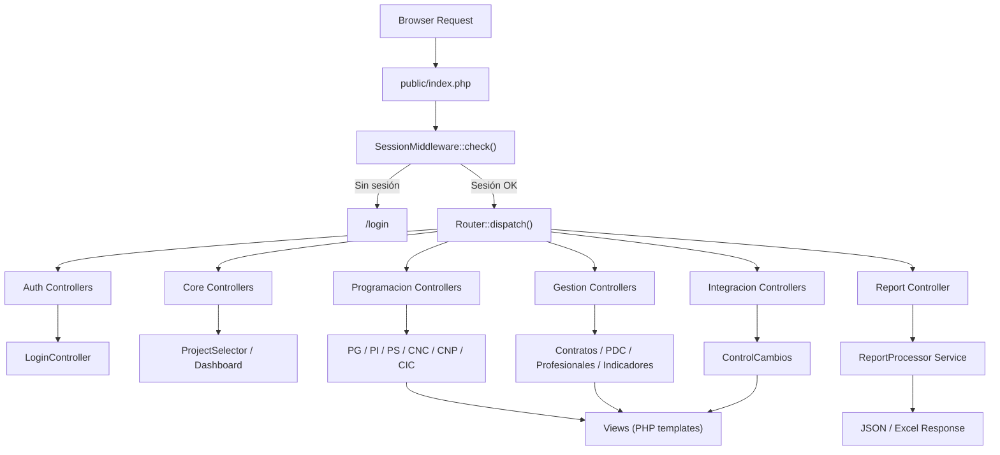
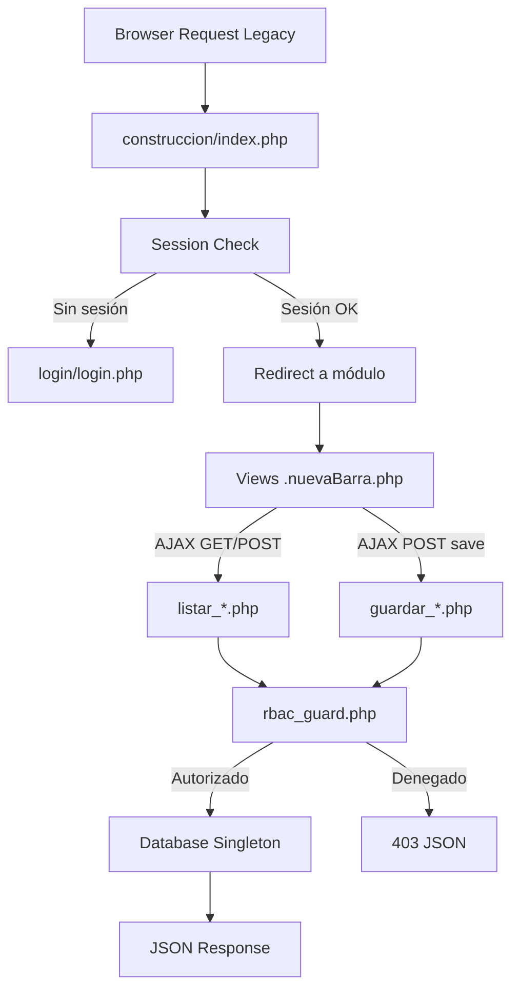
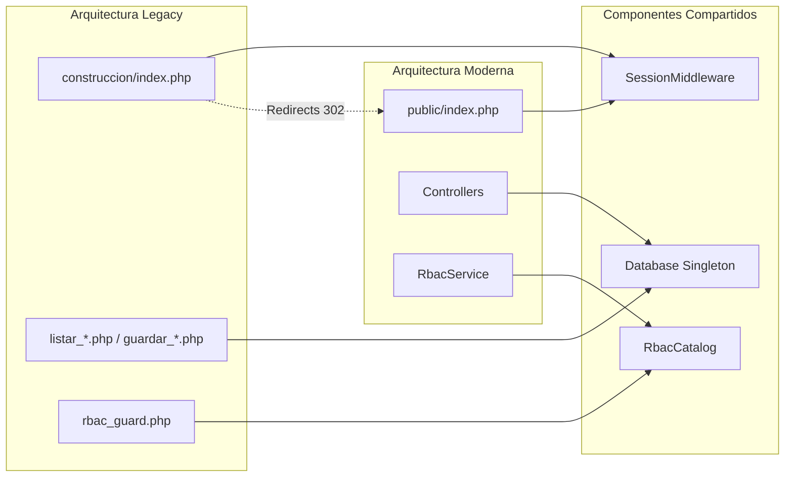

# Documentación de Rutas (Last Planner AIA)

Este documento centraliza todas las rutas vigentes y controladas por el **Front Controller** (`public/index.php`) de la arquitectura moderna. Toda petición debe pasar por aquí en lugar de acceder a scripts aislados en `construccion/`.

## 1. Autenticación (Auth)

- **`GET /login`**: Muestra el formulario de inicio de sesión.
- **`POST /login`**: Procesa las credenciales de ingreso.
- **`GET /password/forgot`**: Muestra el formulario para solicitar restablecimiento de contraseña.
- **`POST /password/forgot`**: Envía el enlace de recuperación por correo.
- **`GET /password/reset`**: Muestra el formulario de restablecimiento con token válido.
- **`POST /password/reset`**: Actualiza la contraseña desde el enlace de recuperación.
- **`POST /password/update`**: Cambia la contraseña forzada tras login inicial o política de seguridad.
- **`GET /logout`**: Cierra sesión y destruye cookies seguras.

### Auth Admin (`admin/public/index.php`)

- **`GET /admin/login`**: Muestra el formulario de inicio de sesión del panel administrativo.
- **`POST /admin/login`**: Procesa las credenciales del panel administrativo.
- **`GET /admin/password/forgot`**: Muestra el formulario de recuperación para administradores.
- **`POST /admin/password/forgot`**: Envía el enlace de recuperación del panel administrativo.
- **`GET /admin/password/reset`**: Muestra el formulario de restablecimiento del panel administrativo.
- **`POST /admin/password/reset`**: Restablece la contraseña del panel administrativo.
- **`GET /admin/logout`**: Cierra la sesión del panel administrativo.

## 2. Inicialización y Contexto (Core)

- **`GET /proyectos`**: Selector de proyectos (Fase 2 de la refactorización).
- **`POST /proyecto/seleccionar`**: Guarda el proyecto seleccionado en sesión.
- **`GET /dashboard`**: Página principal general o panel central.
- **`POST /context/week`**: Configura la semana activa de trabajo en sesión.
- **`POST /context/clear-week`**: Limpia la semana seleccionada del contexto.

## 3. Programación (Planificador)

- **`GET /programa-general`**: Vista principal de la Programación General.
- **`POST /programa-general/filtros`**: Solicitud AJAX para contar/obtener métricas de filtro.
- **`GET /programa-general/set-filtro`**: Persiste un filtro específico en la sesión.
- **`GET /programa-general-actualizar`**: Interfaz de actualización masiva del programa general.
- **`GET /programacion-semanal`**: Vista general de Programación Semanal.
- **`GET /programacion-semanal/cnp`**: Programación Semanal (Causas de No Cumplimiento - Programado).
- **`GET /programacion-semanal/cnc`**: Programación Semanal (Causas de No Cumplimiento - Completado).
- **`GET /programacion-semanal/cic`**: Programación Semanal (Control de Indicadores de Cumplimiento).
- **`GET /programacion-intermedia`**: Vista de Programación Intermedia (Lookahead / Restricciones).
- **`POST /programacion-intermedia/filtros`**: Solicitud AJAX para obtener filtros de la P. Intermedia.
- **`GET /programacion-intermedia/set-filtro`**: Fija filtros de sesión para P. Intermedia.
- **`POST /programacion-intermedia/shared-constraints/preview`**: Pre-visualiza impacto de restricciones compartidas.
- **`POST /programacion-intermedia/shared-constraints/apply`**: Aplica en lote restricciones compartidas.

## 4. Gestión Transversal

- **`GET /pdc`**: Plan de Compras.
- **`GET /profesionales`**: Administración de Profesionales de los proyectos.
- **`GET /subcontratistas`**: Módulo de empresas subcontratistas.
- **`GET /contratos`**: Gestión del listado de Contratos.
- **`GET /listado-actividades`**: Maestro general del Listado de Actividades de Sistema.
- **`GET /indicadores`**: Dashboard o gráficos de métricas KPIs del proyecto.

## 5. Reportes Dinámicos

- **`GET|POST /reportes/{tipo}`**: Endpoint único universal de reportes.  
  Soporta tipos como: `corte-programacion`, `restricciones`, `compromisos`, `consolidado-odc`, `curva-s`, `general`, `run-all`.

## 6. Integración Funcional

- **`GET /control-cambios`**: Módulo integrado de control de cambios.

---

## 7. Endpoints AJAX Legacy — Data API (`listar_*.php`)

> Estos scripts residen en `construccion/` y son consumidos vía AJAX (GET/POST) por las vistas Handsontable. Todos están protegidos por `rbac_guard.php`.

| Endpoint                                                     | Método | Descripción                          | Permiso RBAC                        |
| :----------------------------------------------------------- | :----- | :----------------------------------- | :---------------------------------- |
| `contratos/listar_contratos.php`                             | POST   | Contratos por proyecto               | `gestion.contratos.ver`             |
| `controlCambios/listar_controlCambios.php`                   | POST   | Órdenes de cambio                    | `integracion.control_cambios.ver`   |
| `indicadores/listar_indicadores.php`                         | POST   | PAC, Pareto CNC, métricas semanales  | `gestion.indicadores.ver`           |
| `indicadores/listar_detalles_indicadores.php`                | POST   | Detalle de indicadores por tipo      | `gestion.indicadores.ver`           |
| `listadoActividades/listar_listadoActividades.php`           | POST   | Actividades del programa           | `gestion.listado.ver`               |
| `pdc/listar_pdc.php`                                         | POST   | Plan de compras y contratación       | `gestion.pdc.ver`                   |
| `profesionales/listar_profesionales.php`                     | POST   | Equipo AIA del proyecto              | `gestion.profesionales.ver`         |
| `programaGeneralActualizar/listar_programaGeneralActualizar.php` | POST   | Vista actualización PG               | `lps.programa_general.ver`          |
| `programacion_intermedia/listar_programacion_intermedia.php` | POST   | Restricciones y lookahead            | `lps.programacion_intermedia.ver`   |
| `programacion_semanal/listar_programacion_semanal.php`       | POST   | Actividades de la semana           | `lps.programacion_semanal.ver`      |
| `programacion_semanal/listar_CIC.php`                        | POST   | Calificación integral contratistas   | `lps.cic.ver`                       |
| `programacion_semanal/listar_CNC.php`                        | POST   | Causas de no cumplimiento            | `lps.programacion_semanal.ver`      |
| `programacion_semanal/listar_CNP.php`                        | POST   | Compromisos no programados           | `lps.programacion_semanal.ver`      |
| `subcontratistas/listar_subcontratistas.php`                 | POST   | Empresas subcontratistas             | `gestion.subcontratistas.ver`       |

## 8. Endpoints de Persistencia Legacy (`guardar_*.php`)

> Procesan escritura (INSERT/UPDATE) desde Handsontable. Protegidos por `rbac_guard_require_permission()`.

| Endpoint                                                     | Permiso RBAC                        |
| :----------------------------------------------------------- | :---------------------------------- |
| `contratos/guardar_contratos.php`                            | `gestion.contratos.editar`          |
| `controlCambios/guardar_controlCambios.php`                  | `integracion.control_cambios.editar`|
| `listadoActividades/guardar_listadoActividades.php`          | `gestion.listado.editar`            |
| `pdc/guardar_pdc.php`                                        | `gestion.pdc.editar`                |
| `profesionales/guardar_profesionales.php`                    | `gestion.profesionales.editar`      |
| `programaGeneralActualizar/guardar_programaGeneralActualizar.php` | `lps.programa_general.editar`       |
| `programacion_intermedia/guardar_programacion_intermedia.php`| `lps.programacion_intermedia.editar`|
| `programacion_semanal/guardar_programacion_semanal.php`      | `lps.programacion_semanal.editar`   |
| `programacion_semanal/guardar_CIC.php`                       | `lps.cic.editar`                    |
| `programacion_semanal/guardar_CNC.php`                       | `lps.programacion_semanal.editar`   |
| `programacion_semanal/guardar_CNP.php`                       | `lps.programacion_semanal.editar`   |
| `subcontratistas/guardar_subcontratistas.php`                | `gestion.subcontratistas.editar`    |

## 9. Endpoints de Autoguardado (`autosave_*.php`)

| Endpoint                                       | Permiso RBAC                     |
| :--------------------------------------------- | :------------------------------- |
| `profesionales/autosave_profesionales.php`     | `gestion.profesionales.editar`   |
| `subcontratistas/autosave_subcontratistas.php` | `gestion.subcontratistas.editar` |

## 10. Archivos PHP Raíz Legacy

| Archivo                                                | Función                                                     |
| :----------------------------------------------------- | :---------------------------------------------------------- |
| `construccion/index.php`                               | Router de permisos legacy (redirect a módulo según rol)     |
| `construccion/cerrar.php`                              | Cierre de sesión legacy                                     |
| `construccion/conexion.php`                            | Singleton de conexión DB legacy (obsoleto, usar `Database.php`) |
| `construccion/reportes.php`                            | CLI/Cron de reportes batch                                  |
| `construccion/cambiar_pagina.php`                      | Paginador legacy                                            |
| `construccion/generarTablaHTMLProgramacionSemanal.php` | Generador HTML para Programación Semanal                    |
| `construccion/actualizarCICProyectos.php`              | Actualización batch de CIC por proyecto                     |

## 11. Diagramas de Arquitectura

### Flujo del Router Moderno (`public/index.php`)

### Flujo Legacy (`construccion/`)

### Puntos de Intersección

---

> **Nota Adicional:**
> Todos los accesos a estas rutas pasan primero por el `SessionMiddleware` y aquellos métodos restringidos son validados en el ciclo de vida del propio Controlador a través del `RbacService->can()`.
> Los accesos desde scripts paralelos .php en `construccion/` redirigen automáticamente en 301/302 a estas rutas limpias.
