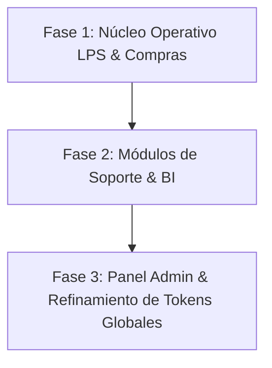

# Auditoría Visual Canónica y Plan de Reparación End-to-End (`DESIGN.md` + *Refactoring UI*)

**Fecha:** 2026-07-31  
**Estado:** Especificación Validada  
**Alcance Exclusivo:** Desktop (≥ 1180 × 820 px), Tema Operativo Dark (`#0b100d` / `#111a15`).  
**Reglas no permitidas:** Prohibido mobile, tablet o tema `linen`.

---

## 1. Resumen Ejecutivo y Metodología

Esta auditoría evalúa la totalidad de las superficies del sistema **Last Planner AIA** (18+ rutas distribuidas en 6 áreas funcionales) bajo los 8 principios del *Refactoring UI Design System* combinados con el contrato canónico `DESIGN.md` ("La Sala de Control Serena").

### Metodología de Scoring (1 a 10)
El puntaje de cada superficie se calcula mediante la fórmula `Puntaje = round(Controles_Aprobados / 8 × 10)` basada en los siguientes 8 chequeos de diagnóstico:

1. **Blur Test (Jerarquía)**: ¿El contenido primario sobresale claramente al desenfocar la vista?
2. **Grayscale Test**: ¿La estructura y prioridades se entienden en blanco y negro sin depender únicamente de color?
3. **Escala de Espaciado Estricta**: ¿Se utilizan únicamente valores de la escala `4, 8, 16, 24, 32, 48, 64 px`?
4. **Des-énfasis de Etiquetas**: ¿Las etiquetas de campo y encabezados de tabla están de-enfatizadas (menores/secundarias) respecto a los datos?
5. **Restricción de Ancho de Contenido**: ¿La prosa está limitada a ~65ch y los formularios a anchos controlados (o 28px en densidad PDC Excel-like)?
6. **Contraste WCAG AA**: ¿El texto cumple la relación de contraste de al menos `4.5:1` sobre fondos penumbra?
7. **Consistencia Tipográfica**: ¿Se utiliza Montserrat exclusivamente para jerarquía/decisión e Inter para lectura densa?
8. **Profundidad Escasa y Fría**: ¿Las sombras son sutiles, tintadas de frío y el vidrio (`.aia-glass`) está reservado solo a jerarquía?

---

## 2. Inventario y Diagnóstico Superficie por Superficie

### A. Acceso Público y Autenticación
| Superficie | Ruta HTTP | Score Actual | Brechas Principales | Estado |
| :--- | :--- | :---: | :--- | :---: |
| **Login Principal** | `/login` | **9/10** | Micro-ajuste en contraste de borde de input en reposo vs. focus. | Migrado |
| **Recuperación Contraseña** | `/password/forgot`, `/password/reset` | **7/10** | Estilos legados de Bootstrap compitiendo con clases `aia-input`. | Parcial |

### B. Contexto y Selección de Proyecto
| Superficie | Ruta HTTP | Score Actual | Brechas Principales | Estado |
| :--- | :--- | :---: | :--- | :---: |
| **Selector de Proyectos** | `/proyectos` | **8/10** | Las tarjetas de proyectos requieren estandarizar padding e insignias de estado (chips de severidad). | Migrado |

### C. Programación & Lean Construction (LPS)
| Superficie | Ruta HTTP | Score Actual | Brechas Principales | Estado |
| :--- | :--- | :---: | :--- | :---: |
| **Programa General (PG)** | `/programa-general` | **9/10** | Piloto canónico del DS. Excelente jerarquía y legibilidad opaca. | Migrado |
| **Prog. Intermedia (PI)** | `/programacion-intermedia` | **8/10** | Ajustar padding de celdas en la grilla y de-enfatizar encabezados. | Migrado |
| **Prog. Semanal (PS)** | `/programacion-semanal` | **8/10** | Píldoras de pestañas (CNP, CNC, CIC) requieren tokens `--ds-active-*` estandarizados. | Migrado |
| **Submódulo CNP** | `/programacion-semanal/cnp` | **7/10** | Modales de registro con jerarquía de etiquetas excesivamente prominente. | Parcial |
| **Submódulo CNC** | `/programacion-semanal/cnc` | **7/10** | Colores semánticos directos de Bootstrap en vez de tokens semánticos AIA. | Parcial |
| **Submódulo CIC** | `/programacion-semanal/cic` | **7/10** | Tabla de indicadores con líneas divididas excesivas (ruido visual). | Parcial |
| **Actualizar Cronograma** | `/programa-general-actualizar` | **7/10** | Zona de drag-and-drop de archivos requiere estandarizar bordes dashed y foco. | Parcial |

### D. Gestión Operativa & Compras
| Superficie | Ruta HTTP | Score Actual | Brechas Principales | Estado |
| :--- | :--- | :---: | :--- | :---: |
| **Plan de Compras v2** | `/plan-compras` | **9/10** | Excepción registrada de densidad 28px. Alto rendimiento en React. | Migrado |
| **Profesionales** | `/profesionales` | **6/10** | Tabla legada con padding heterogéneo y falta de des-énfasis en headers. | Legacy |
| **Subcontratistas** | `/subcontratistas` | **6/10** | Formularios con anchos desproporcionados (full-width innecesario). | Legacy |
| **Indicadores Operativos**| `/indicadores` | **7/10** | Tarjetas KPI con escalas de texto heterogéneas y sombras cálidas. | Parcial |
| **Control de Cambios** | `/control-cambios` | **7/10** | Tabla de log de auditoría requiere formateo mono para timestamps e IDs. | Parcial |

### E. Business Intelligence & Torre de Control (`/bi/*`)
| Superficie | Ruta HTTP | Score Actual | Brechas Principales | Estado |
| :--- | :--- | :---: | :--- | :---: |
| **Control Tower BI** | `/bi/control-tower` | **7/10** | Navegador superior `views/bi/_nav.php` con píldoras desalineadas en dark. | Parcial |
| **BI Vistas Especializadas**| `/bi/programa-general`, `/bi/intermedia`, `/bi/semanal`, `/bi/pdc`, `/bi/contratistas`, `/bi/responsables`, `/bi/curva-s` | **7/10** | Contenedores iframe / visuales con márgenes inconsistentes respecto al shell. | Parcial |

### F. Panel de Administración (`/admin/*`)
| Superficie | Ruta HTTP | Score Actual | Brechas Principales | Estado |
| :--- | :--- | :---: | :--- | :---: |
| **Admin Panel Global** | `/admin/*` (Users, Projects, Families, Dashboard) | **5/10** | Utiliza AdminLTE y Bootstrap legacy. Falta de tokens CSS `--ds-*`, grises no afinados, contraste débil en sidebar. | Legacy (Exento de migración completa por `AGENTS.md`, pero requiere alineación de contraste dark). |

---

## 3. Plan de Reparación End-to-End por Fases



### **Fase 1: Núcleo Operativo LPS & Compras (Prioridad Crítica)**
* **Objetivo:** Elevar el score de todas las superficies principales de trabajo en obra a ≥ 9/10.
* **Superficies:**
  - `/programacion-semanal/cnp`, `/cnc`, `/cic`: Reemplazar clases de colores directos por chips semánticos `.aia-chip` con `data-aia-severity`.
  - `/programa-general-actualizar`: Aplicar patrones de dropzone canónicos del DS con foco de 4px.
  - `/password/forgot` y `/password/reset`: Migrar vistas a componentes `.aia-card` e `.aia-input`.

### **Fase 2: Módulos de Soporte & Torre de Control BI (Prioridad Media)**
* **Objetivo:** Estandarizar la navegación secundaria y la presentación de datos en la gestión operativa (Score ≥ 8.5/10).
* **Superficies:**
  - `/profesionales` y `/subcontratistas`: Migrar cabeceras y celdas de tablas a la capa `table.css` del DS; aplicar `max-w-md` a los formularios.
  - `/indicadores`: Refactorizar tarjetas KPI con tipografía `Montserrat` Display (`1.875rem`) para valores e `Inter` Label (`0.875rem`) para descripciones.
  - `/bi/*` (Navegador BI `views/bi/_nav.php`): Aplicar `aia-glass` y estados activos de navegación basados en tokens `--ds-active-*`.

### **Fase 3: Panel Admin & Refinamiento de Tokens Globales (Prioridad de Mantenimiento)**
* **Objetivo:** Eliminar ruidos de contraste y adaptar el Panel Admin a la experiencia penumbra del sistema (Score ≥ 7.5/10).
* **Superficies:**
  - `/admin/*`: Inyectar hoja de adaptación dark sobre AdminLTE para asegurar contraste mínimo AA (4.5:1) en textos y laterales.
  - Verificación global de hojas sin capa y auditoría de ausencia de estilos inline.

---

## 4. Plan de Verificación y Control de Calidad (QA)

1. **Verificación Automatizada E2E**:
   - Ejecutar la suite de pruebas Playwright en viewport canónico `1180 × 820 px`:
     ```bash
     npx playwright test tests/browser/full-app-flow.spec.mjs --workers=1
     ```
2. **Auditoría de Accesibilidad & Contraste**:
   - Validar que ningún elemento de texto en superficies migradas presente un contraste menor a 4.5:1.
3. **Control de Rutas y Sesión (`DevDoor`)**:
   - Garantizar que todas las pruebas visuales accedan mediante `/dev/entrar?u=test.A&p=Da%20Porto`.

---

## 5. Especificación de Autorevisión (Self-Review)

- **Sin placeholders:** Todos los módulos, rutas y parámetros están explícitamente detallados.
- **Consistencia interna:** Cumple estrictamente el contrato de `AGENTS.md` (Dark Mode, 1180×820, sin mobile/tablet/linen).
- **Scope acotado:** Plan por fases ejecutable sin cambios destructivos ni refactorizaciones innecesarias en el backend.

## Cierre

**DEROGADA el 2026-08-24. Superada como vehículo, no ejecutada** — y la distinción importa: marcarla
«ejecutada» sería afirmar que su trabajo se hizo, y no se hizo por esta vía.

El veredicto ya estaba tomado y medido desde el **2026-08-20**, en
[[docs/superpowers/reports/2026-08-20-cierre-pendientes-auditoria]] §2, que lo dice con estas
palabras: «**los dos planes viejos quedan superados como vehículo** — la migración de CNP/CNC/CIC
entra al programa design system como entrada de DS-F2 con dueño, no se reabre un plan archivado sin
owner». Este `## Cierre` solo lo anota donde se lee.

### Qué la sustituye, pieza por pieza

| Lo que esta spec proponía | Qué lo sustituye |
|---|---|
| Inventario y scoring de 18+ superficies (§2) | **DS-F0 · Auditoría total** (`567e566e`, 2026-08-19): 68 hallazgos clasificados sobre un censo de **257 rutas**, en `docs/design-system/auditoria/`. Instrumento más ancho y con severidad declarada |
| Plan de reparación por fases (§3) | **DS-F2 · Reimplementación por adaptadores**, con CNP/CNC/CIC como entrada propia y con dueño (anotado en [[TASKS]] el 2026-08-20) |
| Redefinir tokens y criterios visuales | **DS-F1 · Redefinición del contrato** |

### Las dos superficies que motivaban reabrirla, medidas hoy

La auditoría del 2026-08-20 recomendaba «`impeccable:audit` puntual sobre esas superficies antes de
reabrir». Ese audit **ya se hizo** ese mismo día, y su veredicto sigue vigente — re-verificado en
esta sesión sobre el árbol actual, no leído del informe:

- **`/indicadores` — migrada, sin superficie propia que migrar.**
  `views/indicadores/indicadores.view.php:14` usa `aia-shell aia-shell--sidebar`, y su contenido es
  un iframe de Power BI (`:147`). El hallazgo DS-F0 correspondiente es **F0-082**, y su texto es
  revelador: «el "sin deuda" de `/indicadores` no significa lo mismo que en los demás módulos».
  La brecha que esta spec le atribuía —«tarjetas KPI con escalas de texto heterogéneas y sombras
  cálidas», 7/10— **no tiene dónde aplicarse**: esas tarjetas las pinta Power BI, no el repo.
- **CNP · CNC · CIC — legacy real, y el culpable es el JS, no el PHP.**
  `public/js/modules/programacion_semanal/legacyCards.js` da hoy **0** ocurrencias de `aia-`, **10**
  de `ps-legacy-card` y **2** de `btn btn-`. Intacto desde el veredicto (`git log --since=2026-08-20`
  sobre ese archivo: vacío). Hallazgo DS-F0 **F0-022**, mayor: las tres pantallas están declaradas
  en el manifiesto y **ningún escenario las cubre**.

Ese matiz es el que condena a esta spec como vehículo: proponía reemplazar clases en las **vistas
PHP** (§3, Fase 1), y la deuda real vive en un módulo **JavaScript** que ninguna de sus fases
nombra. Habría cerrado sin arreglar nada.

### Qué NO se pierde al derogarla

Nada de la deuda. `F0-022` sigue vivo y con dueño en DS-F2; `F0-082` está clasificado
`sin-problema` con su porqué escrito. Lo que se retira es **el plan como vehículo**, que es
justamente lo que no tenía dueño y por eso llevaba 24 días sin cerrar.

Su spec hermana [[docs/superpowers/specs/2026-08-01-ui-audit-core-lps-ops-design]] se deroga por lo
mismo y en el mismo acto.
