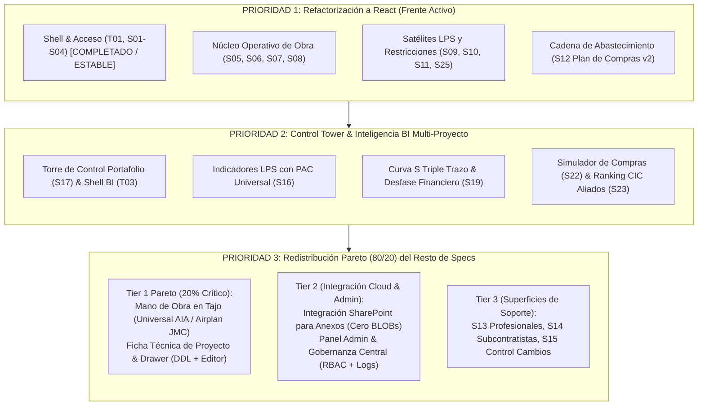
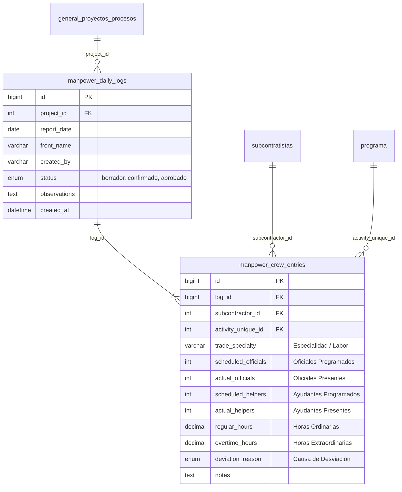

# Especificación Maestra: Gobernanza y Priorización del Roadmap LPS AIA

> **Estado:** Vigente. Aprobada como directriz estratégica de desarrollo el 2026-09-23 por Felipe Benítez.
> **Reglas Rectoras:** Aislamiento estricto por `project_id`, normalización de roles vía `App\Security\RbacService::normalizeRole()`, paridad visual estricta en temas claro y oscuro, cero refactors de cortesía y ciclo TDD con código de salida 0.

---

## 1. Mandato Estratégico y Propósito

El avance de Last Planner AIA requiere una secuencia de ejecución disciplinada que evite la fragmentación en múltiples frentes paralelos sin terminar. Con base en la consolidación de las **36 decisiones de Design System (Ronda 1)** y las **120 decisiones arquitectónicas de módulos (Ronda 2)**, se define el siguiente **orden cardinal de prioridades**:



---

## 2. PRIORIDAD 1: Refactorización y Migración a React SPA

### 2.1 Estado Actual Medido (Baseline)
- **Implementado en React (`frontend/src/`):**
  - `T01` (Shell Runtime: `SesionProvider`, `AppShell`, `BarraLateral`, `NavegacionSelectorProyectos`).
  - `S01` (Pantalla de Login con protección CSRF y rate limiting).
  - `S02` y `S03` (Recuperación y restablecimiento de contraseña con enlaces firmados).
  - `S04` (Selector de Proyectos con búsqueda difusa y selección de contexto).
- **Pendiente de Migración:**
  - Las superficies operativas de obra viven actualmente en PHP híbrido (`src/Controllers/` + `views/`).

### 2.2 Secuencia de Entrega de Prioridad 1

#### Bloque 1A: Núcleo de Planificación de Obra
1. **`S05` — Programa General (`/programa-general`):**
   - Altura de fila compacta a 30px (`line-height: 1.25`) en grilla Handsontable.
   - Bloqueo inmutable de semanas pasadas con candado y estilo `--ds-surface-well`.
   - Colapsado jerárquico EDT por niveles (1, 2, 3, Todos).
   - Indicador de celdas modificadas sin guardar (dirty state) y botón flotante de guardado.
   - Trazabilidad de ruta crítica con filete/rail rojo accesible.
   - Exportador Excel estructurado con jerarquía y fórmulas nativas.
2. **`S06` — Actualizador de Cronograma (`/actualizar-cronograma`):**
   - Reconciliación por lotes en segundo plano con barra de progreso.
   - Selector TomSelect con coincidencia difusa para mapeo inteligente de actividades EDT.
   - Historial de importaciones y diff visual de reprogramaciones.
3. **`S07` — Programación Intermedia / Lookahead (`/programacion-intermedia`):**
   - Control deslizante para horizonte Lookahead de 4 a 8 semanas (por defecto 6 semanas).
   - Matriz fija de los 7 Recursos con píldoras tipográficas (`C, P, M, MO, E, PR, ES`).
   - Propagación automática de restricciones compartidas con advertencia multiactividad.
   - Escudo de protección LPS: bloqueo de paso a Semanal si la actividad no cuenta con el 100% de restricciones liberadas.
   - Drawer de comentarios y bitácora en tiempo real.
4. **`S08` — Programación Semanal y Compromisos Diarios (`/programacion-semanal`):**
   - Grilla diaria Lunes a Sábado con check-in de cumplimiento diario.
   - Wizard "Auto-Programar" de 3 pasos para importar actividades liberadas del Lookahead (con `<i class="fas fa-magic"></i>`).
   - Etiquetado de Trabajo No Programado (TNP) con badge ámbar.
   - **Opción B de Felipe:** Agrupación estructurada por **frente de trabajo / EDT** y orden cronológico interno (no arrastre ciego plano).
   - **Opción B de Felipe:** Cierre semanal flexible con confirmación del Director de Obra y periodo de gracia configurable (evitando bloqueos rígidos de medianoche).
   - **Opción B de Felipe (Mano de Obra en Semanal):** Asignación por cuadrilla típica (número de oficiales/ayudantes) sin forzar nombres propios en la planeación semanal.
   - Píldoras satélite para apertura contextual de CNP, CNC y CIC.
   - Vista de impresión para cartelera de obra en formatos A3/A4.

#### Bloque 1B: Satélites LPS y Gestión de Restricciones
5. **`S09` — Compromisos No Programados (`/cnp`):**
   - Acción de 1 clic para convertir un CNP recurrente en Restricción de Lookahead.
6. **`S10` — Causas de No Cumplimiento (`/cnc`):**
   - Detonación automática obligatoria de modal CNC ante cualquier compromiso no cumplido.
   - Árbol de análisis de causa raíz "5 Porqués" en fallas críticas recurrentes.
   - Gráfico de Pareto interactivo con barras por categoría y línea de acumulación al 80%.
   - Atribución estricta de responsabilidad (AIA, Subcontratista, Cliente, Diseñador).
7. **`S11` — Calificación de Cumplimiento de Contratistas (`/cic`):**
   - Semáforo y percentil de calificación CIC por subcontratista.
   - Scorecard individual exportable del aliado.
   - Sello inmutable de cierre de evaluación semanal.
8. **`S25` — Restricciones y Escalamiento (`/escalamientos`):**
   - Tablero Kanban visual de 4 columnas (Por Iniciar, En Proceso, Vencida, Liberada).
   - Semáforo en días de calendario bajo la denominación en español **"Plazo Límite de Compromiso"** (erradicando la sigla anglosajona SLA).
   - Escalamiento jerárquico en 3 niveles (Nivel 1 Residente -> Nivel 2 Director -> Nivel 3 Gerencia).
   - Vista de crisis "SOS" en cabecera para restricciones sobre actividades de ruta crítica.

#### Bloque 1C: Cadena de Abastecimiento
9. **`S12` — Plan de Compras v2 (`/plan-compras`):**
   - Línea de tiempo visual con lead times por paquete de compra.
   - Semáforo de holgura (verde positiva, amarillo neutra, rojo negativa/retraso).
   - Enlace bidireccional entre paquete de compra y actividad EDT del Programa General.
   - Asistente retrospectivo de cálculo de fechas de licitación.
   - Radar de insumos críticos con lead time superior a 6 semanas.

---

## 3. PRIORIDAD 2: Control Tower y Marco BI Multi-Proyecto

### 3.1 Justificación de Negocio
Una vez que las superficies de obra en React capturan la operación diaria, la alta dirección y los directores de obra requieren visibilidad transversal inmediata. La Prioridad 2 unifica los tableros analíticos y la toma de decisiones corporativa.

### 3.2 Componentes del Frente BI

1. **`S17` — Torre de Control Portafolio (`/bi/control-tower`):**
   - **Triaje Ejecutivo de 3 Niveles:** Clasificación automática del portafolio de obras en *Crítico*, *En Riesgo* y *Saludable* según PAC acumulado y restricciones vencidas.
   - **Matriz de Cuellos de Botella Sistémicos:** Detección de restricciones compartidas que impactan simultáneamente múltiples proyectos (ej. mismo proveedor, trámite de licencia o cliente común).
   - **Mapa Geográfico Interactivo:** Visualización georreferenciada de las obras AIA con pines de salud y métricas de avance.
   - **Brief Card para WhatsApp y Correo:** Generador de resumen ejecutivo en tarjeta gráfica ligera para difusión semanal a comités de presidencia.
   - **Invarianza de Contraste:** Filas coloreadas protegidas con los tokens del Design System `--ds-active-row-text-primary: #f7faf8` sobre fondos rojos/ámbar.
   - **Monitor de Abandono Operativo:** Alerta visual ante obras que lleven más de 7 días sin actualizar datos ni registrar check-in.
   - **Proyección de Retraso:** Cálculo prospectivo de desviación de fecha de entrega contractual basado en la tendencia de PAC de las últimas 8 semanas.

2. **`T03` — Marco Unificado de BI (`/bi/*`):**
   - Shell analítico común con selector de rango de semanas, exportación consolidada y filtros transversales de portafolio (por tipología AIA: "Vivienda", "Infraestructura", "Comercial").
   - **Modo Presentación Fullscreen:** Adaptación a pantalla completa de alta legibilidad para proyección en comités de obra y juntas directivas.

3. **`S16` — Indicadores LPS Centralizados (`/indicadores`):**
   - **PAC como Métrica Universal:** Despliegue de **PAC (Porcentaje de Actividades Cumplidas)** en todos los tableros, con tooltip explicativo de su equivalencia histórica a PPC.
   - **Tendencia de 8 Semanas:** Sparkline y gráfica de barras con línea de meta corporativa fija al 85%.
   - **Desglose Multidimensional:** PAC por frente de trabajo y por subcontratista.
   - **Drill-Down Interactivo:** Clic en cualquier semana para abrir en drawer el listado detallado de compromisos cumplidos y fallidos.
   - **Confiabilidad de Lookahead:** Comparativa entre actividades programadas en Lookahead vs compromisos efectivamente llevados a Semanal.

4. **`S19` — Curva S Multi-Proyecto (`/bi/curva-s`):**
   - Gráfico de Curva S con triple trazo: Línea Base Contractual vs Programado Vigente vs Ejecutado Real.
   - Comparativo de desfase físico vs financiero para alertar facturación desalineada del avance real de obra.

5. **`S22` y `S23` — BI Especializado de Compras y Contratistas:**
   - `S22`: Simulador interactivo de impacto de demoras en compras sobre la ruta crítica de obra.
   - `S23`: Ranking corporativo de subcontratistas basado estrictamente en el índice CIC histórico.

---

## 4. PRIORIDAD 3: Matriz de Priorización Pareto (80/20) del Resto de Specs

### 4.1 Principio Rector Pareto (80/20)
No todos los requerimientos secundarios tienen el mismo retorno de valor. Se aplica la regla de Pareto: **el 20% de las funcionalidades genera el 80% de la tracción operativa y financiera en campo**. Se redistribuyen los specs restantes en tres niveles estrictos:

| Nivel de Prioridad | Especificación / Módulo | Tipo | Justificación Pareto (Retorno de Inversión) |
|---|---|:---:|---|
| **Tier 1 (Crítico 80/20)** | **Parte Diario de Mano de Obra en Tajo** *(Universal AIA / Airplan JMC)* | **NUEVO** | **Dolor #1 de costos en obra:** Control diario de personal en sitio, cuadrillas presentes vs programadas, horas extras y desvíos de rendimiento. |
| **Tier 1 (Crítico 80/20)** | **Ficha Técnica y Metadatos de Proyecto** | **NUEVO** | **Gobernanza básica:** Permite registrar cliente, director, fechas contractuales, presupuesto y tipología AIA para alimentar el Drawer y la Torre de Control. |
| **Tier 2 (Integración Cloud)** | **Integración SharePoint / OneDrive para Anexos** | **NUEVO** | **Estabilidad de BD:** Almacenamiento de fotos, planos y RFI en la nube corporativa de AIA sin colapsar la base de datos MySQL con archivos pesados. |
| **Tier 2 (Gobernanza Global)** | **Panel de Administración y Gobernanza Central** | **NUEVO** | **Control de acceso y auditoría:** Matriz interactiva de capacidades RBAC, logs de auditoría, monitor de salud de tablas globales y gestión de feature flags. |
| **Tier 3 (Superficies Satélite)** | `S13` Profesionales / Residentes de Obra | Existente | Asignación formal de residentes a frentes de obra específicos. |
| **Tier 3 (Superficies Satélite)** | `S14` Directorio Maestro de Subcontratistas | Existente | Ficha comercial de contratistas, especialidades y semáforo de inducción SST. |
| **Tier 3 (Superficies Satélite)** | `S15` Control de Cambios del Proyecto | Existente | Trazabilidad de órdenes de cambio y modificaciones de alcance. |
| **Tier 3 (Superficies Satélite)** | `S27` Landing / Redirección Transitoria `/dashboard` | Existente | Enrutamiento legacy hacia el selector o la pantalla por defecto. |

---

## 5. Especificación Arquitectónica: Mano de Obra en Tajo (Universal AIA)

### 5.1 Mandato del Producto
> **"Basado en Tajo Airplan JMC, pero aplicable en todos los proyectos."** — *Felipe Benítez, 2026-09-23.*

El módulo toma la experiencia operativa probada en la ampliación del Aeropuerto José María Córdova (Airplan T1 JMC) y la desacopla de especificidades aeroportuarias para convertirla en el estándar de captura de mano de obra de todas las obras de Arquitectos e Ingenieros Asociados (edificaciones, infraestructura, centros comerciales y proyectos industriales).

### 5.2 Modelo Conceptual y Aislamiento Multitenant
- Toda consulta y registro está estrictamente aislado por `project_id` en una tabla global compartida.
- La captura es **mobile-first**, diseñada para que el Residente de Obra o el Maestro de Obra registre el personal desde una tableta o celular en el frente de trabajo en menos de 2 minutos.



### 5.3 Reglas de Negocio Universales
1. **Separación de Rangos de Operarios:** Registro obligatorio discriminado entre **Oficiales** y **Ayudantes**.
2. **Discriminación de Horas Extras:** Las horas extraordinarias se registran en campo para alimentar el control de sobrecostos sin esperar al cierre quincenal de nómina.
3. **Cruce Automático vs. Programación Semanal:** Al seleccionar el frente de trabajo, la interfaz sugiere automáticamente las cuadrillas y actividades programadas para ese día en el Módulo 5 (`S08`), permitiendo contrastar de inmediato:
   $$\Delta \text{Personal} = (\text{Oficiales Real} + \text{Ayudantes Real}) - (\text{Oficiales Prog} + \text{Ayudantes Prog})$$
4. **Alerta de Desviación:** Si la presencia real difiere en más de un 20% respecto a lo programado, se exige marcar un motivo breve (ej. *"Ausentismo injustificado del contratista"*, *"Lluvia / Clima adverso"*, *"Falta de material en frente"*).
5. **Aprobación Escalonada:**
   - **Residente de Obra (`R`):** Crea y edita el parte diario de su frente.
   - **Director de Obra (`D`):** Revisa el consolidado diario de la obra y emite el cierre/aprobación.
   - **Control de Gestión / Admin (`A`):** Exporta los consolidados de Horas-Hombre (HH) para imputación a costos en SINCO.

---

## 6. Especificación Arquitectónica: Ficha Técnica y Metadatos de Proyecto

### 6.1 Problema Identificado
En la Decisión 2.7, se aprobó el Drawer lateral para previsualizar datos del proyecto, pero se constató que la tabla `general_proyectos_procesos` carece de campos esenciales como cliente, director, fechas contractuales y presupuesto total, y que no existe interfaz para administrarlos.

### 6.2 Ampliación de Schema DDL Seguro
Migración idempotente sobre `general_proyectos_procesos`:
```sql
ALTER TABLE `general_proyectos_procesos`
    ADD COLUMN `cliente` VARCHAR(150) NULL AFTER `Proyecto_Proceso`,
    ADD COLUMN `director_obra` VARCHAR(120) NULL AFTER `cliente`,
    ADD COLUMN `direccion_obra` VARCHAR(255) NULL AFTER `director_obra`,
    ADD COLUMN `fecha_inicio_contractual` DATE NULL AFTER `fechaFinLineaBase`,
    ADD COLUMN `fecha_fin_contractual` DATE NULL AFTER `fecha_inicio_contractual`,
    ADD COLUMN `presupuesto_total` DECIMAL(15,2) NULL AFTER `costoDiaRetraso`,
    ADD COLUMN `linea_negocio` ENUM('Vivienda', 'Infraestructura', 'Comercial', 'Preconstruccion', 'Gerencia Inmobiliaria') NOT NULL DEFAULT 'Vivienda' AFTER `Area`;
```

### 6.3 Interfaz de Edición y Consumo
- **En el Drawer de `S04`:** Visualización de lectura rápida accesible por cualquier usuario con membresía en la obra.
- **En la Administración del Proyecto:** Formulario accesible exclusivamente para **Director de Obra (`D`)** y **Administrador (`A`)** mediante endpoint seguro:
  `PUT /api/proyectos/{id}/metadatos` protegido con CSRF, validación de schema Zod y registro inmutable en auditoría.

---

## 7. Especificación Arquitectónica: Integración SharePoint / OneDrive para Anexos

### 7.1 Mandato de Almacenamiento Limpio (Decisión 7.4)
> **"Cero BLOBs pesados en MySQL local. Integración con SharePoint / OneDrive empresarial de AIA."**

### 7.2 Arquitectura de Conexión y Carpetas
- **Estructura Jerárquica en SharePoint:**
  ```text
  /AIA-Obras/
    └── {codigo_proyecto}/
         └── Restricciones/
              └── {ano_semana}/
                   └── RES-{id}-{timestamp}-{nombre_sanitizado}.pdf
  ```
- **Esquema de Metadatos en MySQL (Tabla Ligera):**
  Tabla `lps_archivos_adjuntos`:
  - `id` (bigint PK)
  - `project_id` (int NOT NULL)
  - `entidad_tipo` (enum: `'restriccion'`, `'cnc'`, `'mano_obra'`)
  - `entidad_id` (bigint NOT NULL)
  - `sharepoint_item_id` (varchar(255) NOT NULL)
  - `sharepoint_web_url` (text NOT NULL)
  - `nombre_archivo` (varchar(255) NOT NULL)
  - `tamano_bytes` (bigint NOT NULL)
  - `mime_type` (varchar(100) NOT NULL)
  - `subido_por` (varchar(120) NOT NULL)
  - `subido_en` (datetime NOT NULL)
- **Componente React de Subida:** Dropzone accesible con validación de extensiones permitidas (PDF, DWG/DXF renders, PNG/JPG, XLSX), barra de progreso y botón de visualización directa embebida en visor web seguro de Microsoft 365.

---

## 8. Especificación Arquitectónica: Panel de Administración y Gobernanza Central

### 8.1 Reemplazo Moderno del Módulo `/admin/`
El directorio actual `/admin/` (excluido del atlas original) se dota de un spec independiente (`2026-09-24-admin-gobernanza-sistema-design.md`) para proveer al Administrador del Sistema (`rol: A`) las herramientas aprobadas en las Decisiones 12.1 a 12.10:
1. **Matriz de Capacidades RBAC:** Grilla interactiva Roles × Acciones con checkboxes de lectura/escritura y guardado transaccional.
2. **Registro de Auditoría Central (`system_audit_logs`):** Vista inmutable de quién hizo qué, cuándo, en qué proyecto y desde qué dirección IP.
3. **Monitor de Aislamiento y Salud RLS:** Comprobador en tiempo real que ejecuta queries canónicas de validación de `project_id` y reporta violaciones de aislamiento.
4. **Gestor Central de Feature Flags:** Panel de activación gradual por entorno (`local`, `staging`, `production`) y por obra.
5. **Disparador Seguro de Respaldos:** Botón con confirmación en dos pasos que invoca el script de respaldo local de MySQL con verificación de suma de verificación (checksum).

---

## 9. Plan de Implementación y Gates de Publicación

### 9.1 Fases Secuenciales de Desarrollo
1. **Sprint 1 (Prioridad 1 — Núcleo React):**
   - Culminar superficies `S05` (Programa General) y `S06` (Actualizador de Cronograma).
   - Culminar superficies `S07` (Lookahead 6 semanas) y `S08` (Plan Semanal con opciones B de Felipe).
2. **Sprint 2 (Prioridad 1 — Satélites & Restricciones):**
   - Culminar `S09` (CNP), `S10` (CNC con 5 Porqués y Pareto) y `S11` (CIC).
   - Culminar `S25` (Tablero Kanban de Restricciones y protocolo SOS).
   - Culminar `S12` (Plan de Compras v2).
3. **Sprint 3 (Prioridad 2 — Control Tower & BI):**
   - Implementar `S17` (Torre de Control con triaje de 3 niveles y mapa).
   - Implementar `T03` (Shell BI fullscreen) y `S16` (Indicadores con PAC universal al 85%).
   - Implementar `S19` (Curva S triple trazo).
4. **Sprint 4 (Prioridad 3 — Tier 1 Pareto):**
   - Implementar el módulo **Mano de Obra en Tajo Universal** (modelo Airplan JMC).
   - Implementar migración DDL y editor de **Ficha Técnica y Metadatos de Proyecto**.
5. **Sprint 5 (Prioridad 3 — Tier 2 & Tier 3):**
   - Implementar integración con **SharePoint** para soportes documentales.
   - Implementar **Panel de Administración y Gobernanza Central**.

### 9.2 Gate de Aceptación y Verificación Técnica
Antes de declarar cerrado cualquier frente o pull request:
1. **Pruebas Estáticas:** `docker compose exec app vendor/bin/phpstan analyse src admin/src --memory-limit=1G` con 0 errores.
2. **Seguridad Global de Datos:** `docker compose exec app php tests/test_global_table_safety.php` con exit code 0.
3. **Reconciliación y RLS:** `docker compose exec app php tests/test_global_table_reconciliation.php` con exit code 0.
4. **Frontend TypeScript & Build:** `npm --prefix frontend run build` y `npm --prefix frontend run test` en verde.
5. **Integración Browser E2E:** Playwright ejecutado contra `localhost:8081` sin errores en consola ni regresiones visuales en ambos temas (claro y oscuro).
6. **Publicación:** Merge a `main` condicionado a CI en verde según `AGENTS.md`.
