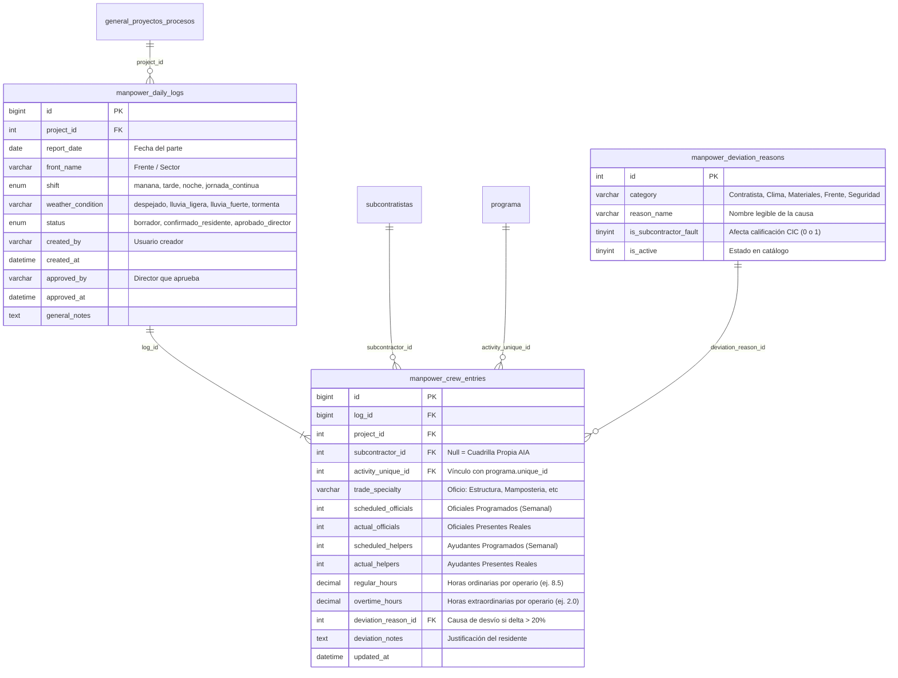
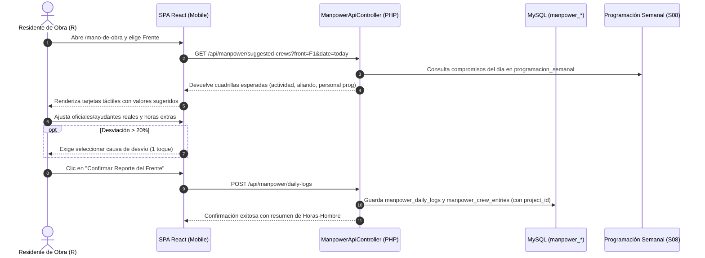

# Especificación Técnica: Parte Diario de Mano de Obra en Tajo & Control de Cuadrillas (Universal AIA)

> **Estado:** Vigente. Aprobada el 2026-09-23 como especificación técnica Tier 1 (Prioridad 3 - Pareto 80/20).
> **Mandato del Producto:** *"Basado en Tajo Airplan JMC, pero aplicable en todos los proyectos."* — Felipe Benítez.
> **Reglas Rectoras:** Aislamiento estricto por `project_id`, normalización de roles vía `App\Security\RbacService::normalizeRole()`, UI Mobile-First optimizada para campo, tablas globales compartidas y trazabilidad total de horas hombre (HH).

---

## 1. Justificación de Negocio y Propósito

El control de mano de obra en campo representa entre el **35% y el 50% del costo directo** de las obras de Arquitectos e Ingenieros Asociados (AIA). Históricamente, la captura de personal presente en obra se realizaba mediante planillas físicas de papel, chats de mensajería instantánea o libros de obra desconectados de la programación Last Planner.

Esta especificación toma como base el **modelo operativo validado en campo en la ampliación del Aeropuerto José María Córdova (Airplan T1 JMC)** y lo desacopla de especificidades aeroportuarias para convertirlo en el estándar corporativo para:
1. **Edificaciones y Vivienda:** Seguimiento de cuadrillas de estructura, mampostería, acabados e instalaciones.
2. **Infraestructura y Vías:** Control de personal de movimientos de tierra, pavimentación, redes hidrosanitarias y puentes.
3. **Comercial e Industrial:** Cuadrillas de montaje electromecánico, estructuras metálicas y cubiertas.

### Objetivos Clave
- **Captura Ultrarrápida en Tajo:** Registro completo de un frente de obra por el residente en menos de 2 minutos desde dispositivo móvil o tableta.
- **Contraste Automático vs. Programación Semanal:** Comparativa inmediata entre las cuadrillas comprometidas en el Plan Semanal (`S08`) y el personal real que ingresó a trabajar.
- **Control de Horas Extraordinarias:** Visibilidad diaria del sobrecosto en horas extras antes del corte de nómina o facturación de subcontratistas.
- **Alimentación al Scorecard CIC (`S11`):** Las desviaciones injustificadas de personal por parte de subcontratistas impactan automáticamente su índice de cumplimiento.
- **Exportación Consolidada para Costos:** Generación de resúmenes de Horas-Hombre (HH) para alimentar el sistema ERP/SINCO de AIA.

---

## 2. Modelo de Datos Relacional (MySQL con Global Tables)

De acuerdo con `docs/global-tables-architecture.md`, el módulo se implementa sobre tablas globales compartidas, con clave foránea implícita hacia `general_proyectos_procesos.Id` mediante la columna obligatoria `project_id`.



### 2.1 Definición DDL de Tablas

```sql
-- 1. Catálogo de Motivos de Desviación de Personal
CREATE TABLE IF NOT EXISTS `manpower_deviation_reasons` (
    `id` INT AUTO_INCREMENT PRIMARY KEY,
    `category` ENUM('Contratista', 'Clima', 'Suministros', 'Frente', 'Seguridad_SST', 'Otros') NOT NULL,
    `reason_name` VARCHAR(150) NOT NULL,
    `is_subcontractor_fault` TINYINT(1) NOT NULL DEFAULT 0,
    `is_active` TINYINT(1) NOT NULL DEFAULT 1,
    `created_at` DATETIME NOT NULL DEFAULT CURRENT_TIMESTAMP
) ENGINE=InnoDB DEFAULT CHARSET=utf8mb4 COLLATE=utf8mb4_unicode_ci;

-- Semillas iniciales del modelo Airplan JMC universalizado
INSERT INTO `manpower_deviation_reasons` (`category`, `reason_name`, `is_subcontractor_fault`) VALUES
('Contratista', 'Ausentismo injustificado de personal del aliado', 1),
('Contratista', 'Personal nuevo sin inducción o sin carnet SST', 1),
('Contratista', 'Retiro de personal por falta de pago del subcontratista', 1),
('Clima', 'Suspensión de labores por lluvia intensa en tajo', 0),
('Clima', 'Piso o terreno saturado no apto para trabajo seguro', 0),
('Suministros', 'Desabastecimiento de insumos / Concreto retrasado', 0),
('Suministros', 'Falla mecánica de equipo mayor o grúa torre', 0),
('Frente', 'Frente no liberado por actividad predecesora', 0),
('Seguridad_SST', 'Paralización preventiva por riesgo de trabajo en alturas', 0),
('Otros', 'Permiso sindical / Emergencia médica en obra', 0);

-- 2. Cabecera del Parte Diario de Mano de Obra
CREATE TABLE IF NOT EXISTS `manpower_daily_logs` (
    `id` BIGINT AUTO_INCREMENT PRIMARY KEY,
    `project_id` INT NOT NULL,
    `report_date` DATE NOT NULL,
    `front_name` VARCHAR(120) NOT NULL,
    `shift` ENUM('ordinario', 'extendido', 'nocturno') NOT NULL DEFAULT 'ordinario',
    `weather_condition` ENUM('despejado', 'nublado', 'lluvia_ligera', 'lluvia_fuerte') NOT NULL DEFAULT 'despejado',
    `status` ENUM('borrador', 'confirmado_residente', 'aprobado_director') NOT NULL DEFAULT 'borrador',
    `created_by` VARCHAR(120) NOT NULL,
    `created_at` DATETIME NOT NULL DEFAULT CURRENT_TIMESTAMP,
    `approved_by` VARCHAR(120) NULL,
    `approved_at` DATETIME NULL,
    `general_notes` TEXT NULL,
    INDEX `idx_manpower_project_date` (`project_id`, `report_date`),
    INDEX `idx_manpower_project_front` (`project_id`, `front_name`)
) ENGINE=InnoDB DEFAULT CHARSET=utf8mb4 COLLATE=utf8mb4_unicode_ci;

-- 3. Detalle de Cuadrillas y Asistencia en Tajo
CREATE TABLE IF NOT EXISTS `manpower_crew_entries` (
    `id` BIGINT AUTO_INCREMENT PRIMARY KEY,
    `log_id` BIGINT NOT NULL,
    `project_id` INT NOT NULL,
    `subcontractor_id` INT NULL,
    `activity_unique_id` INT NULL,
    `trade_specialty` VARCHAR(100) NOT NULL,
    `scheduled_officials` INT NOT NULL DEFAULT 0,
    `actual_officials` INT NOT NULL DEFAULT 0,
    `scheduled_helpers` INT NOT NULL DEFAULT 0,
    `actual_helpers` INT NOT NULL DEFAULT 0,
    `regular_hours` DECIMAL(4,2) NOT NULL DEFAULT 8.50,
    `overtime_hours` DECIMAL(4,2) NOT NULL DEFAULT 0.00,
    `deviation_reason_id` INT NULL,
    `deviation_notes` VARCHAR(255) NULL,
    `updated_at` DATETIME NOT NULL DEFAULT CURRENT_TIMESTAMP ON UPDATE CURRENT_TIMESTAMP,
    INDEX `idx_crew_log_id` (`log_id`),
    INDEX `idx_crew_project_subcontractor` (`project_id`, `subcontractor_id`),
    INDEX `idx_crew_activity` (`activity_unique_id`),
    CONSTRAINT `fk_manpower_entries_log` FOREIGN KEY (`log_id`) REFERENCES `manpower_daily_logs` (`id`) ON DELETE CASCADE
) ENGINE=InnoDB DEFAULT CHARSET=utf8mb4 COLLATE=utf8mb4_unicode_ci;
```

---

## 3. Integración con el Runtime y Tablas Globales

Para cumplir con la gobernanza de aislamiento de datos (`Database.php`), las nuevas tablas se registran en las constantes canónicas de la clase:

```php
// En src/Core/Database.php:
private const GLOBAL_TABLES = [
    // ... tablas existentes
    'manpower_daily_logs',
    'manpower_crew_entries',
    'manpower_deviation_reasons',
];

private const PROJECT_SCOPED_IDS = [
    // ... tablas existentes
    'manpower_daily_logs' => 'id',
    'manpower_crew_entries' => 'id',
];
```

---

## 4. Flujo Operativo y Experiencia de Usuario (Mobile-First)

### 4.1 Captura Matutina por el Residente de Obra (Rol `R`)
1. **Acceso Ágil:** El residente ingresa desde su teléfono móvil a `/app/mano-de-obra` (o la ruta directa en tajo).
2. **Contexto Automático:**
   - La pantalla muestra el proyecto activo en sesión (`project_id`).
   - La fecha se fija por defecto en la fecha actual del sistema.
   - El residente selecciona su **Frente de Trabajo** (obtenido de la lista de frentes activos de la obra: ej. *"Torre 1 - Pisos 4 a 6"*, *"Pista de Rodaje Alfa"*, *"Zona de Comidas"*).
3. **Carga Inteligente de Actividades del Plan Semanal:**
   - El sistema consulta automáticamente la tabla `programacion_semanal` (`S08`) para el día de la semana correspondiente (L, M, X, J, V, S).
   - Genera tarjetas pre-diligenciadas con las actividades programadas para ese frente y los subcontratistas asignados.
4. **Validación Rápida de Presencia:**
   - Para cada cuadrilla, el residente visualiza:
     - Nombre de la Actividad y Subcontratista.
     - Contadores numéricos con botones grandes `+` y `-` para **Oficiales** y **Ayudantes**.
     - Horas ordinarias predefinidas (ej. 8.5h).
     - Si hubo trabajo extendido, un campo numérico para **Horas Extras**.
5. **Detección de Desviación y Causa:**
   - Si $(\text{Oficiales Real} + \text{Ayudantes Real})$ difiere en más de un 20% respecto a lo programado, la tarjeta muestra un borde ámbar y despliega un menú desplegable de 1 toque con los motivos de `manpower_deviation_reasons`.
6. **Inclusión de Cuadrillas No Programadas:**
   - Botón visible `+ Agregar Cuadrilla Imprevista` para registrar labores extraordinarias o actividades de mitigación no contempladas en el plan semanal original.
7. **Confirmación:**
   - El residente pulsa *"Confirmar Reporte del Frente"*. El estado pasa a `confirmado_residente`.



---

### 4.2 Consolidación Vespertina por el Director de Obra (Rol `D`)
1. Al final del día, el Director de Obra visualiza la pantalla de consolidación diaria:
   - Resumen total de personal presente en toda la obra vs programado.
   - Cantidad total de Oficiales y Ayudantes.
   - Total de Horas Extras generadas en el día y su costo proyectado:
     $$\text{Costo Extras Día} = \sum (\text{Horas Extras} \times \text{Tarifa Horaria Oficial/Ayudante})$$
   - Lista de frentes pendientes de reporte (si algún residente no ha cargado su información).
2. El Director revisa las causas de desviación registradas por los residentes.
3. Clic en **"Aprobar Cierre Diario de Mano de Obra"**. El parte cambia a `aprobado_director` y queda congelado para modificaciones ordinarias.

---

## 5. Reglas de Cálculo e Indicadores Automatizados

### 5.1 Desviación de Personal ($\Delta \text{Personal}$)
Para cada cuadrilla y para el total de la obra:
$$\Delta \text{Personal} = (\text{Oficiales Real} + \text{Ayudantes Real}) - (\text{Oficiales Programados} + \text{Ayudantes Programados})$$

### 5.2 Confiabilidad de Cuadrillas (CPC - Cumplimiento de Personal de Cuadrillas)
Indicador porcentual diario y semanal por subcontratista y por frente:
$$\text{CPC} = \left( \frac{\text{Personal Total Presente}}{\text{Personal Total Programado}} \right) \times 100\%$$
- **Verde ($\ge 90\%$):** Cuadrilla completa según compromiso LPS.
- **Amarillo ($75\% - 89\%$):** Déficit leve; riesgo de retraso en la actividad.
- **Rojo ($< 75\%$):** Deserción crítica de personal; impacto inminente en la fecha de entrega.

### 5.3 Cálculo de Horas-Hombre (HH)
Total de horas de esfuerzo invertidas en el día:
$$\text{HH Ordinarias} = \sum (\text{Oficiales} + \text{Ayudantes}) \times \text{regular\_hours}$$
$$\text{HH Extras} = \sum (\text{Oficiales} + \text{Ayudantes}) \times \text{overtime\_hours}$$
$$\text{HH Totales} = \text{HH Ordinarias} + \text{HH Extras}$$

### 5.4 Retroalimentación al Módulo CIC (`S11`)
Cuando un subcontratista presenta una causa de desviación catalogada con `is_subcontractor_fault = 1` (ej. *Ausentismo injustificado*), el sistema descuenta puntaje en el acápite de **Cumplimiento de Cuadrilla** en la evaluación semanal del aliado (`cic.view.php` / `S11`), evitando que el contratista culpe a la obra por retrasos derivados de su propia falta de operarios.

---

## 6. Matriz de Autorización y Seguridad RBAC

Todas las acciones pasan por `App\Security\RbacService::normalizeRole()`:

| Rol Canónico | Ver Partes Diarios | Crear/Editar Borrador | Confirmar Frente | Aprobar Cierre Obra | Reabrir Parte Cerrado | Exportar HH / SINCO |
|---|:---:|:---:|:---:|:---:|:---:|:---:|
| **Director de Obra (`D`)** | ✅ | ✅ | ✅ | ✅ | ✅ | ✅ |
| **Residente de Obra (`R`)** | ✅ | ✅ (su frente) | ✅ (su frente) | ❌ | ❌ | ✅ (local) |
| **Visitante / Subcontratista (`V`)** | ✅ (solo sus cuadrillas) | ❌ | ❌ | ❌ | ❌ | ❌ |
| **Administrador (`A`)** | ✅ | ✅ | ✅ | ✅ | ✅ | ✅ |

---

## 7. Contratos de API REST (Backend PHP)

### 7.1 `GET /api/manpower/daily-logs`
Consulta los partes diarios de la obra para una fecha o rango.
- **Headers:** `X-CSRF-Token`, Cookie de sesión autenticada.
- **Query Params:** `date` (YYYY-MM-DD), `front` (opcional).
- **Respuesta 200 OK:**
```json
{
  "project_id": 12,
  "report_date": "2026-09-23",
  "status": "confirmado_residente",
  "summary": {
    "total_officials": 24,
    "total_helpers": 38,
    "total_regular_hh": 527.0,
    "total_overtime_hh": 45.0,
    "cpc_percentage": 94.2
  },
  "fronts": [
    {
      "front_name": "Torre 1 - Estructura",
      "status": "confirmado_residente",
      "entries": [
        {
          "id": 1045,
          "subcontractor_name": "Estructuras & Concretos S.A.S.",
          "activity_name": "Vaciado de losa piso 5",
          "trade_specialty": "Armado de hierro",
          "scheduled_officials": 6,
          "actual_officials": 6,
          "scheduled_helpers": 8,
          "actual_helpers": 7,
          "regular_hours": 8.5,
          "overtime_hours": 2.0,
          "deviation_reason": null
        }
      ]
    }
  ]
}
```

### 7.2 `GET /api/manpower/suggested-crews`
Genera la plantilla sugerida a partir de la Programación Semanal (`S08`).
- **Query Params:** `front_name`, `date`.
- **Respuesta 200 OK:** Lista de cuadrillas programadas para ese día con sus actividades asociadas.

### 7.3 `POST /api/manpower/daily-logs`
Crea o actualiza el parte diario de un frente de trabajo.
- **Payload:** Esquema validado con Zod en frontend y saneado en backend (`App\Security\CsrfGuard`).

### 7.4 `POST /api/manpower/daily-logs/{id}/approve`
Aprobación formal del parte por parte del Director de Obra.

### 7.5 `GET /api/manpower/export/sinco`
Genera archivo CSV/Excel formateado para importación directa en el módulo de control de costos de SINCO ERP.

---

## 8. Verificación y Criterios de Aceptación

### 8.1 Pruebas Automatizadas
1. **Aislamiento Multitenant:**
   - `tests/test_manpower_isolation.php`: Valida que un usuario de la Obra A no puede leer ni modificar partes de la Obra B aunque manipule el ID en la petición HTTP.
2. **Cálculo de HH y Desviación:**
   - Pruebas unitarias en PHPUnit verificando el cálculo exacto de horas ordinarias, extras y porcentajes CPC.
3. **Control de Flujo de Estados:**
   - Comprobar que un residente no puede aprobar el cierre definitivo de obra, y que un parte cerrado en `aprobado_director` rechaza mutaciones salvo reapertura explícita del Director.

### 8.2 Pruebas de Interfaz (Playwright)
- Ejecución en viewport móvil (390×844) simulando la captura de un parte completo en menos de 2 minutos.
- Verificación del árbol accesible, soporte táctil de botones y contraste visual en tema claro y tema oscuro.
