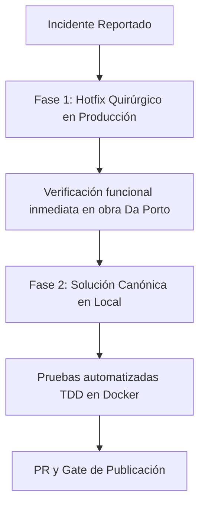

# Calificación y registro de Trabajo No Planificado (TNP) en semanas confirmadas — diseño

- Fecha: 2026-09-24
- Frente: `calificacion-tnp-semana-confirmada`
- Contexto: Incidente en producción (SiteGround, proyecto Da Porto, Semana 4, usuaria Catalina Pérez)

---

## 1. El problema y contexto del incidente

Al calificar avance real (`Real`) en actividades clasificadas como Trabajo No Planificado (TNP) o actividades manuales sin compromiso previo durante la **Fase: Calificación de Compromisos** (`Semanal_Confirmada = 1`), el sistema rechaza la operación con **HTTP 409 (Conflict)**.

En la interfaz de usuario, Handsontable intercepta el error en su manejador `.fail()`, descarta la respuesta del servidor y muestra el siguiente diálogo al usuario:

> **«Error detectado: No se pudo guardar: sin conexión con el servidor. Revisa la red y vuelve a escribir el dato.»**

Este diálogo es un falso positivo de red: el servidor respondió de inmediato con un error de lógica de negocio (HTTP 409), pero la UI asume ciegamente que ocurrió una desconexión.

---

## 2. Autopsia técnica y causas raíz

### 2.1 En `SemanalApiController::modificar()` (Líneas 300–317)
En Last Planner System (LPS), un TNP surge en obra **después** de cerrada la planificación: no posee compromiso previo ni cantidad sugerida programada. En la base de datos (`programacion_semanal`), para estas filas:
- `Compromiso` es `NULL` (o `0`).
- `Cantidad_Sugerida` es `NULL`.

Cuando el usuario escribe en la celda `Real`, el frontend ejecuta `saveRow()` enviando toda la fila empaquetada:
- `Cantidad_Sugerida: '0.0'` (calculada en el navegador).
- `Compromiso: ''` o `'0.0'`.

El backend evalúa:
```php
$suggested = $this->parseLocalizedFloat($_POST['Cantidad_Sugerida'] ?? null); // 0.0
$planningFieldsChanged = ...
    || $this->nullableFloatChanged(
        $suggested,
        $this->lpsService->toFloat($rowActual['Cantidad_Sugerida'] ?? null) // null
    ); // 0.0 !== null => TRUE!

$confirmed = (int) ($weekState['Semanal_Confirmada'] ?? 0) === 1;

if ($confirmed && ($commitmentChanged || $assigneesChanged || $planningFieldsChanged)) {
    $this->jsonError('Los datos de planificación solo se editan en programación.', 409);
    return;
}
```

**Fallo de diseño:** La comprobación de `$confirmed` se ejecuta **antes** de evaluar si la fila es TNP (`$esTnp` recién se consultaba en la línea 323). Al comparar `0.0` contra `NULL`, `$planningFieldsChanged` da `true` y el servidor asume erróneamente que se intentó editar la planificación de una semana confirmada, devolviendo HTTP 409.

### 2.2 En `SemanalApiController::tnp()` (Línea 1328)
Si el usuario intenta registrar el TNP mediante el modal de la barra de herramientas (*Registrar TNP*):
```php
\CommitmentLockGuard::guard($dbPrefix, $semana, 'tnp');
```
`CommitmentLockGuard::guard()` valida si `Semanal_Confirmada == 1`. Al **no** pasar el cuarto argumento `$allowIfConfirmed = true`, `CommitmentLockGuard` aborta inmediatamente con HTTP 409:
`"No se puede realizar 'tnp': los compromisos de la semana ya fueron confirmados."`

Esto es un contrasentido conceptual: el modal de TNP está diseñado precisamente para registrarse en semanas en ejecución o confirmadas.

### 2.3 En `public/js/modules/programacion_semanal/hot.js` (Línea 3073–3081)
En el evento `afterChange` de Handsontable:
```javascript
if (prop === 'Ejecutado_Real') {
  var esTnpRow = rowData.Es_TNP === 1 || rowData.Es_TNP === '1';
  if (!esTnpRow && typeof getStateKey === 'function') {
    esTnpRow = (getStateKey(rowData) === 'cal-tnp');
  }
  if (esTnpRow) {
    continue; // BUG: aborta el bucle de afterChange y nunca llama a saveRow()
  }
}
```
El autor original quiso omitir la validación de causa CNC para las filas TNP (las TNP no requieren CNC), pero colocó un `continue;` en el ciclo principal de `afterChange`, lo que impide que la edición de `Ejecutado_Real` en una TNP pase a `saveRow()`.

### 2.4 Falso mensaje de red en `hot.js` (Línea 2587)
El bloque `.fail()` de `saveRow()` no lee `jqXHR.responseJSON?.mensaje`. Todo error 4xx o 5xx es rotulado como fallo de conectividad.

---

## 3. Plan en dos fases



---

## 4. Fase 1: Guía de Hotfix Quirúrgico para Producción (SiteGround)

Dado que producción corre sobre una versión anterior del código, el hotfix debe ser **mínimo, seguro y quirúrgico**, sin depender de migraciones ni alterar dependencias.

### Archivo a editar en el servidor
`~/www/lastplanneraia.com/public_html/src/Controllers/Api/SemanalApiController.php`

### Cambio 1: En método `modificar()` (alrededor de la línea 300)
Mover la resolución de `$esTnp` antes de la validación de fase confirmada, y excluir explícitamente a las TNP del bloqueo de planificación:

```php
// --- ANTES ---
        $confirmed = (int) ($weekState['Semanal_Confirmada'] ?? 0) === 1;

        if ($realChanged && !$confirmed) {
            $this->jsonError('El avance real solo se registra en la fase de calificación.', 409);
            return;
        }
        if ($confirmed && ($commitmentChanged || $assigneesChanged || $planningFieldsChanged)) {
            $this->jsonError('Los datos de planificación solo se editan en programación.', 409);
            return;
        }
        if ($realChanged && ($subcontractor === '' || $responsible === '')) {
            $this->jsonError('Falta Sub-Contratista o Responsable AIA para registrar avance.');
            return;
        }

        $esTnp = (int) ($rowActual['Es_TNP'] ?? 0) === 1;

// --- DESPUÉS ---
        $confirmed = (int) ($weekState['Semanal_Confirmada'] ?? 0) === 1;
        $esTnp = (int) ($rowActual['Es_TNP'] ?? 0) === 1 
            || (isset($_POST['Es_TNP']) && (int) $_POST['Es_TNP'] === 1);

        if ($realChanged && !$confirmed) {
            $this->jsonError('El avance real solo se registra en la fase de calificación.', 409);
            return;
        }
        // Las actividades TNP no tenían planificación previa; no se bloquean por planningFieldsChanged
        if ($confirmed && !$esTnp && ($commitmentChanged || $assigneesChanged || $planningFieldsChanged)) {
            $this->jsonError('Los datos de planificación solo se editan en programación.', 409);
            return;
        }
        if ($realChanged && ($subcontractor === '' || $responsible === '')) {
            $this->jsonError('Falta Sub-Contratista o Responsable AIA para registrar avance.');
            return;
        }
```

### Cambio 2: En método `tnp()` (alrededor de la línea 1328)
Habilitar `$allowIfConfirmed = true`:

```php
// --- ANTES ---
    private function tnp(string $dbPrefix, int $semana): void
    {
        $projectId = $this->projectId($dbPrefix);
        \CommitmentLockGuard::guard($dbPrefix, $semana, 'tnp');

// --- DESPUÉS ---
    private function tnp(string $dbPrefix, int $semana): void
    {
        $projectId = $this->projectId($dbPrefix);
        \CommitmentLockGuard::guard($dbPrefix, $semana, 'tnp', true);
```

---

## 5. Fase 2: Solución Canónica en el Repositorio Local

En el repositorio local se implementa la solución completa, cubriendo tanto backend como frontend y validación automatizada:

### 5.1 Backend: `src/Controllers/Api/SemanalApiController.php`
1. **Detección y bypass de TNP**: Aplicar el cambio de `$esTnp` antes de la línea 314.
2. **Tolerancia en `Cantidad_Sugerida`**: En `$planningFieldsChanged`, cuando `$rowActual['Cantidad_Sugerida']` es `NULL` y el valor entrante es `0.0` (o nulo), no tratarlo como alteración de planificación (la sugerida es un cálculo automático, no una decisión humana).
3. **Guard de TNP**: Añadir `$allowIfConfirmed = true` en `tnp()`.

### 5.2 Frontend: `public/js/modules/programacion_semanal/hot.js`
1. **Corrección de `afterChange`**:
   Sustituir el `continue;` que abortaba `saveRow` por una bandera que únicamente salte las validaciones de asignados faltantes y exigencia de CNC:
   ```javascript
   if (prop === 'Ejecutado_Real') {
     var esTnpRow = rowData.Es_TNP === 1 || rowData.Es_TNP === '1';
     if (!esTnpRow && typeof getStateKey === 'function') {
       esTnpRow = (getStateKey(rowData) === 'cal-tnp');
     }
     
     if (!esTnpRow) {
       // Validar subcontratista, responsable y CNC solo en filas planificadas
       if (isSubMissing || isResMissing) { ... }
       if (requiresCnc(rowData, newValue)) { ... }
     }
   }
   ```
2. **Corrección de `.fail()` en `saveRow()`**:
   Leer `jqXHR.responseJSON?.mensaje` para mostrar el mensaje real devuelto por la API en caso de fallos HTTP (409, 422, 403), evitando la confusión de falta de conexión.

### 5.3 Pruebas Automatizadas
1. **Test de integración PHP (`tests/test_semanal_tnp_calificacion.php`)**:
   - Crear / actualizar test enfocado que:
     - Cree una semana y la marque como confirmada (`Semanal_Confirmada = 1`).
     - Tenga una fila marcada como `Es_TNP = 1` (con `Compromiso = NULL` y `Cantidad_Sugerida = NULL`).
     - Ejecute una llamada POST a `/api/semanal/save?opcion=modificar` con `Real = 50.0`.
     - Verifique que la respuesta sea HTTP 200 con `{"respuesta":"BIEN"}`.
     - Pruebe también el endpoint `opcion=tnp` con semana confirmada y confirme que no responde 409.
     - Confirme que una fila **no-TNP** (`Es_TNP = 0`) donde se intente alterar `Compromiso` siga respondiendo HTTP 409.

---

## 6. Criterios de Aceptación y Verificación

1. **En Producción**:
   - Catalina Pérez puede calificar el `Real` de una TNP en la Semana 4 de Da Porto y guardar exitosamente sin error 409 ni alerta de red.
2. **En Local**:
   - `docker compose exec app php tests/test_semanal_tnp_calificacion.php` termina con RC = 0.
   - `docker compose exec app vendor/bin/phpstan analyse src/Controllers/Api/SemanalApiController.php --memory-limit=1G` reporta 0 errores.
