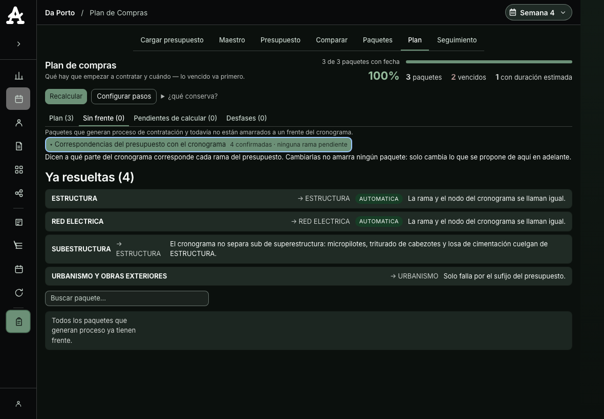
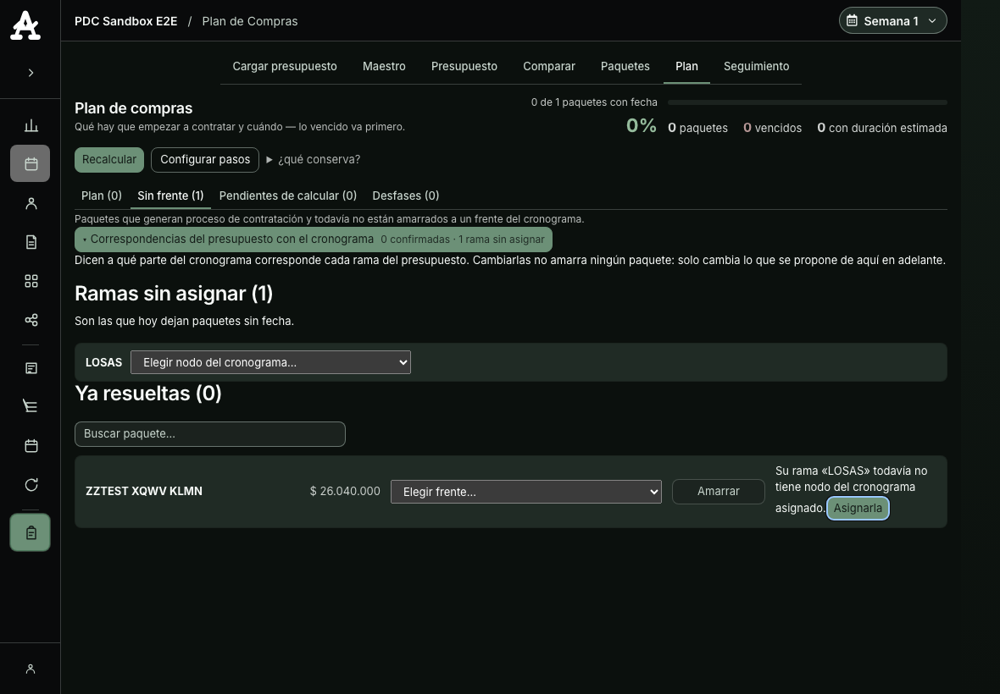

# Cierre pre-lanzamiento del PDC v2 — bitácora de verificación

- **Fecha:** 2026-07-29
- **Spec:** [`2026-07-29-cierre-prelanzamiento-pdc-design.md`](../../../docs/superpowers/specs/2026-07-29-cierre-prelanzamiento-pdc-design.md)
- **Tarea del tablero:** Ola 1 · nº 3
- **Entorno:** worktree principal `/Volumes/Crucial X6/Developer/lps-aia`, rama `main` en `1a75b19`,
  árbol limpio al empezar. Stack `last-planner-aia` (app `http://localhost:8081`, MySQL host `:3307`,
  base `lastplanneraia_dev`). **No** se usó el stack `lps-aia-pdc` (`:3308`), cuya base se llama igual.
- **Aislamiento:** se trabajó en el worktree principal, no en uno nuevo. Motivo: los puntos 1 y 4 se
  verifican contra el **contenedor servido**, que monta precisamente este worktree; montar otro exigía
  stack y base propios para cuatro cambios pequeños. El árbol estaba limpio y la sesión hermana del
  tablero vive en su propio worktree (`.claude/worktrees/pdc-b2-vencimientos`).
- **Punto 2 del spec (los 25 paquetes sin `duracion_ref`) no se tocó**: es de la sesión del tablero de
  vencimientos, por la regla escrita en [`estado-olas.md`](../estado-olas.md).

---

## Punto 3 · Los tests PHP en rojo

### Cómo se corrió

Un archivo por invocación, clasificando por **código de salida** — no por `grep "^FAIL"`, que miente
porque varios de estos scripts imprimen líneas `FAIL:` y aun así salen con 0, y otros fallan sin
imprimir la palabra. Sin `timeout` (no existe en macOS).

```bash
for f in tests/test_*.php; do
  docker compose exec -T app php "$f" > "logs/$(basename "$f" .php).log" 2>&1
  printf '%s\t%s\n' "$?" "$(basename "$f" .php)" >> summary.tsv
done
```

### Resultado

```
=== ROJOS (rc != 0) ===
1	test_human_validation_matrix
1	test_pdc_phpstan_nivel6
1	test_pdc_v2_brecha_daporto
1	test_report_processor_cic_project_scope
=== TOTALES ===
total=108 rojos=4
```

**Son 4 rojos de 108, no 16 de 103.** La cifra del spec venía de la rama `pdc-a4-fechas`; sobre el
estado integrado de `main` la mayoría ya está resuelta. Los cuatro quedan clasificados abajo. **Cero
rojos sin explicación.**

### (a) Roto de verdad — arreglado

#### `test_pdc_phpstan_nivel6`

```
FAIL todos los archivos del PDC están en el gate (fuera: PlanComprasSeguimientoController.php)
Gate PHPStan del PDC: FAIL (1)
```

**Qué pasaba.** `PlanComprasSeguimientoController.php` entró con la fase B1 y nadie lo añadió a
`phpstan-pdc.neon`. El gate del PDC exige nivel 6 y este test es su guardián: un archivo nuevo del
módulo fuera de la lista significa código del PDC **sin analizar**, y el gate global (nivel 5) tampoco
lo cubría con la exigencia del módulo. Era el rojo que sí tapaba algo.

**Arreglo.** Añadido a `paths` en `phpstan-pdc.neon`. No se relajó nada: el archivo pasa nivel 6 tal
como está.

```
$ docker compose exec -T app vendor/bin/phpstan analyse -c phpstan-pdc.neon --memory-limit=1G
 20/20 [▓▓▓▓▓▓▓▓▓▓▓▓▓▓▓▓▓▓▓▓▓▓▓▓▓▓▓▓] 100%
 [OK] No errors

$ docker compose exec -T app php tests/test_pdc_phpstan_nivel6.php   # rc=0
PASS todos los archivos del PDC están en el gate
Gate PHPStan del PDC: PASS
```

### (b) Test obsoleto — documentado, **no** arreglado en esta ola

#### `test_pdc_v2_brecha_daporto`

```
FAIL: no hay versión 292 en el proyecto 73.
```

**Qué cambió y por qué.** El test fija en código `$PROYECTO = 73` y `$VERSION = 292`: el estado de Da
Porto que A3.5 declaró «punto de partida canónico» para medir la brecha del motor. Ese estado **ya no
existe en esta base**, porque el presupuesto de Da Porto se reimportó hoy:

| | |
|---|---|
| Única versión viva del proyecto 73 | `376` |
| Archivo | `102 - 2026 09 DAPORTO - RIONEGRO - PI_Version_3 (4).xlsx` |
| Importado por / cuándo | Juan Felipe Benitez Ramos · **2026-07-29 15:09:53** |
| Contenido | 403 actividades · 820 insumos · $29 492 804 353,65 |

Es el **piloto**: la obra real montándose encima. Su estado actual es coherente con un plan recién
empezado —820 insumos, 396 vínculos al maestro, **12** asignaciones a paquetes, 3 paquetes planeados—
no con las cientos de decisiones humanas contra las que el trinquete medía.

**Por qué no se «arregla».** El test tiene un `SKIP` por si el proyecto no está sembrado, pero mira la
tabla equivocada: comprueba que haya filas en `pdc_insumo_paquete` (hay 12) y no que exista la versión
que va a medir, así que **falla donde debería saltar**. Repuntarlo a la versión 376 sería peor que
dejarlo rojo: compararía el motor contra 12 decisiones humanas en vez de contra el corpus completo, y
`BRECHA_MAXIMA = 7` dejaría de significar nada mientras sigue pareciendo un trinquete verde. Eso es
exactamente el «mover un assert para poner verde» que el spec prohíbe.

**Lo que hace falta y no es de esta sesión:** decidir cuál es el nuevo estado canónico de referencia
—el de Tomás cuando termine el piloto, o un fixture congelado— y reapuntar el trinquete a él. Se
propone como diferible en el resumen. Mientras eso no pase, el test es un rojo **con causa escrita**,
y hay que saber que **la brecha del motor no está siendo vigilada por nadie**.

> No se detectó pérdida de datos. No hay rastro en esta base de una versión 292 previa, así que no se
> puede afirmar que la reimportación borrara trabajo: lo que se ve es una obra empezando. Se deja dicho
> porque la afirmación contraria sería igual de infundada.

#### `test_human_validation_matrix`

```
FAIL: no contiene familias excluidas de Mano de Obra
FAIL: no contiene familias RCI sin unificar
FAIL: incluye familia guardada Red de Extinción de Incendios
```

**Qué cambió y por qué.** El test compara un artefacto binario commiteado
(`docs/qa/matriz-validacion-humana.xlsx`) contra las reglas vivas del corpus de familias
(`docs/qa/pdc_family_corpus_extractor.php`). Las reglas se depuraron **después** de generar el XLSX,
así que el artefacto quedó atrás. Medido:

| Divergencia | Valores concretos |
|---|---|
| Familias que el XLSX usa y hoy no están permitidas | `Campamento de Obra` (6), `Malacate` (6), `Amenidades Especiales de Cubierta` (6), `Bomba de Concreto` (2), `Botada de Escombros` (4) |
| Familias que hoy son alias de otra (fusionadas) | `Zapatas de Cimentacion`, `Mesones de Bano`, `Mesones de Cocina`, `Amenidades Especiales de Cubierta` |
| Familia RCI esperada hoy | `Red de Extinción de Incendios` — el desplegable del XLSX todavía trae `Bomba Red Contra Incendio` y `Deteccion de Incendio` |

**Por qué no se arregla aquí.** Dos razones, y la segunda es la que manda:

1. **No hay generador en el repo.** El único archivo que menciona el XLSX es el propio test; el script
   que lo produjo no está versionado, así que no se puede regenerar sin reconstruirlo. Y el XLSX lleva
   columnas de decisión humana prellenadas (`decision_humana`, `familia_correcta`, `motivo`…):
   regenerarlo a ciegas podría tirar trabajo de una persona.
2. **El test se contradice consigo mismo.** Exige que `Botada de Escombros` esté en el desplegable
   (línea 119) mientras el extractor la considera no permitida (`matrixFamilyAllowed` da falso). No
   existe un estado del XLSX que ponga verdes los dos asserts: hay que decidir cuál de los dos tiene
   razón, y esa decisión es del dueño del corpus de familias.

**No bloquea el lanzamiento del PDC v2:** es la matriz de validación humana del corpus de familias del
Listado de Actividades, no un contrato del plan de compras. Se propone como diferible.

### (c) Ambiental — anotado con su causa

#### `test_report_processor_cic_project_scope`

```
=== CIC Project Scope: FAIL ===
 - no existe CIC del proyecto 73
 - no existe CIP del proyecto 73
```

**Causa.** El test procesa los CIC/CIP de los proyectos sembrados y luego exige que existan filas para
el proyecto **73**. El log muestra que el procesamiento corrió y terminó `ok` para Metrolínea, Da Porto
y Milán Campestre; lo que falta son las filas resultantes del 73. Es el mismo proyecto que se reimportó
hoy: **estado de datos locales**, no lógica de aislamiento por proyecto (los otros proyectos sí generan
sus filas, que es lo que el test vigila).

**No se toca.** Es ajeno al PDC v2 y su assert es legítimo; ponerlo verde exige sembrar CIC/CIP del
proyecto 73, que es escribir en la base del piloto mientras Tomás trabaja encima. Se propone como
diferible, con la nota de que su causa es de entorno y no de código.

---

## Punto 4 · La contaminación del indicador con el sandbox e2e

### El diagnóstico

`tests/browser/support/pdc-sandbox.mjs` registraba el reseteo **solo** en `test.beforeEach`. El seed
sabe limpiar de sobra —`pdcSandboxLimpiarDatos()` para lo del proyecto 990100 y
`pdcSandboxLimpiarGlobales()` para los residuos en `general_paquetes_contratacion` y
`general_maestro_insumos`— pero nunca se le llamaba al final. Consecuencia: **lo que crea el último
test sobrevive a la corrida**, vive en catálogos globales sin `project_id`, y el motor de sugerencias
aprende de lo asignado en todos los proyectos. De ahí el 8 en vez de 7.

### El arreglo

Un `test.afterAll` en `usarSandboxPdc()` que vuelve a resetear, con los mismos guardarraíles que la
siembra (si el entorno no era sembrable no hay nada que limpiar) y una salida de escape para
diagnosticar: `PDC_E2E_CONSERVAR_SANDBOX=1` deja el sandbox tal cual. Los 13 specs `pdc-v2-*` lo usan,
así que el arreglo es uno.

### La verificación — A/B contra la base real

Medida usada: filas de prueba que sobreviven en los catálogos **globales** más el estado del sandbox.

```
== ANTES (línea base limpia) ==
paquetes_globales_test=0 maestro_test=0 asignaciones_sandbox=0 versiones_sandbox=0

### A) comportamiento VIEJO — PDC_E2E_CONSERVAR_SANDBOX=1 (no limpia al final)
  1 passed (7.2s)
paquetes_globales_test=1 maestro_test=0 asignaciones_sandbox=2 versiones_sandbox=1   ← contaminación reproducida

### B) con el arreglo — pasada 1
  1 passed (6.4s)
paquetes_globales_test=0 maestro_test=0 asignaciones_sandbox=0 versiones_sandbox=0

### B) con el arreglo — pasada 2
  1 passed (5.6s)
paquetes_globales_test=0 maestro_test=0 asignaciones_sandbox=0 versiones_sandbox=0   ← mismo número dos veces
```

**Sobre la condición de hecho nº 4 del spec** («correr los e2e dos veces y medir la brecha da el mismo
número las dos veces»): se cumple en lo que la condición perseguía —dos corridas seguidas dejan la base
en estado idéntico y sin residuo global—, pero **no con la brecha como instrumento**, porque el test de
brecha está rojo por lo explicado arriba (su versión canónica no existe). Se sustituyó por la medición
directa del residuo, que es la causa que la brecha detectaba de rebote. Queda dicho para que nadie lea
esto como «la brecha se midió».

---

## Punto 5 · El maestro de paquetes gobernado

En el comité se afirmó que «la obra ya no puede tocar el maestro global y solo un administrador lo
actualiza». Se convirtió en test ejecutable: `tests/test_pdc_v2_maestro_gobernado.php`.

Se comprueban **dos** capacidades, porque al maestro global se entra por dos puertas y verificar solo
la que nombró el spec habría dejado fuera la más directa:

- `lps.paquetes_contratacion.reglas` — aprobar reglas y overrides globales del motor.
- `lps.paquetes_contratacion.editar` — la que de verdad inserta una fila en
  `general_paquetes_contratacion` (`PlanComprasPaquetesController::crear` → `guardEscritura` →
  `PaquetesService::crearPaquete`).

Los permisos se resuelven con `RbacService`, que lee **primero la BD** y solo cae al catálogo en código
si está vacía; la evidencia declara de dónde salió la respuesta.

```
$ docker compose exec -T app php tests/test_pdc_v2_maestro_gobernado.php     # rc=0
Origen de los permisos: BD (`rbac_role_permissions`, 286 filas)

Rol PERMITIDO — OT (Oficina Técnica / Compras):
  OK   OT puede aprobar reglas globales (lps.paquetes_contratacion.reglas).
  OK   OT puede crear paquetes en el maestro (lps.paquetes_contratacion.editar).

Rol DENEGADO — R (Residente de Obra, «la obra»):
  OK   R NO puede aprobar reglas globales (lps.paquetes_contratacion.reglas).
  OK   R NO puede crear paquetes en el maestro (lps.paquetes_contratacion.editar).
  OK   R sí puede VER el maestro (asigna insumos sin editar el catálogo).

Otros roles sin mando sobre el maestro: DCV, V, C, S, G — todos denegados en ambas capacidades.

Reparto real:
  Roles con lps.paquetes_contratacion.editar: A, D, OT
  OK   El maestro lo escriben exactamente A, D y OT.

TODO OK
```

### Veredicto: la afirmación se sostiene, con una corrección de redacción

**Lo que es cierto:** el Residente de Obra —«la obra» del día a día— no puede crear ni renombrar nada
en el maestro global, ni aprobar reglas del motor. Lo intenta y recibe `403 FORBIDDEN`. Tampoco pueden
DCV, Visualizador, Subcontratista, SST ni Ambiental. La promesa de fondo que se le hizo al dueño del
producto se cumple.

**Lo que hay que corregirle:** «solo un administrador» es más estrecho que la realidad. Escriben el
maestro **tres** roles: Administrador (A), **Director de Obra (D)** y **Oficina Técnica / Compras
(OT)**. No es un agujero, es una decisión deliberada del grilleo del 2026-07-26, escrita en
`database/migrations/20260726_pdc_v2_permiso_reglas_motor.php`: OT es el dueño acordado del maestro, y D
tiene control operativo total para auditar el sembrado. Pero el Director de Obra **es** la obra, así que
conviene decirlo así en el comité antes de que alguien lo descubra usándolo.

El test fija ese reparto (`A, D, OT` exactamente), de modo que ampliarlo por accidente pone un rojo.

---

## Punto 1 · El panel de correspondencias, visto en pantalla

Verificado con Playwright contra el contenedor servido (`http://localhost:8081`), **desktop 1180×820 y
dark mode**, como exige `AGENTS.md`. Usuario `test.A`.

### Da Porto — el proyecto real



```
API /plan-compras/api/plan/correspondencias → 200
  resueltas: 4 · pendientes: 0 · confirmadas: 4 · sinConfirmar: 0
pestaña «Sin frente»: Sin frente (0)
panel en el DOM: 1
  cerrado por defecto (aria-expanded): false
  resumen: 4 confirmadas · ninguna rama pendiente
  resueltas en pantalla: 4 · pendientes en pantalla: 0
  overflow-x del body: 0
  errores de consola: ninguno
```

El panel **se ve y funciona**: arranca cerrado, se despliega, y lista sus cuatro correspondencias con
su ancla y su motivo escrito (`ESTRUCTURA → ESTRUCTURA · «La rama y el nodo del cronograma se llaman
igual»`, `SUBESTRUCTURA → ESTRUCTURA · «El cronograma no separa sub de superestructura…»`,
`URBANISMO Y OBRAS EXTERIORES → URBANISMO · «Solo falla por el sufijo del presupuesto»`).

### Sandbox — el escenario «sin frente y sin propuesta», que es donde vive el atajo



```
[PDC Sandbox E2E]
panel en el DOM: 1
  cerrado por defecto (aria-expanded): false
  filas sin propuesta con atajo: 1
  ATAJO → aria-expanded del panel: true      ← el atajo abre el panel
  resumen: 0 confirmadas · 1 rama sin asignar
  resueltas en pantalla: 0 · pendientes en pantalla: 1
  overflow-x del body: 0
  errores de consola: ninguno
```

La fila sin propuesta muestra su causa y el atajo: «Su rama «LOSAS» todavía no tiene nodo del
cronograma asignado. **Asignarla**». Pulsarlo lleva el panel de `aria-expanded=false` a `true`.

### Lo que **no** se pudo reproducir, y por qué

**Las 25 correspondencias del cierre de A4.2 no existen hoy en esta base.** El panel lista las ramas
que usan los paquetes asignados del proyecto, y la línea base de A4.2 (versión 292, 85 paquetes sin
frente) desapareció con la reimportación del presupuesto de Da Porto de hoy. Lo que hay son **4**
correspondencias, todas confirmadas, coherentes con un plan recién empezado.

Por eso la verificación se partió en dos: el **proyecto real** demuestra que el panel pinta
correspondencias de verdad; el **sandbox** —forzando a mano el amarre deshecho y un paquete con nombre
que no comparte palabras con ningún frente— demuestra el caso «sin frente y sin propuesta» y el atajo,
que en Da Porto hoy no ocurre. El sandbox quedó restaurado con su seed al terminar (residuo global 0).

**Lo que se arregló aquí.** El botón del panel escribía la etiqueta y el resumen pegados
(`…con el cronograma4 confirmadas`): `.pdc-plan-panel-toggle` y `.pdc-plan-panel-resumen` no tenían
ninguna regla CSS. Añadidas (`inline-flex` + `gap: 8px`), bundle reconstruido, recapturado. Es
literalmente lo que un e2e verde no veía y una captura sí — el motivo de que este punto existiera.
Ver [`hallazgos-piloto.md`](../hallazgos-piloto.md) H3.

### Lo demás que se volvió a correr después de tocar CSS y bundle

```
$ npx vitest run   (pdc-app)
 Test Files  18 passed (18)      Tests  261 passed (261)

$ npx playwright test tests/browser/pdc-v2-plan.spec.mjs tests/browser/pdc-v2-visor.spec.mjs --workers=1
  3 passed (13.2s)
```

Y la suite `pdc-v2-*` completa (17 tests): **15 pasan, 2 fallan** —`pdc-v2-modalidades` y
`pdc-v2-sin-scroll-x`—, ambos por el estado de datos de Da Porto y no por estos cambios (ninguno
importa el sandbox). Registrados como [`hallazgos-piloto.md`](../hallazgos-piloto.md) H1.

## Punto 6 · Hallazgos del piloto

Ver [`hallazgos-piloto.md`](../hallazgos-piloto.md). **El punto 6 no se da por cumplido:** Tomás no ha
reportado hallazgos a esta sesión; los cuatro registrados son observaciones propias.
